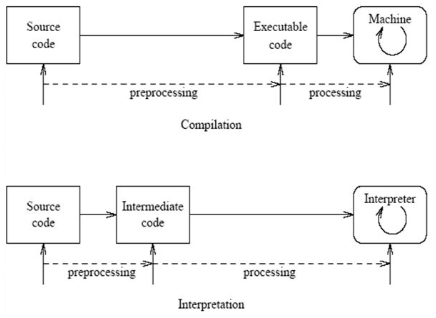
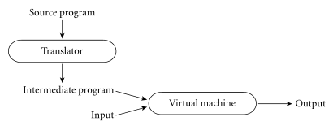

**Main Source :**

- **[Programming language theory - Wikipedia](https://en.wikipedia.org/wiki/Programming_language_theory)**
- **Book chapter 1**

Programming language can be thought as a model of computation, they express computation with syntax (rules for constructing valid expression) and semantics (meaning of each expression). Programming language is typically defined with mathematical notation and formal methods, such as [formal grammar](/theory-of-computation-and-automata/formal-grammar).

Formal grammar is studied abstractly, the symbols used are often simplified to focus on the structure and rules of the grammar itself. For example, one production rules may look like $S \rightarrow aA$. While this look meaningless, it can be modified such that it reflects a typical programming language construct.

One example : $S \rightarrow \text{id } A$, $A \rightarrow A \text{ expr}$, $A \rightarrow \text{empty}$. This is an example of how variable assignment is defined as formal grammar. An assignment requires a single identifier $\text{id}$ (replaced from $a$), and expression $A$. The expression $A$ can be expanded recursively if it includes another expression.

**Programming Language Theory (PLT)** is a branch of computer science that focuses on studying the design, implementation, characterization, and analysis of programming language. Some concerns of PLT :

- **Syntax and Semantics** : Syntax deals with the structure and grammar of programming languages, specifying how programs should be written. Semantics focuses on the meaning and interpretation of programs.
- **Type Systems** : Type systems help ensure program correctness and safety. They provide a way to classify and enforce constraints on the values that programs can manipulate. For example, when making variable assignments, we can enforce types (e.g., int, string), so that only variables with operations defined for those types can be operated on.
- **Language Implementation** : Programming language specify how computation is performed, language implementation techniques, including compilers, interpreters, runtime systems, and virtual machines are studied in order to carry out the actual computation.

### Compilation & Interpretation

Essentially, programming languages are designed to help programmers develop their programs more easily. In the past, people had to code in machine language for their programs that targets specific machines. As machine language and hardware became more complex, an abstraction was created. People designed languages that helped them express machine language in a more human-readable way (initially similar to mathematical formula). These language expressions are then translated into actual machine language, this process is called [compilation](/computer-and-programming-fundamentals/compilation), and the program that does this is called a [compiler](/compilers).

A compiler translates high-level languages (source code) into target machine language that can be understood by the computer and executed by the user. Another way of running a program constructed in high-level languages is through an [interpreter](/computer-and-programming-fundamentals/interpreter). Instead of translating the entire source code beforehand, an interpreter takes the source code (or typically in intermediate code) and input from the user, dynamically translating each instruction for the computer to execute.

  
Source : https://www.researchgate.net/figure/nterpretation-vs-compilation_fig4_334289755

:::info
By definition, a compiler is a translator that converts a programming language into a target language. The target language doesn't have to be machine language, although this is common usage. For instance, it could translate from one high-level programming language to another.
:::

Some compilers do a preprocessing steps. The preprocessor operates on the source code at a textual level, manipulating or modifying it before the compilation steps. The C language preprocessing tasks includes expanding macros, including or importing other source files, excluding certain portions of code based on conditional macro, etc.

Compilation can be faster, since every decision is made beforehand. However, interpretation can be easier to debug, as instructions are executed on the fly. Although, it is possible to combine both approach through intermediate language.

  
Source : Book page 15

Interpretation is sometimes interchanged with compilation because they translate high-level code. Sometimes, some language is called interpreted if the initial translation process into intermediate code is simple enough.

:::tip
Language like Java interprets source code into intermediate language called **bytecode**, then the bytecode is compiled at the time it is running. This process is called [just-in-time (JIT) compilation](/computer-and-programming-fundamentals/interpreter#jit-compilation), in which compilation happens right before particular instruction in bytecode is executed.
:::

### Compilation Process

See [compilation process on compilers fundamentals](/compilers/compilers-fundamentals).
