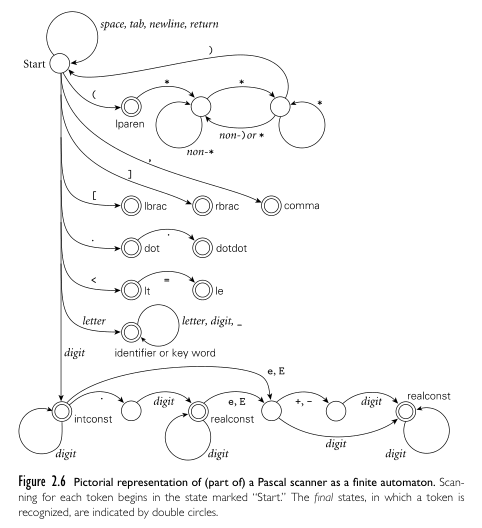

**Main Source :**

- **Book chapter 2**
- **[Backus-Naur form - Wikipedia](https://en.wikipedia.org/wiki/Backus–Naur_form)**

Syntax is the rules that specifies the valid structure of a program. It defines how the elements of a programming language, such as keywords, identifiers, operators, expressions, and statements, can be combined to form well-formed programs. The structure of program need to be standardized in order to avoid ambiguity. By ambiguity, we mean situations where a given sequence of symbols can be interpreted in multiple ways, leading to different meanings or interpretations.

An example of ambiguity is the simple arithmetic expression : 2 + 3 × 4. This can either be interpreted as 2 + 3 then × 4, if the language always process anything from left-to-right (also known as left-to-right evaluation), or 3 × 4 then + 2, if the language follows typical math operations.

### Basic Syntax

One way to represent a syntax is through a non-terminal symbols, then using production rules to define how these non-terminal symbols can be expanded. Example :

`digit -> 0 | 1 | 2 | 3 | 4 | 5 | 6 | 7 | 8 | 9 `, this mean `digit` is non-terminal that can be expanded to either `0`, `1`, `2`, and so on until `9`. The `|` represent "or".

A **non-terminal symbol** represents a syntactic category or a language construct in a grammar. In English language, non-terminals are the sentence, noun, verb, or phrase. There is also **terminal symbol**, which represent the actual elements or words in the language. For example, the word "cat" is a terminal that belongs to noun non-terminal. The grammar rule for noun would be `noun -> cat | dog | tree | ...`.

A syntax rule for any number greater than 100 would be :

```markdown
<greater-than-100> -> <non-zero-digit> <digit> <digit> <digit>*
<non-zero-digit> -> 1 | 2 | 3 | 4 | 5 | 6 | 7 | 8 | 9
<digit> -> 0 | 1 | 2 | 3 | 4 | 5 | 6 | 7 | 8 | 9
```

:::note
Sometimes we use `<>` angle bracket to enclose the non-terminal.
:::

A number greater than 100 must be anything beyond 100, like 101, 102, 103, and so on. So, the first digit should be any digit that is non-zero. We added another rule called `<non-zero-digit>` for this. Then, the non-zero digit is followed by two digits, signifying it must be followed by two digit, so number like 99 is invalid according to this syntax.

After the two digit, there is another digit included with the `*` symbol. This corresponds to **Kleene star operator**, which mean the particular non-terminal can be repeated zero or more times. A single `<digit>` with Kleene star means we can put any digit as many as we want. So, it is possible to create long number like 10000000000 or 123123123 with this syntax.

### Regular Expression

A [regular expression](/theory-of-computation-and-automata/regular-languages-part-1#regular-expression) is a pattern or rule that is used to describe valid strings or sequences of characters within a language. If syntax defines the overall structure and grammar of a language, regular expression is the notation for pattern matching and string manipulation.

Syntax are built on **tokens**, which are the smallest individual units or elements in a programming language. They represent predefined categories of lexical elements, such as keywords, identifiers, literals, operators, and punctuation symbols.

For example, the symbol `+`, `-`, `*`, and `/` are mostly literals in most programming languages for arithmetic operation. Keyword like `while`, `if`, and `else` are also common.

Regular expression is a simple formal rules, it helps to define tokens. A classification of regular expression :

1. **Character** : Must contain character or symbol that specify the pattern.
2. **Empty String** : Empty string is represented with $\epsilon$ or epsilon symbol.
3. **Concatenation** : Runs under three operation, concatenation, alternation, and repetition. Concatenation specifies that two patterns must appear consecutively in the input string. For example, if there are two regular expressions, $A$ and $B$, the concatenation of $A$ and $B$ : $AB$ means that $A$ must be followed by $B$ in the input string.
4. **Alternation** : The "or", represented by the `|` symbol is called alternation. It allows for multiple choices at a particular point in the syntax. For example, if there are two regular expressions, $A$ and $B$, $A|B$ means that either $A$ or $B$ is valid at that position in the input string.
5. **Repetition** : Specifies how many times a pattern can occur. Common quantifiers include $*$ for zero or more repetition, or $+$, for one or more repetition.

With regular expression, we can represent an integer :

```markdown
<integer> -> (- | ε) <digit> <digit>*
<digit> -> 0 | 1 | 2 | 3 | 4 | 5 | 6 | 7 | 8 | 9
```

The `(- | ε)` specify that we can either put negative sign or nothing before the first digit.

### Context-Free Grammar

While regular expression can represent tokens, they have limitations when it comes to handling nested constructs. A nested construct refers to a structure or element that is contained within another similar structure or element.

Regular expression won't be able to do this :

```md
<expr> -> (<expr> 0 | ε)
```

This syntax defines that an expression can be expanded to another expression followed with a "0" symbol. Furthermore, that expression can be expanded again, as many as we want, creating a recursive production rule. At the point we want to stop expanding, we can choose to expand it to empty symbol.

For example, given an `<expr>`, we can transform it into `<expr> 0` (by changing `<expr>` into `<expr> 0`), then transform it again into `<expr> 0 0`, and so on.

The formal methods which can do this is called [context-free grammar](/theory-of-computation-and-automata/context-free-grammar).

#### BNF

**Backus-Naur Form (BNF)** is a common notation to describe a syntax. A syntax described by BNF must be at least a context-free grammar, because BNF allows for recursive production rule. Typically, BNF represent a rule with :

` <symbol> ::= __expression__`.

Any non-terminal such as `symbol` must be enclosed with angle brackets, and its presence in input must be replaced (indicated with `::=`) with `expression` on the right, which can be another non-terminal that requires to be replaced as well, or just a terminal.

The use of `|` indicate a choice, similar to regular expression. BNF doesn't include the `*` or `+` symbols for repetition, but they can be used in another variant of BNF called **Extended Backus–Naur Form (EBNF)**.

#### Derivations & Parse Trees

**Derivation** describes the step-by-step process of rewriting symbols in a grammar to generate a particular string. It shows how the grammar rules are applied to transform the start symbol into the desired string.

Each step in a derivation involves selecting a non-terminal symbol and replacing it with the right-hand side of a production rule that matches the selected non-terminal symbol.

With a rule in context-free :

```md
<expr> ::= (<expr> 0 | <expr> 1 | <expr> 2 | <expr> 3 | ε)
```

The derivation process, starting from a single `<expr>` can lead to any string in the language. We can generate various strings, such as "0", "1", "10", "321", "12303", each requiring a distinct derivation process.

Let's say that the `<expr> ::= <expr> 0` is the first rule, `<expr> ::= <expr> 1` is the second rule, and so on. To generate the string "3210", we will follow the first, second, third, and fourth rule, respectively. We call each string generated during the derivation process in a **sentential form**.

Sometimes, if the production rule produces multiple non-terminal, such as `<expr> ::= <expr> <expr> <0>`, the derivation can go more complex. At this point, there will be two choices, expanding the leftmost `<expr>` first, or the second. We call a derivation process in which leftmost non-terminal is always derivated first a **leftmost derivation**, while the opposite is **rightmost derivation**.

The derivation process can be represented graphically in a **parse tree**. Different derivation that leads to different string generates different parse tree.

  
Source : Book page 43-44

The above is an example of a context-free grammar derivation in a parse tree. First, the `expr` is transformed into `expr op expr`, creating another two `expr` and an `op`. Then, the derivation continues, where `expr` is turned into some identifier, and `op` is turned into one of the four choice of operator.

If there are more than one parse tree generated for the same string, we can say the grammar is **ambiguous**. It turns out that the parse tree on the top derives leftmost `expr` first, while the second is the opposite. The generated string is the same, but the order of derivation is different. The first phase tree precede operator `*` (multiplication) before `+`.

:::tip
See also [context-free grammar](/theory-of-computation-and-automata/context-free-grammar).
:::

### Scanning

The previous section discuss how syntax is specified. After writing source code in certain syntax, the next process is parsing. It is the process of analyzing if the structure of a sequence of symbols follows the rules of a formal grammar correctly.

Before parsing, a step called **scanning** occurs. This involves dividing the sequence of characters (e.g., source code) into meaningful units called tokens. Each token is then identified according to its category (e.g., keyword, identifier, literals), and parsing occurs afterwards.

:::info
Scanning is the first step in [compilation process](/programming-language-theory/plt-fundamentals#compilation-process), while parsing is the second step.
:::

The purpose of scanning is to simplify the input by removing meaningless comments for the parser and eliminating whitespace (e.g., spaces, tabs, carriage returns, newlines) to reduce input complexity, while preserving only the important tokens.

  
Source : Book page 48

Above is the outline of scanner algorithm in Pascal programming language. Although it is from a specific language, the similar approach can be used for others. In general, the algorithm should ignore any white spaces. If it encounters unique symbols, it checks the symbol table if it is meaningful for the language. If some keywords are not from the language, it could be user-defined identifier, the compiler will also keep track of this.

The deterministic behavior of scanner can be described with a [finite automaton](/theory-of-computation-and-automata/finite-automata) like [DFA](/theory-of-computation-and-automata/finite-automata#dfa). Deterministic means the system will always know what to do when it encounters any input. The automaton starts with an initial state, then it transitions to other state depending on the symbol encountered. If it reaches a final state, it means it has recognized some token.

  
Source : Book page 49

[Regular expression](#regular-expression) is used to define the lexical rules or patterns that a scanner should recognize. This is why earlier we mentioned that regular expressions are helpful in defining tokens, as they are used to specify the patterns that scanner recognizes.

Since a scanner reflects a finite automaton, creating a scanner specified with a regular expression involves converting the regular expression into an equivalent finite automaton. The regular expression is converted into an [NFA](/theory-of-computation-and-automata/finite-automata#nfa) first, then converted into a DFA. Optionally, we may [minimize the DFA](/theory-of-computation-and-automata/finite-automata#minimization) to reduce the number of states.

:::tip
See [regular expression to finite automata](/theory-of-computation-and-automata/regular-languages-part-2#regular-expression-to-finite-automata) for an abstract example.
:::

The practical way of designing a scanner is making our own regular expression based on the language syntax, then use a **scanner generator**. A scanner generator will generate the logic to tokenize the input source code based on the defined lexical rules. The actual code for scanner may involve the use of switch statement and nested loop to simulate an automaton behavior.

Obviously, potential error will occur during scanning, this is called **lexical error**. It can arise from invalid characters, unrecognized character sequences, or violations of the language's lexical rules. The scanner may stop the scanning and report the error to user or ignoring the invalid token and continuing the scanning process.

### Parsing

...
