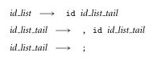
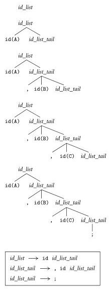
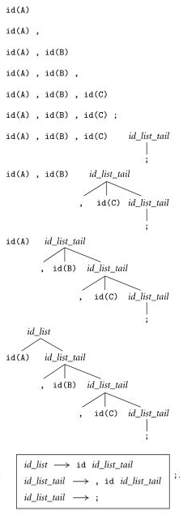
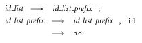

**Main Source :**

- **Book chapter 2**

The parser takes sequence of tokens produced in the [previous step](/programming-language-theory/syntax#scanning). The objective of parser is to analyze whether source code (now in tokens) is correct syntactically. Parser does this by finding if it is possible to create a parse tree with given the input and the language grammar.

  
 Source : Book page 62

This is a grammar for a programming language to create a list (or array). Typically, a list is created by including the elements and then separating each of them with a comma, along with a semicolon if the language requires it.

The grammar starts from `id_list`, it needs to be replaced with some identifier `id`, and a non-terminal `id_list_tail`. `id_list_tail` is used if we want to include extra element for the list. To do that, we replace it with a `, id id_list_tail`. If we want to end the list, we can replace the `id_list_tail` with a semicolon.

For example, starting from `id_list` :

1. `id_list` → `A id_list_tail` (by `id_list -> id id_list_tail`)
2. `A id_list_tail` → `A, B id_list_tail` (by `id_list_tail -> , id id_list_tail`)
3. `A, B id_list_tail` → `A, B;` (by `id_list_tail -> ;`)

We used two identifiers, `A` and `B`, resulting in the final list `A, B;`. The identifier is the tokens received from user.

The technique we just used to derive `A, B;` is called **top-down parsing**.

#### Top-down Parsing

The top-down parsing generates parse tree starting from the language grammar. In the list example, we started from `id_list`, then see how can we replace it according to the production rule of the grammar. Remember, for a string to be valid in the language, all non-terminals must be replaced by terminals according to the grammar production rules.

It turns out that `id_list` can only be replaced with `id id_list_tail`. So, we will replace `id_list` with `id id_list_tail`. This production rule asks for an identifier. The identifier will be taken from the input tokens.

The next step, we see that there are two choices to replace `id_list_tail`. The first choice replaces it with another `id id_list_tail`. This will only be chosen if there's still token available. If not, then we should replace it to semicolon, ending the parse tree generation.

  
Source : Book page 63

This image illustrates the parse tree generation of input `A, B, C;`. Starting from the `id_list`, it is replaced with an identifier and `id_list_tail`. The `A`, being the first token in the stream will be the assigned as the identifier. Then, we see there is a comma and `B`, so `id_list_tail` must not end yet. This is continued until we see there are no identifiers, only a semicolon.

The top-down approach generates a parse tree by predicting which particular non-terminal will be replaced next. It does this by examining the available tokens in the token stream. If the prediction made by the top-down parser is incorrect—perhaps the production rule does not match the current input token—then the parser may raise a **syntax error**.

#### Bottom-up Parsing

In contrast, bottom-up parser starts from the input instead of the grammar.

  
Source : Book page 63

It realizes that `A` is an identifier, then it encounters a comma, then another identifier `B`, and so on. This continues until the point it encounters a semicolon, where the only possible production rule is from `id_list_tail`. So, it began replacing the semicolon to `id_list_tail` from that point.

Afterwards, there are `C` and a comma on the previously encountered tokens. The possible production rule for this is the rule of `id_list_tail -> , id id_list_tail`, where `C` is the identifier here. So, it continues making the tree from bottom to up. The generation ends until the parser doesn't encounter comma anymore, when the only possible production rule is `id_list -> id id_list_tail`.

The bottom-up parsing is also known as **shift-reduce parser**. It consists of two main actions, shifting and reducing.

- In shifting, the parser reads the next input token and shifts it onto the parsing stack. The parser maintains a [stack](/data-structures-and-algorithms/stack) to keep track of the symbols it has seen and their corresponding states.
- When a specific pattern of symbols on the top of the parsing stack matches the right-hand side of a production rule, the parser reduces (replaces) those symbols with the corresponding non-terminal symbol on the left-hand side of the production rule.

#### Choice

Depending on the grammar, top-down or bottom-up parsing may or may not be efficient. In a large program of this list grammar, bottom-up parsing can take up many spaces. This is because it needs to expand keep track tokens until semicolon is reached.

  
Source : Book page 64

This grammar allows for bottom-up parser to reduce the space of stack if needed. It doesn't need to encounter a semicolon in order to reduce them, we may choose to reduce it in the middle of parsing. However, this grammar can't be parsed top-down, because we can't really predict whether to replace `id_list_prefix` with the first rule or the second one.

### Type of Parser

There are many types of parser. One way to categorize them is based on where it starts to derive.

- **LL (Left-to-right, Leftmost derivation)** : LL parsers are typically class of top-down parsers. It reads the input from left-to-right and derive starting from the leftmost non-terminals.
- **LR (Left-to-right, Rightmost derivation)** : Similar to LL, it reads the input from left-to-right, but instead derives the rightmost non-terminal, resulting in the construction of the parse tree bottom-up.

Some parser uses something called **lookahead token**. It is an information about the next token or input symbol in the input stream used for parser to make better parsing decisions.

The number of lookahead token is denoted with number and parenthesis after the parser type. For example, LL(0), LL(1), LL(k) refers to LL parser with 0, 1, and k many lookahead tokens. As the value of lookahead token increases, the complexity of the parsing algorithm also increases.

#### Recursive Descent Parser

Recursive descent parsing is a top-down parsing technique where the parser corresponds to the grammar's production rules through a set of recursive procedures or functions. Each non-terminal in the grammar is typically associated with a parsing function that predicts and matches the corresponding production rule. Recursive descent parsers can be hand-written and are relatively easy to understand and implement.

LALR Parser: LALR (Look-Ahead LR) parsers are a compromise between the power of LR parsers and the efficiency of SLR (Simple LR) parsers. LALR parsers are widely used in practice due to their ability to handle a wide range of grammars while maintaining reasonable efficiency.

SLR
LALR
