**Main Source :**

- **Book chapter 2**
- **[Introduction to Parsers - Neso Academy](https://youtu.be/OIKL6wFjFOo?si=iRFE0__ImeaKu38n)**
- **[LL(1) Parsing - Neso Academy](https://youtu.be/clkHOgZUGWU?si=-z878_LOxoCrsdBP)**
- **[What is the difference between LALR and LR parsing? [duplicate] - stackoverflow](https://stackoverflow.com/questions/19663564/what-is-the-difference-between-lalr-and-lr-parsing)**

The parser takes sequence of tokens produced in the [previous step](/programming-language-theory/syntax#scanning). The objective of parser is to analyze whether source code (now in stream of token) is correct syntactically. Parser does this by finding if it is possible to create a parse tree with given the input and the language grammar.

### Parsing Example

  
 Source : Book page 62

This is a grammar for a programming language to create a list (or array). Typically, a list is created by including the elements and then separating each of them with a comma, along with a semicolon if the language requires it.

The grammar starts from `id_list`, it needs to be replaced with some identifier `id`, and a non-terminal `id_list_tail`. `id_list_tail` is used if we want to include extra element for the list. To do that, we replace it with a `, id id_list_tail`. If we want to end the list, we can replace the `id_list_tail` with a semicolon.

For example, starting from `id_list` :

1. `id_list` → `A id_list_tail` (by `id_list -> id id_list_tail`)
2. `A id_list_tail` → `A, B id_list_tail` (by `id_list_tail -> , id id_list_tail`)
3. `A, B id_list_tail` → `A, B;` (by `id_list_tail -> ;`)

We used two identifiers, `A` and `B`, resulting in the final list `A, B;`. The identifier is the tokens received from user.

The technique we just used to derive `A, B;` is called **top-down parsing**.

### Top-down Parsing

The top-down parsing generates parse tree starting from the language grammar. In the list example, we started from `id_list`, then the parser analyze how can `id_list` be replaced according to the production rule of the grammar.

:::tip
Remember, for a string to be valid in the language, all non-terminals must be replaced by terminals according to the grammar production rules.
:::

It turns out that `id_list` can only be replaced with `id id_list_tail`. So, the parser will replace `id_list` with `id id_list_tail`. This production rule asks for an identifier. The parser assumes that the identifier exist in the input tokens.

  
Source : Book page 63

This image illustrates the parse tree generation of input `A, B, C;`. Starting from the `id_list`, it is replaced with an `id` and `id_list_tail`. The `A`, being the first token in the input stream is assigned as the identifier.

The next step, `id_list_tail` is a non-terminal that we must replace. We see that there are two choices to replace. The first choice replaces it with another `id id_list_tail`. This will only be chosen if there's still token available. If not, then we should replace it to semicolon, ending the parse tree generation.

In the input, we see there is a comma and `B`, so `id_list_tail` must not end yet. Then, parser chose to replace `id_list_tail` with `, id id_list_tail`, and assigning `B` as the `id`. This process continues until there are no more tokens, making only the possible rule `id_list_tail → ;`, which doesn't have anymore non-terminals.

Notice that the top-down approach somewhat predicts what will happen next. It must predict which rule should be chosen next to replace the non-terminals and create the parse tree. When an unexpected prediction occurs, such as the parser expecting a token, but there are no more tokens available, the parser may raise a **syntax error**, indicating that the input is incorrect.

### Bottom-up Parsing

In contrast, bottom-up parser starts from the input instead of the grammar. Bottom-up parser keeps track a token [stack](/data-structures-and-algorithms/stack), which will be used to keep track the symbols it has encountered so far.

The objective of bottom-up parser is to keep adding symbol to the stack, then construct the parse tree when it recognizes some grammar rule.

  
Source : Book page 63

Using the same example, it first encounters `A`. It is an identifier, and there are no direct rule that replace an identifier. The parser does do anything other than adding the symbol to the stack. Keeping on, it encounters a comma `,`, `B`, `C`, and then a semicolon `;`.

The parser recognizes that there exist a rule in the grammar, where a non-terminal is replaced with a semicolon. The rule is `id_list_tail → ;`. The parser starts building up the tree from here, replacing the semicolon with a non-terminal `id_list_tail`. It replaces by popping the semicolon, and pushing `id_list_tail` onto the stack.

Going back to the stack, it now realizes another pattern. The two previous tokens are `C` and `,`. There exists a rule for this, namely `id_list_tail → , id id_list_tail`, where `id` is `C` and `id_list_tail` is what we just pushed before. Now, it popped the last three symbols, and pushes another `id_list_tail`.

This process continues until `A` is encountered without a comma, making the only possible rule is `id_list → id id_list_tail`.

More regularly, the bottom-up parsing is also known as **shift-reduce parser**. It consists of two main actions, shifting and reducing.

- In shifting, the parser reads the next input token and shifts it (push) onto the parsing stack. The parser maintains the stack to keep track of the symbols it has seen and their corresponding states.
- When a specific pattern of symbols on the top of the parsing stack matches the right-hand side of a production rule, the parser reduces (pop) and shifts (push) those symbols with the corresponding non-terminal symbol on the left-hand side of the production rule.

#### Choice

Depending on the grammar, top-down or bottom-up parsing may or may not be efficient. In a large program with this list grammar, the bottom-up parsing can take up many spaces. This is because it keeps shifting tokens until a semicolon is reached. In other word, grammar affects how parser performs.

  
Source : Book page 64

The above is an optimized grammar for bottom-up parser. It allows for bottom-up parser to reduce the space of stack if needed. It doesn't need to encounter a semicolon in order to reduce them, we may choose to reduce it in the middle of parsing. However, this grammar can't be parsed top-down, because we can't really predict whether to replace `id_list_prefix` with the first rule or the second one.

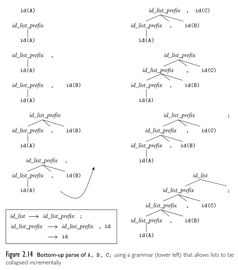  
Source : Book page 65

### Type of Parser

There are many types of parser. One way to categorize them is based on where it starts to derive.

- **LL (Left-to-right, Leftmost derivation)** : The top-down parsers are also known as LL parsers. It reads the input from left-to-right and derive starting from the leftmost non-terminals.
- **LR (Left-to-right, Rightmost derivation)** : Bottom-up parsers are known as LR parsers. Similar to LL, it reads the input from left-to-right, but instead derives the rightmost non-terminal, resulting in the construction of the parse tree bottom-up.

Some parser uses something called **lookahead token**. It is an information about the next token or input symbol in the input stream used for parser to make better parsing decisions.

The number of lookahead token is denoted with number and parenthesis after the parser type. For example, LL(0), LL(1), LL(k) refers to LL parser with 0, 1, and k many lookahead tokens. As the value of lookahead token increases, the complexity of the parsing algorithm also increases exponentially. Even the single lookahead token in LR(1) makes it significantly larger than LR(0). The additional lookahead token introduces more possibilities for state transitions in the parsing automaton. For each state in the LR(1) parser, the parser needs to consider all possible lookahead tokens and create distinct states based on their combinations.

:::note
The grammar needs to be adapted with different type of parser, including different numbers of lookahead token.
:::

### More Detail

#### Recursive Descent Parser

Recursive descent is the **top-down parsing** technique that works by recursively applying production rules of a grammar to parse an input string. Recursive descent parsers can be handwritten for a relatively simple language.

This technique works by associating each non-terminal in the grammar with a function that handles them individually based on every possible production rule.

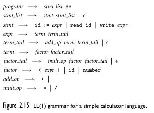  
Source : Book page 66

:::note
"$$" is an end symbol.
:::

Above is LL(1) grammar for a calculator language, below are the pseudocode for each of the function.

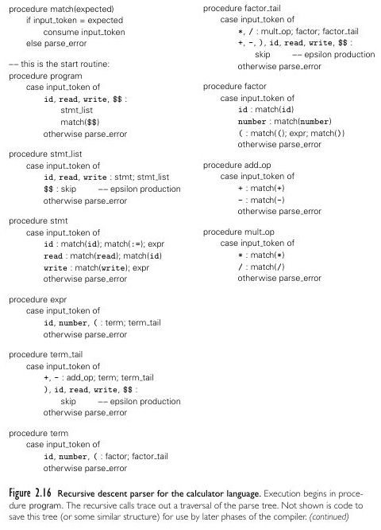  
Source : Book page 67, 68

And the input program as well as its top-down parse tree. The $\epsilon$ denotes an empty string.

  
Source : Book page 66, 69

Similar to the [list example in top-down parsing](#top-down-parsing), it predicts which production rule used to replace certain non-terminal based on the input stream. At the first, it chose to replace `stmt_list` with `stmt stmt_list` rather than empty string because there are available input. Then, `stmt` is replaced with `read id`, because it encounters `read` and an id `A`. The behavior of this parser that sees next input is what makes it an LL(1) parser, seeing the next token count as one lookahead token.

After parse tree is constructed, it is confirmed that the input is syntactically correct. The parser can save important information for the next compilation step. The information of parse tree can be represented as node-link data structure such as [graph](/data-structures-and-algorithms/graph), [linked list](/data-structures-and-algorithms/linked-list), or [tree](/data-structures-and-algorithms/tree).

:::info
Sometimes parser doesn't create full parse tree explicitly, it may create an abstract syntax tree, which is the simpler version of parse tree that omits certain nodes and details that are not relevant to the syntax analysis.
:::

#### Predictive Parsing

Predictive parsing is another **top-down parsing** technique where it uses a **parsing table** to guide the parsing process. The parser predicts the next production rule to apply by consulting the parsing table based on the current input symbol and the top of the parsing stack.

The parser maintains an explicit stack (rather than recursion call stack) to keep track of the non-terminals and terminals encountered so far. The stack initially contains the start symbol of the grammar.

The parser will generate three sets that provide information about the grammar. These will be used for prediction and error recovery. The three sets are :

- **First** : First set of a non-terminal contains the possible first (starting) symbols that can appear when we use a particular non-terminal in a production rule.
- **Follow** : Follow set of a non-terminal contains the possible terminals that can appear immediately after occurrences of that non-terminal in the grammar.
- **Predict** : Union or combination of first and follow set.

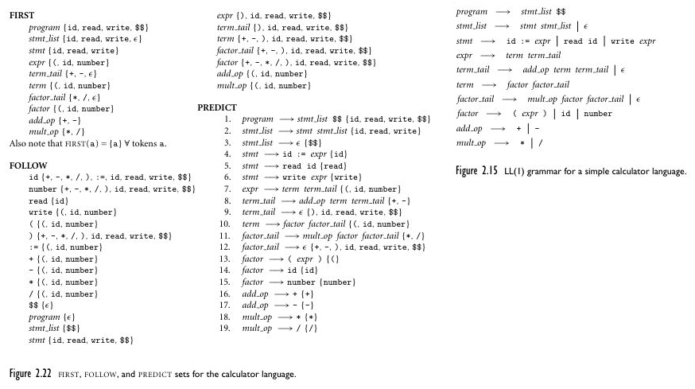  
Source : Book page 75

For example, the first, follow, and predict set of the previous calculator language is above.

- The first set of `stmt`, typically denoted as `FIRST(stmt)` contains `id`, `read`, and `write`. This is because they are the first symbol that appears in every production rule of `stmt`.
- The follow set of `stmt`, `FOLLOW(stmt)` contains `id`, `read`, `write`, and `$$`. This is because `id`, `read`, `write` appear first, and they are also terminals. When there are no terminals in the production rule, `$$` or end marker is included in the set.

Afterwards, parsing table will be constructed. Typically, it is represented as a two-dimensional table (or data structure) with rows corresponding to non-terminals and columns corresponding to terminals.

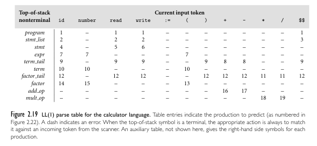  
Source : Book page 72

The table is constructed by assigning certain production rules of non-terminals to each of their terminals in the first or follow set. For example, the predict set of `program` contains terminals like `id`, `read`, `write`, and `$$`. Then, all the associated cell on the table, such as (program, id), (program, read), (program, write), and (program, \$\$), are assigned the production rule for `program`, that is `program → stmt_list $$`.

Now, the parser can just look at the table given the non-terminal and current input token (also called lookahead token) to choose which action to take. For constructing the parse tree and saving the information, the parser may use additional data structure such as tree.

The action can be one of the following:

- **Predict** : If the table entry specifies the number of production rule, the parser applies the rule by replacing the non-terminal on top of the stack with the right-hand side of the production rule. For example, if `program` is on top of the stack, and current input token is `id`, then the rule `program → stmt_list $$` is applied. This is done by popping the left-hand side (`program`) and pushing the right-hand side of the rule (`stmt_list $$`).
- **Match** : Match happens when the topmost symbol on the stack matches the current input token. This indicates the parse tree we are constructing doesn't have children. In other word, we won't expand the particular symbol on the parse tree, the branch ends there.
- **Error** : If the table entry is empty or undefined (denoted by `-` on the image), the parser detects an error and takes appropriate error recovery actions, such as error reporting or error synchronization. We don't say the parser simply halts and returns an error to the user, because it is possible that the parser catches more errors that need to be reported as well.

  
Source : https://youtu.be/clkHOgZUGWU?si=gEQ3mf3ZhNwzNQsC&t=467 (modified)

The above image is a help for visualization from a video example. Starting from the start symbol `S` that act as the root of the tree, the grammar rule is `S → aABb`. The tree is created with four branches from the right-hand side of the rule. The symbols from the right-hand side of the rule is also pushed into the stack.

At some point, the current input symbol and the topmost symbol on the stack matches, that is when "match" action occurs. The `a` symbol in the input matches the topmost stack symbol. When "match" action occur, we stop expanding the branch and designate it as a leaf node. Also, `a` symbol is popped from the stack.

On the next step, `A` is topmost symbol on the stack, and `d` is our current token. Because they don't match, the action "predict" occur, and we should consult the table. On the constructed tree, this indicates we have to expand a branch. Turns out the table want us to replace the `A` with `ε`.

The end result of this parsing is the constructed parse tree. All the leaf nodes, if combined, will resemble the input stream.

:::note
In summary, the parsing table in predictive parsing helps us to know which rule to use to replace certain non-terminal in order to create the parse tree.
:::

#### LR Parsers

For review, bottom-up parser adds tokens to the stack until it recognizes a production rule, and then constructs the tree. The parser incrementally constructs the tree and joins them together.

  
Source : Book page 81

Mostly, bottom-up parser uses a parsing table for parsing. Below are the modified calculator grammar for LR(1) parser, as well as the input program.

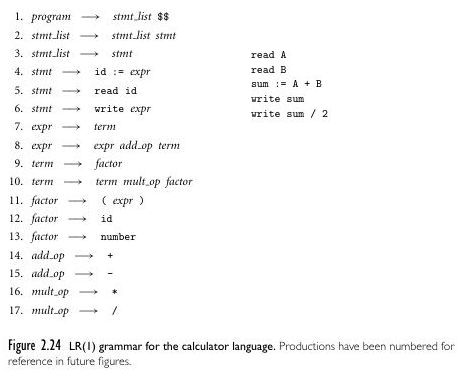  
Source : Book page 82

If top-down parsing creates a table and consults it to decide what to do based on the non-terminal on top of the stack and input token, a bottom-up parser instead consults the table based on the current input token and a **parser state**. The parser state is actually determined by the configuration of the stack.

There are two actions : **shift and reduce**. Shift pushes current input token on the stack, while reduce applies a production rule by popping the part of symbols on the right-hand side of the rule and replacing them (by pushing it onto the stack) with the non-terminal symbol on the left-hand side of the rule. After shifting or reducing happens, the state may also be updated accordingly.

This process continues until the entire input sentence is recognized, that is when "accept" action is encountered on the table. Error that indicates a parsing error or a syntactical mistake in the input string may also occur.

##### LR Parsing Table

The steps to make parsing table is below. We will make the table from the given grammar above and a concrete example.

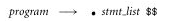  
Source : Book page 83

The parsing process starts from an empty stack, we will start from the `program`. The `program` rule is `program → stmt_list $$`. We typically denote the position of the stack with a dot `.` on the right-hand side of the production rule. We call anything that is indicated with dot, or currently being processed as **LR item**.

Currently, we only have a single LR item in our **list**. If we encounter a non-terminal in the right-hand side of the production rule, we will add that rule to the list, as well as "dotting" them. We will keep adding LR item to the list until a terminal is encountered.

In the example, we encountered the non-terminal `stmt_list` from the `program`. The `stmt_list` has two rules that replaces to `stmt_list stmt` or `stmt`. So, we will add both of the rule to the list. Our list now :

  
Source : Book page 83

Then, the `stmt_list` has another non-terminal `stmt`, it can be replaced to `id := expr`, `read id`, and `write expr`. Once again, add that to our list.

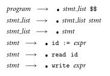  
Source : Book page 83, 84

Now that we don't encounter non-terminal anymore, we can stop adding item to the list. There are three rule that starts with terminals from the `stmt`. Based on the program on [top](#lr-parsers), we encountered `read`.

When we encounter a terminal, we have to shift a token and similarly, move the dot. Now that we encountered `read` token, we will shift this to the stack. By the way, when we move the dot or shift a token, this will change the parser state.

Following the `stmt → read id` production rule, there must be `id`. Turns out the identifier is `A` from the input program. So, shift the token again to the stack and move the dot.

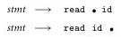  
Source : Book page 84

When dot reaches the end of the production rule, this indicates that the entire right-hand side of the production rule has been successfully matched, thus we have to reduce it. This will involve popping the two symbol (`read` and `id`), and then replacing them with the left-hand side symbol `stmt`.

Since we have reduced the `stmt`, we need to advance the dot on `stmt_list`.

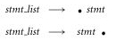  
Source : Book page 84

We are at the end again, so we will pop the left part of the dot (`stmt`), and replace it by pushing the left-hand side of the rule, `stmt_list`.

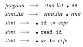  
Source : Book page 84

All of this will change the state of `program` earlier, the dot is now after the `stmt_list`. Since it's not at the end yet, we will shift another token from the input (the next is `read B`). This will be repeated until we have reached the end of the input.

Notice that sometimes we will encounter the similar state. In other word, if we encounter `read` again, we will be at the place where the dot in `stmt → read id` goes from the start to the end again. Then, we will reduce again similar to the previous state.

The state behavioral of bottom-up parsing makes it depict a finite automaton, it's called **Characteristics Finite State Machine (CSFM)**. This is same for any LR parser, such as SLR and LALR.

  
Source : Book page 89

For each different state encountered (i.e., the position of the dot on the stack), we can assign them numbers.

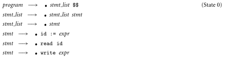  
Source : Book page 83

For example, when all the dot position are like above, it is considered as state 0. We can then map all the state transition into a table :

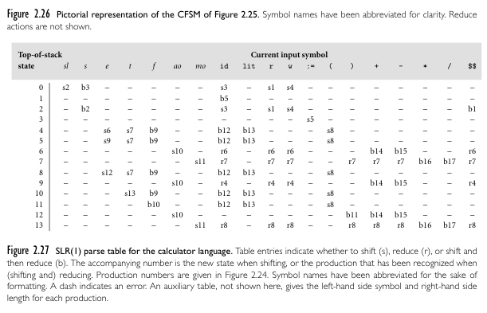  
Source : Book page 89

- `s2` indicates shifting and move to state 2.
- `r7` indicates reduce and move to state 7.
- `b3` indicates shift, reduce, and move to state 3.
- `-` indicates a syntax error.

##### Bottom-up Algorithm

With the constructed table, we can now look at it every time we parse a program. The general process of bottom-up parsing of LR parser :

1. The parser starts with an empty stack and the input sentence to be parsed. The initial state of the parser, usually denoted as state 0, is pushed onto the stack.
2. The parser reads the next input symbol/token from the input sentence. Based on the current state of the parser and the input symbol, the parser consults the parsing table. If the parsing table entry indicates a "shift" action, the input symbol is pushed onto the stack, and the parser transitions to the state indicated in the entry. The process of shifting continues as long as there are input symbols remaining.
3. When the parser encounters a point where a reduction is possible, it checks the parsing table entry for the current state and input symbol. If the parsing table entry indicates a "reduce" action, the parser applies the corresponding production rule. The parser pops the symbols on the right-hand side of the production rule from the stack and replaces them with the non-terminal symbol on the left-hand side of the rule. After the reduction, the parser consults the parsing table again, using the non-terminal symbol on top of the stack and the current state to determine the next action.
4. If, after applying a reduction, the parsing table entry indicates an "accept" action, the parsing process is complete.

##### Conflict

When consulting the table, two conflict situations may happen. In the visualization of automaton, conflict occur when there are two transition arrows, making the automaton nondeterministic.

1. **Shift-Reduce conflict** : It is when a cell in the table has both shift and reduce action. The parser could either shift the current input symbol onto the stack or reduce a portion of the stack using a production rule. We can resolve this conflict by modifying the table based on some precedence or associativity rule defined for the conflicting grammar symbols.
2. **Reduce-Reduce conflict** : This is when multiple reduce are encountered on the table cell. It is when there are multiple production rule to be applied for the same non-terminal at a particular point of the parsing process. This will occur when the grammar is ambiguous. So, one way to resolve this conflict is by applying a grammar modification to eliminate the ambiguity.

### Parser Classification

We can now classify different types of parsers.

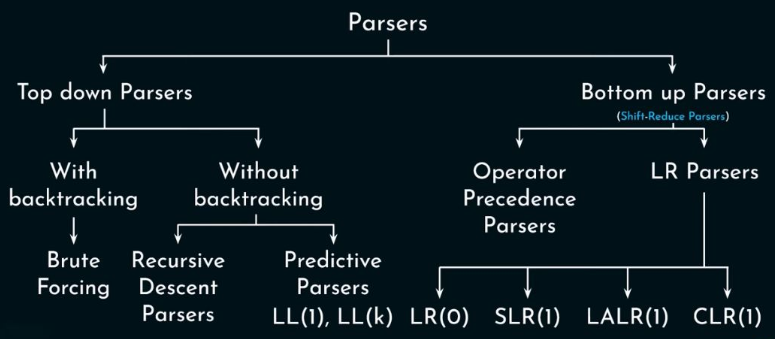  
Source : https://youtu.be/OIKL6wFjFOo?si=1JD7d0vdyh7BR5hA&t=775

- **Brute forcing** : We haven't covered this yet, but this approach is straightforward. The idea is, the parser will generate all the possible parse tree from a particular grammar. It then checks if any of the parse tree produce the same language as the input program.
- **Recursive Descent Parsers** : A top-down approach without [backtracking](/data-structures-and-algorithms/backtracking), where each non-terminal is associated with a recursive function that expands all production rule according to the next input token.
- **Predictive Parsers** : Uses a parsing table to consult what action to take next when constructing the parse tree.
- **LR** : A bottom-up parser, the LR(1) is the one that uses parse table.
- **SLR (Simple LR)** : Less powerful variant of LR parsing, where it uses a simplified parsing table, and will construct a parsing table with a smaller number of states compared to LR variants. SLR parsing tables are relatively easy to construct but may suffer from conflicts.
- **LALR (Look-Ahead LR)** : LALR(1) is more powerful than LR(0), but less than LR(1). It includes extra information about the grammar that makes it performs better than LR(0), but not as large as LR(1).
- **CLR (Canonical LR)** : CLR parsing tables are derived directly from the LR(1) parsing tables without any merging or simplification. This makes CLR the most powerful, but the parsing tables for CLR parsing can be larger, more complex, and often not used in practice.
