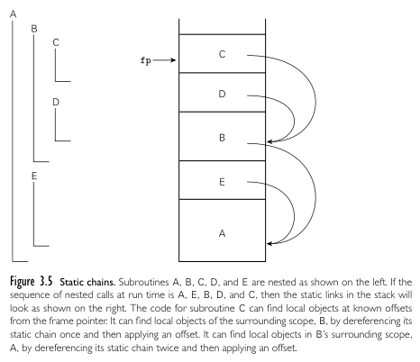

**Main Source :**

- **Book chapter 3**
- **[What are the differences between shallow binding deep binding and ad hoc binding - Quora](https://www.quora.com/What-are-the-differences-between-shallow-binding-deep-binding-and-ad-hoc-binding)**

Emphasized again, programming languages are made to enable programmer to create program for computer easily. One benefits of programming language is abstraction. It is the concept of hiding unnecessary details and focusing on essential concept.

Computer stores data in some memory cell referenced with memory address. When making program, obviously it will involve manipulating data. One abstraction regarding data is, the simplification of accessing them. Programmers don't need to know the memory address of certain data, they can instead use **variables** to represent data.

Variable in programming language are identifier that are associated with names. Names are made mnemonic and descriptive for ease of use. Not only variable, but names are associated with other abstraction, such as function, class in OOP, types, etc.

This topic discusses how names are identified, managed, and referenced in programming languages.

- **Names** : Refer to identifiers used to represent variables, functions, classes, modules, or other entities in a program.
- **Bindings** : Binding is the association of a name and the actual object it represents. Binding needs to be established so that names can be used interchangeably with the actual object. For example, a function may be associated with a memory address where it exists, so that the program could invoke or execute the function when needed.
- **Scopes** : Scope define the regions or portions of a program where names are valid and can be accessed. For example, in many programming languages, defining a variable inside a function would make it inaccessible outside it (the variable is local to the function).

:::tip
Although "object" have different meaning in OOP, they are typically used when referring to something that has a name.
:::

### Binding Time

Binding time refers to the time binding decisions are made. Binding decisions is not only associating names with memory addresses, but includes determining the types of variables, resolving references to external entities, and allocating resources.

Allocating resources is considered as a binding, because this involves binding particular memory, file handles, or network connections to a program that needs it.

Types of binding time :

- **Language design time** : This may include the decision from the language developer about variable scoping rules, type systems, etc.
- **Language implementation time** : Such as the development of compiler (e.g., how should it manages memory)
- **Program writing time** : The programmers creating variables or choosing certain algorithm or data structures.
- **Compile time** : Occur during compilation time, such as syntax analysis or type checking.
- **Link time** : Linking is the process of connecting external files or libraries to create an executable program. Binding decision in here may involve resolving references to external symbols or functions.
- **Load time** : Occur when the program is loaded into memory for execution. The operating system may handle activities such as dynamic memory allocation.
- **Runtime** : When the program is running, it may make dynamic memory allocations through mechanisms like `malloc()` or `new`.

### Object Lifetime & Storage Management

The lifecycle of object :

1. **Creation of objects**, involves allocating memory to store its data and initializing its state.
2. **Creation of bindings**, where names or identifiers are associated with the actual data.
3. **Usage**, actual usage when object are referenced in the program.
4. **Deactivation of bindings**, when binding becomes invalid, may occur when variable is out of scope.
5. **Destruction of bindings**, when binding is deactivated, any resources associated with the binding may be released or freed.
6. **Destruction of objects**, when the actual object is destructed and the system reclaim its memory.

We call the duration or existence of an object or a variable accessible within a program as its **lifetime**.

During its lifetime, there are three mechanisms to allocate storage for an object.

- **[Stack allocation](/operating-system/memory-management#stack-allocation)** : Memory is allocated in a [stack data structure](/data-structures-and-algorithms/stack). It is used for storing subroutines call as well as local variables within them. They are fast, efficient, and handled automatically (in a sense) by the compiler.
- **[Heap allocation](/operating-system/memory-management#dynamic-allocation)** : Also known as dynamic allocation, in which objects are allocated and deallocated at runtime. It is typically managed manually by programmers, although mechanism like [garbage collection](/operating-system/memory-management#automatic-memory-management) allows it to be automatic.
- **Static allocation** : Static allocation is used for objects with a fixed size and a lifetime that spans the entire program's execution. It could be variable placed in global scope (typically any region outside block or function) or initializing variable with `static` keyword in some programming languages. Object allocated statically has a fixed and reserved place in the program memory, making it accessible anywhere and anytime in the program.

### Scope Rules

Scope rules are the rules about visibility and accessibility of variables, functions, and other identifiers within a program. They determine where and for how long an identifier can be referenced or used.

#### Static Scope

We call the languages that determine scope of an identifier in compile-time based on the lexical structure of the program as **static scope** or **lexical scope**. Example of statically scoped languages are C, C++, Java, Python, and most programming languages in general.

For example, below are code taken from [Wikipedia](<https://en.wikipedia.org/wiki/Scope_(computer_science)#Lexical_scope>). The lexical structure of program refers to the arrangement of its code into blocks, functions, and other nested structures. Each block or function introduces a new scope.

```javascript
program A;
var I:integer;
    K:char;

    procedure B;
    var K:real;
        L:integer;

        procedure C;
        var M:real;
        begin
         (*scope A+B+C*)
        end;

     (*scope A+B*)
    end;

 (*scope A*)
end.
```

When a variable is declared within a block or subroutine, its scope is limited to that block or subroutine and any nested blocks or subroutines within it. When a variable is referenced within a nested subroutine, the compiler or interpreter first searches for its declaration within the nested subroutine's scope. If the variable is not found, it continues the search in the enclosing (parent) scope and proceeds up the lexical chain until the declaration is found or until the global scope is reached. The process of resolving variable binding (finding out which variable does a name belong to) in nested scopes is called **static chains**.

  
Source : Book page 120

When multiple declaration are found, the nearest declaration are typically bound, this is called the **nearest declaration rule**. We call a situation in which a variable declaration in an inner scope has the same name as a variable declared in an outer scope, temporarily hiding the outer binding as **shadowing**. When there is shadowing, we also say the scope has a **hole** in it.

:::info
Since static scope uses the program structure, it is generally required to declare variables before they are used. This is because static scoping relies on the program's structure and the location of variable declarations in the source code to determine the scope of variables.
:::

##### Declare vs Define

Some programming languages have a strict requirement for declaring entities before they are used. For example, languages like C and C++ require a **forward declaration** when forward referencing a function or a structure. The use of forward declaration is helpful for compiler when defining a recursive subroutine or types.

Declaration refers to the introduction of a name and its scope, while definition "defines" the actual thing that a name is bound to. For example, `int x;` is declaring a name `x` and associating it with `int` type within the current scope, while `int x = 42;` not only declaring but also specifying actual value and allocating memory for `x`.

:::info
Note that `int` is a primitive type, so memory allocation actually happens at declaration.
:::

When making a recursive type like a [linked list](/data-structures-and-algorithms/linked-list) in C, we will need to declare the type first before defining it.

```c
struct Node; // Declaration

struct Node { // Definition, it defines that struct Node has int data and another struct Node
    int data;
    struct Node; // Can't use if not declared
}
```

#### Dynamic Scope

On the other hand, **dynamic scope** language resolve variables binding at runtime. When a variable is referenced, the program searches for the most recent binding of the variable, starting from the current execution context and moving up the call stack.

The nature of binding resolution during runtime introduces challenges for compilers, where they analyze and translate source code with binding information resolved statically. Dynamically scoped language are typically interpreted, because they evaluate expressions and resolve variable bindings dynamically as the program runs. Example of dynamically scoped language are old languages like Lisp and APL.

For example, each recursive calls in a recursive function may introduce new bindings for variables. A compiler obviously cannot predict the number of recursive calls or the specific bindings that will be active at runtime. This is why interpreter is more suitable for dynamically scoped language as they execute program directly.

Dynamic scoping can make code harder to understand. This is especially for programmer used to static scoping language. When defining a variable like this :

```
x: Int

function f():
    x = 3

function g():
    x: Int = 5
    f()
```

We may expect that `x = 3` defines the declaration of global variable `x` outside the function. When `f` is not called from `main` but in another function like `g`, where it also defines another `x`, then `f` will instead modify `x` inside `g`. This occurs because the most recent binding is always the local variable.

One benefits of dynamic scope is that it allows us to temporarily change the behavior of code that uses some global variable.

```javascript
x: Int = 5

function print(x):
    print_console(x)

function changeX(x):
    x = 10

print(x) // Output: 5

block {
    changeX(10)
    print(x) // Output: 10
}

print(x) // Output: 5
```

`changeX` only change the `x` inside `block`.

:::info
In contrast, it is not necessary to declare variables before they are used in a dynamically scoped language, since the binding is resolved based on the current execution context (it could even be defined under a function definition).
:::

#### Deep & Shallow Binding

Deep and shallow binding refers to how objects are bound and applied with scope rules when they are referenced through subroutines like function. There are two ways of how it should be applied, when the subroutine is defined or when the subroutine is called.

We can illustrate through an example.

```javascript
function f1():
    x: Int = 1

    function f2():
        print(x)

    function f3(f):
        x: Int = 3
        f()

    f3(f2)
```

Function `f1` defines a local variable `x`, `f3` redefines `x` to be 3. `f3` also takes a function to be called after redefining `x`. `f2` will print the value of `x` that is expectedly defined outside it. When we call `f3` passing in function `f2`, there are two possibility.

1. Calling `f3` will change `x` definition to be 3, so `f2` will print the latest definition, which is 3.
2. Calling `f3` change `x` locally, so `f2` will print any value of `x` before it is defined, and that value is 1.

The first is true with **shallow binding**, in which the binding happens at final caller environment. The final environment is of course `f3`, where it defines `x` to be 3. The second is true with **deep binding**, in which the binding happens at the moment the function is defined. When `f2` is defined, the `x` it referenced to be printed is expected to be defined before it, and that is `x: Int = 1`.

:::info
Static scoped language generally uses deep binding, because by definition they need to bind object at compile-time, in which that is not possible with shallow binding, where binding happens at final environment.
:::

:::info
The ability for function to access variables that are defined outside its own scope is also known as **closure**. In other words, a closure is a function bundled together with its surrounding state (lexical environment) at the time of its creation.
:::

### Binding Within a Scope

Sometimes there can be multiple names (but different objects) in a single scope. Concepts that cause this includes aliases, overloading, and polymorphism.

- **Aliases** : Aliases is a situation where two or more names are used to access or refer to the same object or value in memory. Any modifications made to the object through one alias will be reflected when accessing the object through the other alias. This can happen through the use of reference. The resolution of aliases occurs at runtime and is handled by the underlying memory management and variable referencing mechanisms of the programming language.
- **Overloading** : The ability to define multiple functions or methods (or even operators) with the same name but different parameter lists or types. It is possible for user to add their definition of adding a string with an integer, although there are some languages that provide this as feature.
  The resolution of overloading functions depends on the arguments provided during function calls. Some languages determine this during compile-time, they are referred as **static overloading**, while deferring it until runtime when the actual function call is made is referred as **dynamic overloading**.
- **[Polymorphism](/computer-and-programming-fundamentals/object-oriented-programming#polymorphism)** : The ability of treating an object or function as multiple forms or types. There are several resolutions, some language resolve this by implicitly converting argument type to the parameter type (referred as **coercion** or implicit type convertion), some implement the object or function during runtime based on the actual type encountered ([dynamic polymorphism](/computer-and-programming-fundamentals/object-oriented-programming#polymorphism)), and others explicitly create a copy of the function during compile-time for each type and its implementation after performing type checking (referred as **generics**).
