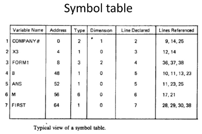
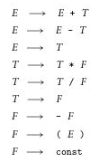
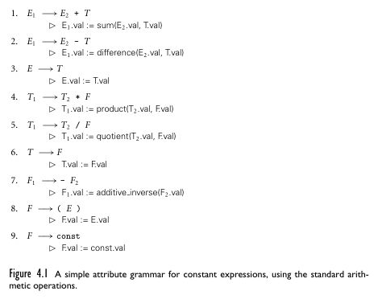
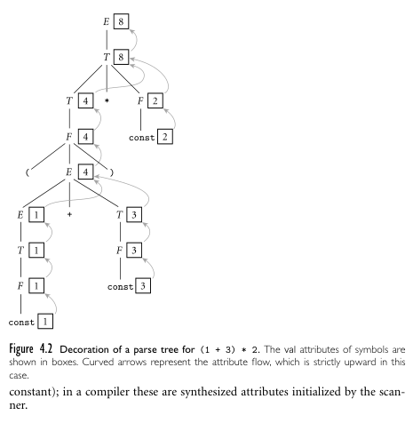
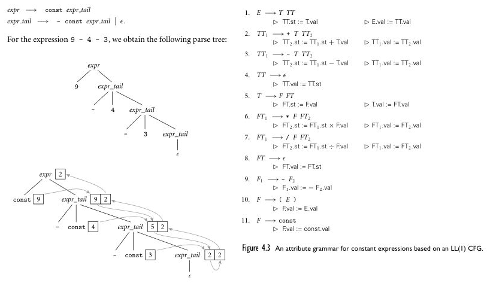
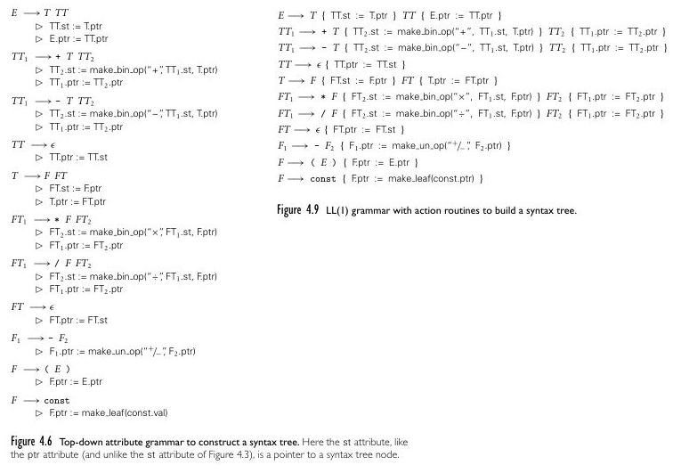
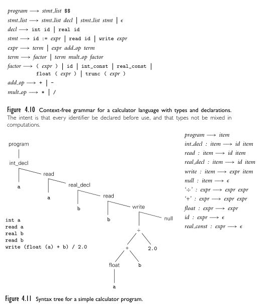
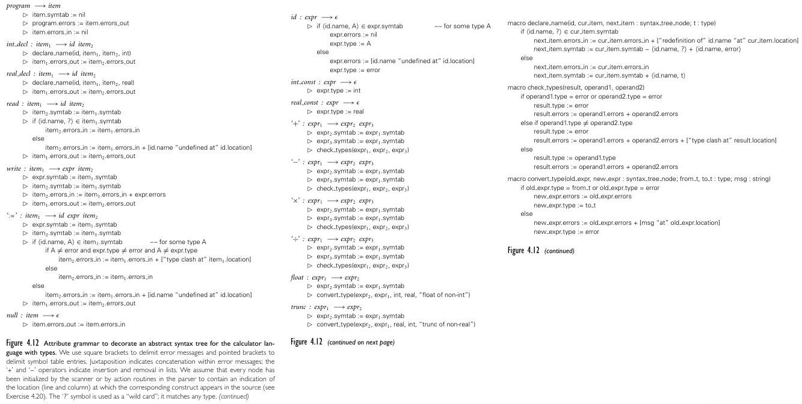

**Main Source :**

- **[Compilation - Part Three: Syntax Analysis - Computer Science](https://youtu.be/8nBoVjEOCMI?si=wnzyRj8DnkWHiebu)**
- **[Symbol table - Wikipedia](https://en.wikipedia.org/wiki/Symbol_table)**

### Role of Semantic Analysis

After a parse tree is constructed in the parsing step, the next step is to analyze the real meaning of the code.

:::tip
Sometimes semantic analysis takes the **abstract syntax tree (AST)** (also known as syntax tree) rather than parse tree (also known as concrete syntax tree). AST is simpler and more concise than a parse tree. It contains only the necessary information for code generation. It doesn't include grammatical information or unnecessary tokens like parentheses, because the tree structure is arranged in such a way that it preserves the same without these.

  
Source : https://ruslanspivak.com/lsbasi-part7/
:::

The output of semantic analysis is a decorated AST, where additional semantic information is attached to the nodes to provide sufficient detail for generating intermediate or machine code. Semantic analysis may also involve looking up or adding information to the symbol table. The **symbol table** is a data structure used to store information about identifiers (variables, functions, classes, etc.) encountered in the program. It keeps track of various attributes associated with each identifier, such as its name, type, scope, memory location, and other relevant information.

  
Source : https://www.slideshare.net/DrKuppusamyP/symbol-table-in-compiler-design

The symbol table is frequently accessed throughout the [lexical analysis step](/programming-language-theory/syntax) until optimization. One common implementation of symbol table is a [hash table](/data-structures-and-algorithms/hash-table).

Semantic analysis helps enforce programming language rules, which are typically specific to each language and cannot be captured in parse tree with context-free grammar alone. This process may involve type systems, checking if a keyword is reserved in the language, checking if an identifier has been declared before its use, etc.

Semantic analysis can be categorized into two based on when it applied : **static semantic analysis** and **dynamic semantic analysis**. The former occurs during compile-time and the latter occurs during runtime. Some error, such as the use of identifier without declaring it first can be known at compile-time, while error like division by zero that is based on input can't be guaranteed.

:::info
Although, some tools may do semantic analysis during the time programmer write code (we can say during compile-time) to catch trivial or potential error as well as enforcing certain rules such as coding guidelines. The tools that do this in a way that they predict the runtime behavior are known as **static analyzer**.
:::

### Attribute Grammars

Attribute grammars are formal methods for specifying semantics of programming languages to a formal language like [context-free grammar](/theory-of-computation-and-automata/context-free-grammar).

The production rule of context-free grammar are "decorated" with **attributes**, which are properties or values associated with the nodes (nonterminals and terminals) of the syntax tree. Attributes can represent various information such as types, values, or intermediate results of computations.

Below is an example of a grammar of arithmetic expressions in [LR](/programming-language-theory/parsing#bottom-up-parsing).

  
Source : Book page 166

:::tip
`E` : expression  
`T` : term  
`F` : factor
:::

And the attribute grammar for the given grammars.

  
Source : Book page 167

- Each symbol is numbered to be distinguished.
- Attribute grammar is written with equations that describe how can we describe the computation of attribute values. There are two types of attribute rules, **copy rules** and **semantic function**.
- Copy rules are attribute rule where one attribute is just a copy of another.
- Semantic function is a function that describe an attribute value is computed with input of another attribute values. It can be any arbitrarily function the language designer want, and we can associate each non-terminal with a value. For example the $E_1.\text{val}$ describe the value of $E_1$. The function $\text{sum}(x, y)$ may describe the sum of $x$ and $y$.
- The value $.\text{val}$ or function $\text{sum}(x, y)$ doesn't actually have meaning, they are not fixed or standardized, but rather a convention that language designer adopt for clarity.

### Attribute Evaluation

The next step is to decorate the parse tree by evaluating attributes. Attribute values are computed and passed from child nodes to parent nodes or from parent nodes to child nodes during the evaluation process. This is called **evaluation flow**.

#### Synthesizes Attributes

  
Source : Book page 169

For this particular example, the flow of evaluation is bottom-to-up. We call attribute that are computed and passed up the parse tree from child nodes to parent nodes as **synthesizes attributes**.

When all attributes are synthesizes, such as [our example above](#attribute-grammars), we call it **S-attributed**. The property of S-attributed is, left-hand side is always produced by the right-hand side. This is true for all attribute in the attribute grammar. This property makes each node in the decorated parse tree to obtain value from their child nodes, causing the tree to be evaluated bottom-to-up.

#### Inherited Attributes

The opposite, where information is allowed to pass from parent nodes or side nodes are called **inherited attributes**. Below is an example where bottom-up evaluation is not possible due to subtraction, in which its mathematical property is left-associative (i.e., have to be evaluated from left).

  
Source : Book page 169-171

From the left child of `expr` it is passed to its sibling node, namely `expr_tail` and so on until the bottom most node. Then, the result (2) goes back to the root.

When all attributes are evaluated from left-to-right like this example, it is called **L-attributed** grammar.

:::info
An attribute grammar is well-defined if it is unique and unambiguous. This means that each attribute is defined only once and has a clear meaning and computation rule associated with it. It never generates a cyclic parse tree; such a grammar is called **noncircular**.
:::

:::info
We call algorithm that transform a language into an equivalent representation in another language or formalism, such as through attribute evaluation a **translation scheme**.
:::

#### Attribute Evaluator

Just like parsing, there is automated tool that will generate a semantic analyzer from an attribute grammar, these are called **attribute evaluator**. The evaluator is typically associated with specific production rule of the attribute grammar. The associated rule of attribute grammar is called **action routine**. It is included in the parser, such as LL or LR. When the parser encounters a production rule while parsing the input, it may execute an action routine associated with that rule.

  
Source : Book page 176, 180

The left is the original grammar (top-down) and the right is the LL(1) grammar associated with the attribute grammar. For example, when it encounters a form like `E → T TT`, it will know that `TT.st := T.ptr`, and so on.

### Decorating Syntax Tree

Now, we can actually decorate the syntax tree with the attribute grammars. There are two ways for this, modifying the context-free grammar with semantic rules or making changes to syntax tree following a formalism called **tree grammar**.

  
Source : Book page 182, 183

The example is the upgraded [calculator language example](/programming-language-theory/parsing#recursive-descent-parser).

- The first approach in the top image modifies the CFG.
- The second approach in the bottom image uses tree grammar. A parse tree is first generated, then transformed into a syntax tree, followed by the decoration. Tree grammar is a form like `A : B → C B`. The `A : B` means that `A` is considered the part (or category) of `B`, and that `B` can be placed around `C`. For example, in `read : item → id item`, `read` is considered as an `item` and an `item` can be placed around `id`.

    
   Source : Book page 185-187

  The above image is the attribute grammar for the second approach (`symtab` may refer to symbol table). One thing to note is, it catches error by making a dummy type called `error`, which is associated with the error message in the symbol table.

:::info
**One-pass compilers** are compilers that perform all the compilation processes from lexical analysis to code generation in a single pass. Each step may be interleaved with another. For example, we may not need to generate a full syntax tree and instead perform semantic analysis directly while parsing. It can be more performant and save memory, but it can be harder to analyze based on just the parse tree.
:::
