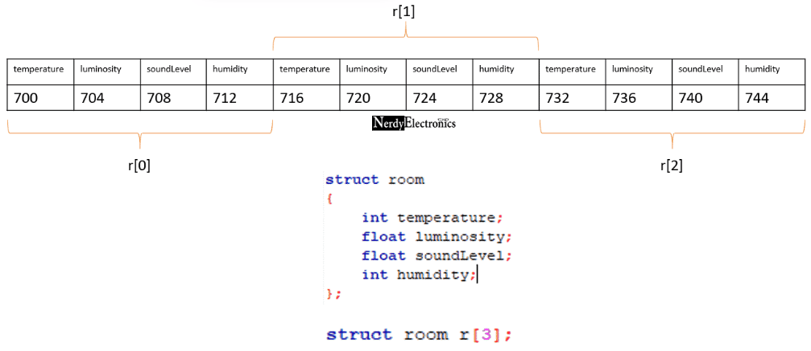
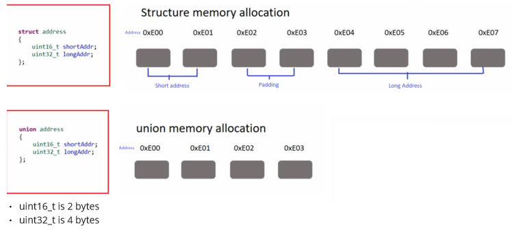

**Main Source :**

- **Book chapter 7**

Data type is a classification or categorization of data that determines the type of values that a variable can hold, the operations that can be performed on those values, and the way the values are represented in memory.

### Type Systems

Type system is a set of rules, constraints, and mechanisms in programming languages that define and enforce the types of values and expressions used in a program. It consists of :

- **Built-in types** (also called primitive or predefined types), common types include boolean, integer, char, float, double, etc. These are typically supported in hardware.
- **Mechanism to declare and define new types**.
- **Rules for type equivalence**, how to decide if one name is the same type of another name.
- **Type compatibility**, what operation can be performed on some types.
- **Type conversion**, a way to convert one type to another, explicitly or implicitly.
- **Type inference**, an optional feature to automatically deduces the types of expressions and variables without explicit type annotations.

With a type system, compilers determine the appropriate operation to perform on operands. For example, if `a` and `b` are integers, then `a + b` will result in an integer addition. If `b` is a floating-point number, the compiler checks whether addition between an integer and a floating-point number is allowed or defined by the user. If both answers are negative, the compiler may choose to throw an error or implicitly convert one type to another.

Some term about type system :

- **Strong typing vs weak typing** : A strongly typed language will never convert one type to another when the operation between them are not supported. Weak typed language may perform this if needed, which can potentially lead to unexpected errors.
- **Static typing vs dynamic typing** : A statically typed language does type checking at compile-time, which results in variable must be annotated by its type (expect if it has type inference) when declared. Dynamic typed is the opposite, it does type checking at runtime, and variable doesn't require explicit type annotation. By checking the type at runtime, a variable can hold different type of values during the execution of the program.

#### Polymorphism

[Polymorphism](/computer-and-programming-fundamentals/object-oriented-programming#polymorphism) allows for entities (variables, functions, etc.) to have multiple types or behave differently depending on the types of their arguments.

While polymorphism depends on type it operates on, it doesn't always imply type checking is done at runtime.

- A straightforward **ad-hoc polymorphism** like function/method overloading, in which multiple functions have the same name, but has different argument(s) or type of the argument(s). Compiler can distinguish between them by comparing the number of parameters or type of the parameters.
- **Subtype polymorphism** allows a subtype to be used where a supertype is expected. This may be encountered in [OOP](/computer-and-programming-fundamentals/object-oriented-programming) languages, where exists concept like inheritance that allows objects of different classes or types to be treated uniformly through common interfaces or base classes.
- A situation where single function or data structure can operate on values of different types, this is called **parametric polymorphism**. It may be explicit (often known as generics), where programmer specifies the function that can work on some types and another; or implicit (often known as type inference), where the compiler infer the type parameters it works on.

#### Classification of Types

- **Numeric Types** : Represent numerical values. They include integer types (such as int, long, short) for representing whole numbers, floating-point types (such as float, double) for representing decimal numbers, and sometimes additional types like byte, decimal, complex numbers.
- **Enumeration Types** : Enumeration types define a set of named values. They represent a finite set of distinct options or choices. Each value in an enumeration type is typically assigned an integer (called ordinal value) as an underlying representation. Enums provide a way to express a set of related constants and make the code more readable and expressive.

  For example, enum in C++ :

  ```cpp
  enum class Color { RED, GREEN, BLUE };
  Color myColor = Color::GREEN;

  // Using the enum values
  if (myColor == Color::RED)
      // ...
  ```

  Under the hood, integer comparison are going on.

- **Subranges Types** : Subrange types allow to define a subset of values within a range of values. For example, a subrange type `Age` may restrict values to be within a specific range, like 0 to 120. Pascal language is first to implement subrange type, for example, we can define : `type test_score = 0..100;`, restricting it to only be defined under the range of 0 to 100.
- **Composite Types** : Composite types are types that are composed of multiple values or subtypes. They are created with type constructor and used to represent structured or compound data. Examples of composite are arrays, lists, tuples, records, structs, classes, and objects. Composite types allow grouping related data together, making it easier to organize.

#### Orthogonality

Orthogonality is a characteristic of an entity having independent and non-overlapping features or dimensions. An orthogonal type system has independent type features that can be combined in many ways without restrictions or conflicts. In other word, changing feature A doesn't affect feature B. To achieve orthogonality, types need to be well-defined and clear meaning, without being ambiguous with others.

For example, a language can support variable being mutable or immutable and nullable or non-nullable.

```
mutable x: Int; // mutable variable, non-nullable
immutable x: Int; // mutable variable, non-nullable
mutable x?: Int; // mutable variable, nullable
immutable x?: Int; // mutable variable, nullable
```

We can say immutability is the orthogonal features of this language and the nullable types as the orthogonal feature of the type system.

### Type Checking

Type checking involves verifying that the types of operands in an operation or expression are compatible, converting between them if necessary, and determining a possibly new type after the operation.

#### Type Equivalence

Two types are considered equivalent according to structural equivalence and name equivalence.

- **Structural Equivalence** : Structural equivalence compares the structure of two types to determine if they have the same composition of fields, methods, and properties. It looks at the internal structure of types, disregarding their names or declarations.

  The compiler compares their order of declaration, formatting, and evaluate any expression.

  ```cpp
  // All these three are same.
  struct Person {
      int age;
      string name;
  };

  struct Person {
      string name;
      int age;
  };

  struct Person { int age; string name; };
  ```

  Another example is the subrange type : `type test_score = 0..100;` should be same as `type test_score = 0..10*10;` (10 times 10), but different with `type test_score = 0..99;`.

- **Name Equivalence** : Name equivalence compares types based on their names or declarations. It assumes that programmer that writes two types definition treat these types differently. If two types have the same name, they are considered equivalent regardless of their internal structure.

  A language is said to have **strict name equivalence** if aliased types are considered distinct from each other, otherwise, if they are considered equivalent, it is said to have **loose name equivalence**.

  :::tip
  Aliased types or type aliases allow programmer to create alternative names or aliases for existing types. We can define type alias like `using age = int` in C++. This defines a new type `age` that can be used just like a normal type, but it is actually just an `int`.
  :::

#### Type Conversion

Type conversion involves changing the type of a value from one data type to another, it can be done explicitly by the programmer (also called type cast), or implicitly by the compiler (also called type coercion).

There are three case in conversion :

1. In languages that use name equivalence, two types are considered the same if they have the same name, regardless of their structural differences. This means that if two types have different names but are structurally equivalent, they are considered interchangeable in terms of type conversions, because they have the same representation under the hood.
2. A potentially unsafe type checking that occurs during runtime, that is when two types are different, but they can be represented as other depending on the actual value in runtime. For example, two subrange types are different, but one subrange is just subrange of another.
3. Types have different low-level representation, but we can define conversion between them.

For example, integer (typically 4 bytes) is a whole number, while double type (typically 8 bytes) is an [IEEE floating-point representation](/computer-and-programming-fundamentals/floating-number#floating-number-representation) with 15 decimal points of precision.

If that integer were to be converted into double, then this would be no problem because double is essentially more precise than an integer. It would be only converting it into larger data types by adding more bit. This is also called **type promotion** or **widening conversion**. Type promotion is typically performed implicitly by the programming language without requiring explicit syntax or cast operators.

On the other hand, a double conversion into integer is called **type demotion** or **narrowing conversion**. Type demotion can result in potential data loss or truncation, as the value may not fit within the smaller type's range or precision. Therefore, type demotion usually requires explicit casting or conversion operations to indicate that the programmer is aware of the potential loss of information.

For example, converting an integer to a double is "as simple as adding .0" to the number (i.e., `5` becomes `5.0`). Conversely, converting a double to an integer involves removing the decimal point (i.e., `5.3` becomes `5`), which results in losing some information.

#### Type Compatibility

Type doesn't have to be same to be operated together. In other word, both operands must be at least compatible. The compatibility between types can be defined by the language or sometimes by the user. When it is defined by the language, the compiler can implicitly do the type conversion, this is known as **type coercion**.

Some coercion can be helpful or even lead to an unexpected behavior. For example, it may make sense to allow addition of a string with an integer, this will append the integer to the string. For example, `"a string" + 1 = "a string1"`.

:::info
In type coercion, the compiler typically prioritizes one conversion over another. For example, in an addition between an integer and a double, the compiler would convert the integer to a double instead of the opposite, in order to avoid information loss.
:::

Other coercion are :

- Integer to boolean : 0 is false, anything not 0 is true (C language)
- Truthy and falsy values : In Python, values such as non-zero numeric values, non-empty sequences (e.g., strings, lists, tuples), non-empty containers (e.g., dictionaries, sets) are considered as True.

We can define our own coercion by overloading operators or overloading the conversion itself. In C++ :

```cpp
class MyInt {
private:
    int value;
public:
    MyInt(int val) : value(val) {}

    operator int() const {
        return value;
    }

    MyInt operator+(const MyInt& other) const {
        return MyInt(value + other.value);
    }
};

int main() {
    MyInt myInt(42);
    int regularInt = myInt;  // Implicit conversion using the conversion operator
    // regularInt now holds the value of myInt

    return 0;
}
```

`MyInt` simply holds an `int`, but it cannot be coerced or operated with a normal `int`. To enable such operations, we overload the conversion operator to convert `MyInt` to an integer using `operator int()` (called automatically by the compiler), and we also overload the `+` operator to perform addition between two `MyInt` objects. Additionally, we can define other operations between a `MyInt` object and a regular integer or even other types.

#### Type Inference

Some expressions are straightforward to deduce the resulting type. Arithmetic operation typically yield the same type as the operands, comparison typically produces boolean, and assignment can be inferred based on the expression being assigned to it. For example, if right-hand side assignment is addition of integer and double, resulting type will be double (assuming integer is converted into double).

### Structs & Unions

Structs (also known as records) are used to define custom data types that encapsulate related data fields or members. A union is a special data type that allows different data types to be stored in the same memory location. This mean, union allocate memory that is shared among all its members. As a result, only one member of the union can be stored and accessed at a time. The union will accommodate size for the largest member within the union.

As seen before, the syntax of declaring a named struct (or union with `union` keyword instead of `struct`) in C++ is like :

```c
struct StructName {
    type1 member1;
    type2 member2;
    // ...
    typeN memberN;
};
```

In memory, struct will be stored in memory layout like below.

  
Source : https://nerdyelectronics.com/memory-layout-of-a-structure/

This is an array of `room` structs, each containing 2 ints and 2 floats, with each element having a size of 4 bytes. The fields of struct are stored next to each other in memory. Some structs may have larger size than they should be, due to [data alignment](/computer-organization-and-architecture/coa-fundamentals#padding) with padding.

Memory allocation of struct and union :

  
Source : https://fastbitlab.com/microcontroller-embedded-c-programming-lecture-157-unions/ (with modification)

### Arrays

### Strings

### Sets

### Pointers & Recursive Types

### Lists

### Files I/O

### Equality Testing & Assignment
