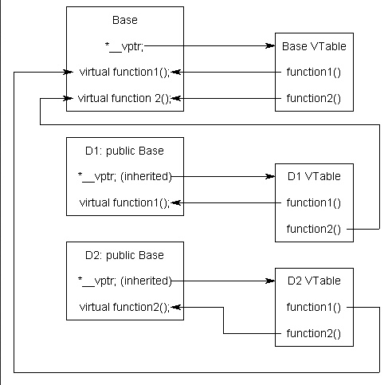
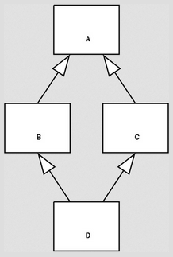

**Main Source :**

- **Book chapter 9**

**Data abstraction** is the concept of abstracting data types. For example, a data type could be made to store unique set of values. The idea is to make that data type abstract, defined through an interface, which will be concretely implemented. Concrete implementation could have various way to implement that data type with its own advantages and trade-offs. From a simple array that perform [linear search](/data-structures-and-algorithms/search#linear-search), using a [binary search tree](/data-structures-and-algorithms/tree#binary-search-tree), or a hash set, which is implemented using [hash function](/data-structures-and-algorithms/hash-table#hash-function) to produce unique code for each element.

In programming, module is a unit of code organization that groups related code together. It is typically used to abstract away the functionality of piece of code. In some languages, module is treated as a type and as a manager.

- Module-as-a-type, modules themselves can have defined attributes or fields, methods, and behavior.
- Module-as-a-manager, they act as a manager or controller for a set of related components or functionalities.

The idea of modules evolves into class and object in [OOP](/computer-and-programming-fundamentals/object-oriented-programming), which are added with more functionality such as inheritance and polymorphism.

:::tip
See [object-oriented programming](/computer-and-programming-fundamentals/object-oriented-programming#concepts) for OOP concepts.
:::

### Encapsulation & Inheritance

#### Modules

In older languages like Modula, Clu, and Euclid (they are called module-based language), the concept of a module is used for encapsulation, grouping related data and operations together. They also allow portions of the module to be designated as private or public. Modules are then exported and imported into separate files for actual use.

In modern languages, these have evolved into object and classes, namespaces, packages, or even just modules but with more modern features.

#### Classes

Classes are included with inheritance, allowing us to make new class that inherit the attributes and methods of another class. Inheritance will form a hierarchical structure and allows for the creation of specialized classes that inherit and build upon the functionality of more generic or abstract classes.

With inheritance being present, a new visibility modifier called `protected`, which is less restrictive than `private` but more restrictive than `public` modifier. It allows class members to be visible to the class and its descendants (subclasses). In language like Java, the `protected` keyword is extended such that class members can be visible within the entire package or namespace in which the class is declared.

Different language has different way of managing visibility. In C++, the rules for visibility modifier in inheritance as follows.

- **Public Inheritance** : When a derived class inherits publicly from a base class, public members of the base class remain public in the derived class, protected members of the base class become protected in the derived class, and private members of the base class are not accessible directly in the derived class.
- **Protected Inheritance** : In protected inheritance, public and protected members of the base class become protected in the derived class. Private members of the base class are not accessible directly in the derived class.
- **Private Inheritance** : With private inheritance, all members of the base class become private in the derived class. This means that public and protected members of the base class are not accessible outside the derived class.

Illustration :

```cpp
class Base {
public:
    int publicVar;     // Public member
protected:
    int protectedVar;  // Protected member
private:
    int privateVar;    // Private member
};

class DerivedPublic : public Base {
    // publicVar is still public in DerivedPublic
    // protectedVar becomes protected in DerivedPublic
    // privateVar is not directly accessible in DerivedPublic
};

class DerivedProtected : protected Base {
    // publicVar becomes protected in DerivedProtected
    // protectedVar becomes protected in DerivedProtected
    // privateVar is not directly accessible in DerivedProtected
};

class DerivedPrivate : private Base {
    // publicVar becomes private in DerivedPrivate
    // protectedVar becomes private in DerivedPrivate
    // privateVar is not directly accessible in DerivedPrivate
};
```

### Initialization & Finalization

#### Constructor & Destructor

In OOP, constructor is the mechanism to initialize object, that is to allocate memory, setting default values, or doing other initial setup. Constructor can have different names, takes the different number of arguments, and be in many forms. If using a constructor in derived class, the base class needs to be initialized as well. With constructor initializing object, there is also **destructors**, which is a method called when an object is destroyed.

It can be illustrated in C++ :

```cpp

class Base {
public:
    Base(int value) {} // constructor
    ~Base() {} // destructor
};

class Derived : public Base {
public:
    Derived(int derived_value) : Base(derived_value) {}
    ~Derived() {}
};
```

In C++, base class constructors are invoked before the derived class constructor, whereas destructors are called from the derived class to the base class. When a constructor is called on a derived class, the compiler traverses up the class hierarchy, invoking constructors from top to bottom, while the reverse order applies for destructors. It ensures that an object is properly initialized by initializing the highest-level object first, and it guarantees that objects are properly destroyed by destroying the lowest-level object first.

#### Initialization & Constructor

When initializing an object variable, we are implicitly calling the class constructor. For example, with an initialization of `foo a`, we are creating an object named `a` of type `foo` using the default constructor of the class `foo`. Because we are not giving arguments, the compiler will call constructor which doesn't take any argument. If we don't have the default constructor, the compiler will generate one for us, unless we have other constructor, then it will be a semantic error.

So, saying `foo a` is shorthand of `foo::foo()` (accessing the namespace with `foo::` then calling the constructor `foo()`). `foo a(2, 'c')` is shorthand of `foo::foo(int, char)`, the constructor for `foo` which takes `int` and `char`.

When we say `foo a(b)`, where `b` is another object of `foo`, we are invoking the copy constructor of the class `foo` to create a new object `b` by making a copy of `a`. The copy constructor is a special constructor that takes a reference to an object of the same class as its parameter. It is used to create a new object by copying the state of an existing object.

In contrast to default constructor, a copy constructor look like this :

```cpp
foo(const foo& other) {}
```

So, a `foo a(b)` is same as `foo::foo(foo&)`. This applies not only when the argument is of the same class foo but also when the argument is an object of another class that can be implicitly converted to foo or matches a constructor overload.

### Dynamic Method Binding

Inheritance allow for [subtype polymorphism](/programming-language-theory/data-types#polymorphism), in which we are able to use any method, either from superclass or subclass based on the type of object we are operating on.

```cpp
class Base {
public:
    virtual void someMethod() {
        std::cout << "Base" << '\n';
    }
};

class Derived : public Base {
public:
    void someMethod() override {
        std::cout << "Base" << '\n';
    }
};

int main() {
    Base* obj = new Derived();  // Pointer of type base class pointing to derived class object
    obj->someMethod();  // Calls the overridden method in the derived class
    delete obj;
    return 0;
}
```

In this C++ code, we are making a pointer of type base class, but it actually points to a subclass `Derived`. This is possible since `Derived` is just the subclass of `Base` As a result, calling `someMethod` on `obj` would call `someMethod` inside `Derived`.

Dynamic method binding is made possible in C++ through `virtual` keyword. `virtual` denotes a method that can be overridden by derived classes (where the most derived class overriding is chosen) and a dynamic dispatch should be used to determine the appropriate implementation at runtime. The `override` denotes a method is overriding a method of subclass (although it is not required, just for readability).

Under the hood, the compiler is making a **virtual table (vtable)** to keep track method binding for each class.

  
Source : https://www.learncpp.com/cpp-tutorial/the-virtual-table/

Essentially, it's an array of function pointers where each entry corresponds to a virtual function in the class. The vtable is generated at compile-time, storing the addresses of the actual function implementations for each virtual function. The compiler also generates a hidden pointer field in the class that points to the address of the table. A separate table and inherited pointer will be created for derived class.

#### Abstract Class

With `virtual` keyword, we can also make a class abstract, meaning it can't be instantiated directly and is designed to be used as a base class for concrete classes. A class is abstract when there is at least one abstract method. In C++, making a class abstract is done by assigning any method to 0 like `virtual void pureVirtualFunction() = 0`.

In language like Java and C#, marking a class as abstract is simpler, it is done by labeling the class and method with `abstract` keyword.

#### Multiple Inheritance

Multiple inheritance is known to cause a problem called **diamond problem**. It is an ambiguity that arise when two base classes of a derived class share a common base class, and they both override a common method or field.

  
Source : https://en.wikipedia.org/wiki/Multiple_inheritance

C++ mitigate this issue by virtual inheritance.

```cpp
class BaseClass {
};

class DerivedClass1 : public virtual BaseClass {
};

class DerivedClass2 : public virtual BaseClass {
};

class Diamond : public DerivedClass1, public DerivedClass2 {
};
```

In this example, both `DerivedClass1` and `DerivedClass2` inherit virtually from `BaseClass` using the virtual keyword. Using this, a shared base class for both class is constructed only once to avoid duplicate member issues.

Then, `Diamond` inherits from both `DerivedClass1` and `DerivedClass2`. With virtual inheritance, there is only one instance of `BaseClass` in `Diamond`, preventing the diamond problem.
