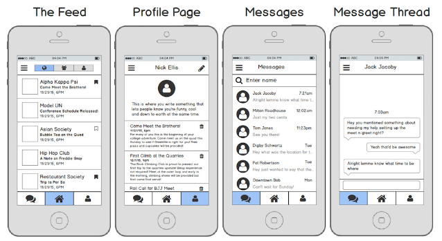
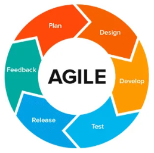
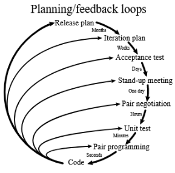
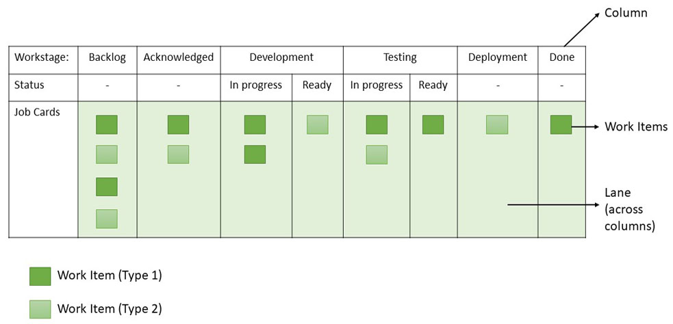
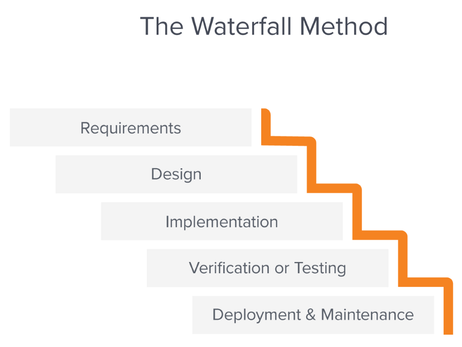
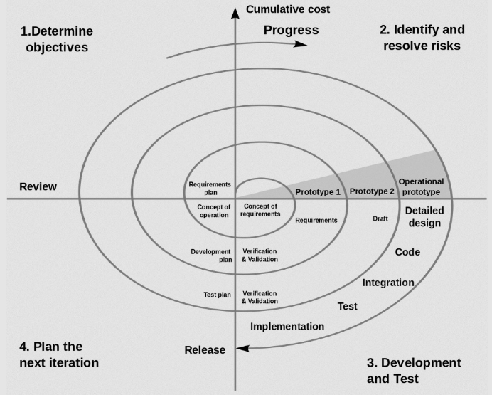

**Main Source:**

- **[Software development process — Wikipedia](https://en.wikipedia.org/wiki/Software_development_process)**
- **[Agile software development — Wikipedia](https://en.wikipedia.org/wiki/Agile_software_development)**

**Software process** is a series of activities or tasks that is followed to create a software. The general process includes:

1. Gathering information on the requirement of the software.
2. Design the architecture, component, and interface. Architecture represents the overall design of software, component design involve designing how will a component operate, and interface design specify how each component interact with each other.
3. Implement the architecture by writing the actual code, following specific coding standards.
4. Testing and verifying that software runs correctly. Broadly speaking, testing can be categorized into three types: individual component testing, system testing where all components are tested together, and a final test to determine if the software meets the specified requirements.
5. Installing, setting up, and configuring the software on targeted hardware.
6. Update the software by introducing new feature or fixing bug based on user feedbacks.

### Prototyping

A prototype is an early sample of a product, specifically designed to test or obtain feedback. Prototyping a software means developing a functioning model of a software system to demonstrate the system's potential functionality.

  
Source: https://smartlogic.io/blog/startup-advice-dont-waste-money-on-an-expensive-prototype/

For example, when making an app, the first priority might be on ensuring the primary functionality of the application to functions properly. In a social media app, we can develop basic user interface or use fake data and profile pictures rather than investing significant effort in creating a visually appealing user interface. The primary focus of such a prototype is to demonstrate the core features and interactions of the app rather than the aesthetics.

Prototyping can be beneficial in software development process, as it can save time and effort in gathering and curating real user data for the prototype.

### Software Methodologies

**Software Methodologies** are specific approaches or frameworks that defines software process.

#### Agile

Agile is a group or framework of iterative approach to software development that emphasizes collaboration, adaptability, and continuous improvement.

  
Source: https://medium.com/@temitopeolanipekun12/what-is-agile-methodology-713c9e29361a

Agile projects are divided into small, time-boxed iterations called **sprints**. Each sprint typically lasts from one to four weeks and results in a potentially shippable increment of the software. This iterative approach allows for frequent feedback and the ability to adapt and adjust based on changing requirements.

- **Planning**: Define the overall project goals, scope, and initial requirements. In agile, we can list the functionality requirement of a product based on their priority. This is called **product backlogs**.
- **Design**: Design decisions are made during each sprint or iteration throughout development, rather than developing all design elements upfront. This allows for flexibility and responsiveness to changes and feedback.
- **Development**: The agile team select a set of user stories from the product backlog and develop the corresponding functionality.

  A **user story** is a way to describe how should a software function in the perspective of user. For example, a user story for an e-commerce website could be: "As a customer, I want to be able to add items to my shopping cart, so that I can easily keep track of the products I want to purchase."  
   This is not an actual feedback from user, but rather a simple and concise way to describe the desired functionality or behavior of the software system.

- **Testing**: [Software testing](/software-engineering/software-testing) is performed in each sprint or iteration, this is called **continuous testing**. User stories in agile are typically accompanied by acceptance criteria. **Acceptance testing** is a type of testing to determine whether a software system meets the specified acceptance criteria.
- **Release**: Agile promotes frequent and incremental releases. At the end of each sprint, a potentially shippable product increment is produced.
- **Feedback**: Feedback is collected from stakeholders, users, and customers during various stages of the process, including sprint reviews and demonstrations. Feedback is used to validate assumptions, refine requirements, and guide future iterations.

There are several examples of agile development:

- **Scrum**: Scrum is the implementation of agile methodology that focuses on incremental changes. It involves previously talked elements like product backlog, sprint, and **daily scrum**. Daily scrum is a short daily meeting where the development team synchronizes and plans their work. It is an opportunity to discuss progress, identify obstacles or blockers, and plan for the day's activities.
- **Extreme Programming (XP)**: XP is an agile methodology that emphasizes close collaboration between the development team and the customer or product owner. It promotes frequent and small releases of software. One common practice in XP is **pair programming**, in which two developers working together on the same codebase, with one actively writing code and the other reviewing and providing immediate feedback. This promotes knowledge sharing and reduces defects.

    
   Source: https://en.wikipedia.org/wiki/Extreme_programming

- **Lean**: Lean is a principles and practices derived from Lean manufacturing, which focus on maximizing customer value while minimizing waste. Customer value is the perceived worth or benefit that a customer receives from a product. In software, maximizing customer value could be prioritizing features and functionalities that provide the most value to the end-users.

  On the other hand, waste refers to any activity or process that does not add value to the software product. These can be unnecessary documentation, waiting time, defects, and overproduction of features that occurs during software engineering process.

- **Kanban**: Kanban is an agile methodology that helps to manage the development of software by visualizing it in a Kanban board. Kanban board represent a workflow of progress of work items. The board consists of columns that represent different stages of the development process, such as "To Do," "In Progress," "Testing," and "Done." Work items, which represent the actual work represented by cards or sticky notes, are moved across the board as they progress through the workflow.

    
   Source: https://www.geeksforgeeks.org/kanban-agile-methodology/

#### Waterfall

Waterfall model is a sequential development approach, where each phase of the project is completed before moving on to the next one. The methodology is called "waterfall" because progress flows steadily downwards, similar to a waterfall.

  
Source: https://business.adobe.com/blog/basics/waterfall

It starts from identifying what the requirements are, designing the system, implementing the system in code, verify and test the software, and deploy as well as maintain the software.

#### Spiral

Spiral is an iterative software development methodology that combines elements of both waterfall and iterative approaches. A complete iteration of the software development process is represented as a cycle of the spiral.

  
Source: https://en.wikipedia.org/wiki/Software_development_process#/media/File:Spiral_model_(Boehm,_1988).svg

A cycle is divided into four phases:

1. **Planning**: This phase involves gathering requirements, defining the project objectives, and constraints.
2. **Risk Analysis**: In this phase, risks are assessed and analyzed. The identified risks are evaluated based on their potential impact on the project and the likelihood of occurrence. Strategies and mitigation plans are developed to address the identified risks.
3. **Development**: Focuses on the actual development and implementation of the software. It includes activities such as designing the system architecture, developing the software components, and thorough testing to ensure quality and functionality.
4. **Evaluation**: The evaluation phase involves reviewing and assessing the progress made. Based on this evaluation, decisions are made regarding the next steps, such as making adjustments.

### Software Planning

Making a software project can be overwhelming if we don't have the plan. It is easy to be distracted by the amount of work we have to do. Here are some tips to plan and build a program:

1. [System Design](/software-engineering/system-design): System design is the process of designing architecture and all related component to build a software system. It is a very good practice to always sketch the system first, at least get a high-level view on how the system will look like.

   A system design involves:

   - **Requirements Gathering**: To know what should we build, we need to know what our requirements are. Requirement can be categorized into two, functional and non-functional. Functional requirements are the specific features and functionalities that the software should provide. Non-functional requirements, on the other hand, specify the qualities or characteristics of the software, such as performance, security, and usability.

     The functional requirements for a streaming platform include enabling users to broadcast videos to the server and allowing other users to receive the broadcasts to watch them. The non-functional requirement would be designing the app to be scalable with thousands of traffic around the world. The app should be able to handle such workload and keep functioning.

     In this step we may also choose our tech stack, including what programming languages, library, framework, or cloud services that suit our needs.

   - **High-level Design**: After knowing what is required to build the software, we can start designing the system in high-level. This involves making a design that outlines the architecture and structure of the software. We could make [various diagram](/software-engineering/diagrams) that represent how each component interact or determining how should we store the data.

   - **More Detailed Design**: Then, we can create a more detailed design that provides a deeper understanding of the internal components, modules, and implementation details of the software application. We can imagine how would the component works or what algorithm it would use.

   - **Core Design**: Core design focuses on designing the central and critical components of the software system. In the case of creating a video streaming app, we can focus on designing how users can broadcast their videos, how the server receives them, and how it simultaneously sends the content to all viewers. We can ignore other non-essential components such as user authentication.

   - **Scale**: After everything is evaluated, we can now focus on how to scale and maintain the system. We should identify which component would most likely be causing performance bottlenecks or limiting the system's scalability. Let's say our streaming app is targeting the international market, which mean anyone around the world would use it. We can choose to distribute server instances, so that users can have low-latency access to the streaming content, regardless of their geographical location.

2. **Start Development**: Begin the actual development by following the design.
3. **Incremental & MVP**: It is a good practice to build the software incrementally, meaning that we develop the software in small increments, each providing a valuable and functional piece of the system. We start breaking down the system into smaller component to help us manage the development process.

   We should identify the MVP (Minimum Viable Product), which represents the smallest set of features that provides value. We don't need to be bothered by advanced authentication system, recommendation algorithms, or social features. Perhaps we don't need to integrate Google or Facebook authentication, we can use a simple username and password for the time being.

   In the case of video streaming:

   1. The initial step would be establishing a connection between the client app and the server by sending a basic text message.
   2. The next step would be to enhance it to transmit an actual video.
   3. Progress would continue gradually, allow multiple clients to connect to the server and send text messages concurrently. The server should be capable of broadcasting messages to all connected clients concurrently.
   4. The text message would be upgraded to a real-time video stream, ensure that all clients receive the stream correctly.
   5. Create a video player capable of running the stream.

4. **Testing**: Write [automated tests](/software-engineering/software-testing#automated) to verify the software and to prevent functionality from becoming incorrect when code is modified.
5. **Keep Going**: After creating the minimum viable product and testing it, we should identify any problems or areas for improvement. We can create a list of TODOs that may include bug fixes, new features, corrections, etc. We can prioritize each task on the To-do list and determine the next steps accordingly. If the bug significantly affect the app, we can fix them. If working on a new feature, we can start again the process from step 1 by creating the high-level design of the new feature, developing it incrementally, and targeting the MVP, and so on going iteratively.
