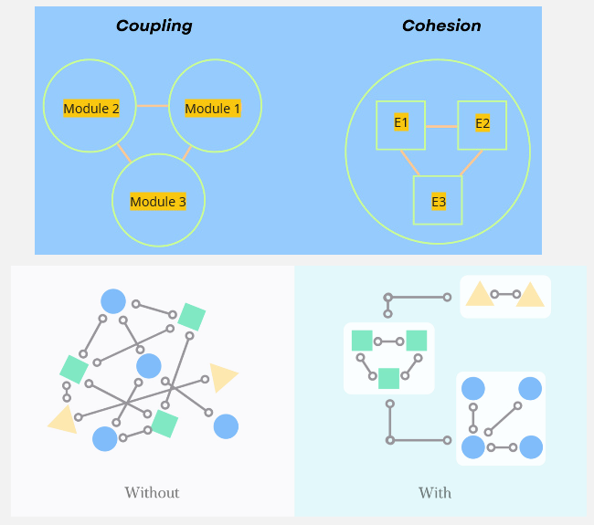
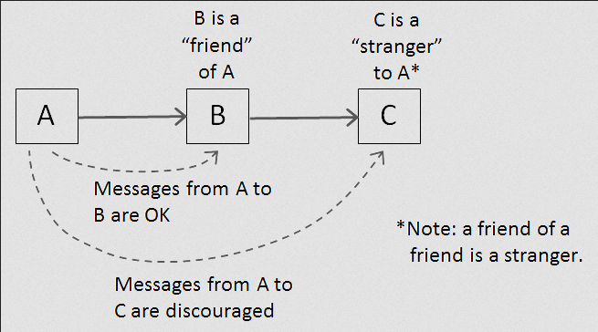

**Main Source :**

- **Various Google searches**
- **[Don't repeat yourself - Wikipedia](https://en.wikipedia.org/wiki/Don%27t_repeat_yourself)**
- **[KISS principle - Wikipedia](https://en.wikipedia.org/wiki/KISS_principle)**
- **[You aren't gonna need it - Wikipedia](https://en.wikipedia.org/wiki/You_aren%27t_gonna_need_it)**
- **[Law of Demeter - Wikipedia](https://en.wikipedia.org/wiki/Law_of_Demeter)**
- **[Separation of concerns - Wikipedia](https://en.wikipedia.org/wiki/Separation_of_concerns)**

**Software Principles** are collection of guidelines, styles, tips, good practices, by various software and engineers to help to guide the process of developing a good software. By good software, it means they are reliable, maintainable, scalable, and many more listed in [software characteristics](/software-engineering#software-characteristics).

### OOP

[Object-Oriented Programming (OOP)](/computer-and-programming-fundamentals/object-oriented-programming) is a common paradigm used in the world of software engineering. The elements of OOP such as classes, objects, inheritance, polymorphism, encapsulation, and many more promotes code organization, reusability, and modularity in a software system. These elements serve as the foundation of other software principle that we will see later.

We will see an example that demonstrate the benefits OOP about code reusing (in [Kotlin programming language](https://kotlinlang.org)).

Non-OOP approach :

```kotlin
val employee1Name = "John Doe"
val employee1Age = 30
val employee1Department = "Sales"

val employee2Name = "Jane Smith"
val employee2Age = 35
val employee2Department = "Marketing"

fun introduceEmployee(name: String, age: Int, department: String) {
    println("Hello, my name is $name. I am $age years old and work in the $department department.")
}

introduceEmployee(employee1Name, employee1Age, employee1Department)
introduceEmployee(employee2Name, employee2Age, employee2Department)
```

OOP approach :

```kotlin
class Employee(val name: String, val age: Int, val department: String) {
    fun introduce() {
        println("Hello, my name is $name. I am $age years old and work in the $department department.")
    }
}

val employee1 = Employee("John Doe", 30, "Sales")
val employee2 = Employee("Jane Smith", 35, "Marketing")

employee1.introduce()
employee2.introduce()
```

The code is about storing employee's data and have a function that can introduce them. The Non-OOP approach require us to make a bunch of variable just to store the data, while in OOP approach, we can make a class and represent the employee as an `Employee` object. Class and objects provides a structured and organized way to encapsulate related data and behavior, leading to more maintainable code.

### DRY

**DRY (Don't Repeat Yourself)** is a software development principle that promotes code reuse and avoids duplication. The DRY principle is stated as "Every piece of knowledge must have a single, unambiguous, authoritative representation within a system".

When code is repeated in multiple places, it becomes harder to update or modify because changes need to be made in multiple locations, increasing the chances of introducing bugs and inconsistencies. When a change is required, it only needs to be made in one place, making maintenance and updates more efficient and less error-prone.

Non-DRY approach :

```kotlin
fun main() {
    println("Hello, Alice!")
    println("Hello, Bob!")
    println("Hello, Charlie!")
}
```

DRY approach :

```kotlin
fun greet(name: String) {
    println("Hello, $name!")
}

fun main() {
    val names = listOf("Alice", "Bob", "Charlie")
    for (name in names) {
        greet(name)
    }
}
```

The code is about storing names and having a function to greet them. Non-DRY approach manually call `println` thrice with the name data. If we somehow wanted to change the greet message, we will need to modify all the three line of code. The DRY approach helps us to avoid printing the greeting message by putting it all in one function, and then integrate it with a for loop.

The previous OOP example also follows this DRY principle.

### KISS

**KISS (Keep It Simple, Stupid)** is a software development principle that promotes emphasizes the importance of simplicity. The principle suggests that systems and code should be kept as simple as possible, avoiding unnecessary complexity.

An example of unnecessary abstracted code :

```kotlin
class Parity(val num: Int) {
    var isEven = false

    fun updateIsEven() {
        if (decideIsEven(num)) {
            numIsEven()
        } else {
            numIsNotEven()
        }
    }

    fun numIsEven() {
        isEven = true
    }

    fun numIsNotEven() {
        isEven = false
    }

    fun decideIsEven(n: Int): Boolean {
        if (n % 2 == 0) {
            return true
        } else {
            return false
        }
    }

    fun getIsEven(): Boolean {
        return isEven
    }
}

fun main() {
    val parity = Parity(3)
    parity.updateIsEven()
    println("Is 3 even?: ${parity.getIsEven()}")
}
```

This code creates a class that is supposed to handle the parity of a number. The purpose of introducing a class in this code is to create an abstraction, this way the function caller doesn't need to handle the parity logic. In reality, the handling of parity is actually very simple and doesn't need to be overly abstracted like above. The checks for `num % 2 == 0` to determine if a number is even is a relatively well-known concept.

We don't need to make function for every single expression we are executing. Making a function just to set a field variable is unnecessary. Making a getter to get the `isEven` variable is also not needed, because in Kotlin properties can have implicit getters generated automatically.

### YAGNI

**YAGNI (You Ain't Gonna Need It)** principle suggests developers should avoid adding functionality until it is necessary. It is typically associated with [agile development methodology](/software-engineering/software-process#agile), where the development style revolve around quick incremental software development.

Its main idea is to focus on delivering the minimum viable product (MVP) or the necessary features to meet the immediate requirements, rather than adding functionality that may or may not be needed in the future.

There are some factors to consider when developing functionality :

- **Development Costs** : Resources required to build the software, such as developers' salaries, project management expenses, software licenses, development tools, and infrastructure costs.
- **Maintenance and Repair Costs** : There is a potential that the functionality may need bug fixes, updates, security patches, or technical support.

Unnecessary development sacrifice time and effort for future development and maintenance, possibly introducing **technical debt**. Technical debt is a consequence of software development bad decisions that keep accumulating costs and challenges as the software evolves, similar to financial debt that accumulates interest over time.

### Coupling & Cohesion

Both describe the relationship and dependency between software components. **Coupling** refers to the inter-component interaction, while **cohesion** refers to the intra-component interaction.

Cohesion is the degree to which elements within a component or module are related and work together to accomplish a single, well-defined purpose.

- **High Cohesion** : High cohesion indicates that the elements within a component are closely related and focused on a specific functionality or responsibility. A highly cohesive component performs a single task or represents a cohesive set of related tasks, making it easier to understand, reuse, and maintain.
- **Low Cohesion** : Low cohesion occurs when a component has multiple unrelated responsibilities or tasks. This can lead to a component that is difficult to understand, modify, and test. Low cohesion may also result in code duplication and reduced reusability.

On the other hand, coupling describe the interaction between modules.

- **Loose Coupling** : In a loosely coupled system, components are independent and interact through well-defined interfaces. Loose coupling principle encourages components to have minimal dependencies on each other. Changes to one component have minimal impact on other components, making the system more flexible, modular, and easier to maintain.
- **Tight Coupling** : Tight coupling occurs when components have strong dependencies and rely heavily on each other's internal details or implementation. In a tightly coupled system, changes in one component may require corresponding changes in multiple other components. This can lead to code that is harder to modify, test, and maintain.

  
Source : [top](https://www.boardinfinity.com/blog/cohesion/), [down](https://www.engati.com/glossary/cohesion-and-coupling)

Below are code that demonstrate cohesion and coupling.

**Low Cohesion :**

```kotlin
class Customer {
    fun calculateOrderTotal(order: Order) {}
    fun sendOrderConfirmationEmail(order: Order) {}
    fun updateCustomerInformation(customerData: CustomerData) {}
}
```

**High Cohesion :**

```kotlin
class OrderProcessor {
    fun processOrder(order: Order) {
        validateOrder(order)
        calculateOrderTotal(order)
        updateInventory(order)
        notifyCustomer(order)
    }
    private fun validateOrder(order: Order) {}
    private fun calculateOrderTotal(order: Order) {}
    private fun updateInventory(order: Order) {}
    private fun notifyCustomer(order: Order) {}
}
```

The class in low cohesion code have their own responsibility within the class. On the other hand, the high cohesion code focuses on the `processOrder` method, where it calls the other private method.

The high cohesion code may be preferable as it makes the caller easier to interact with the class. The caller can just call the method `processOrder` passing in an `Order` to process it. In contrast, in the low cohesion code, caller requires an understanding of how `Customer` class process order. (i.e., should we call `sendOrderConfirmationEmail` or `updateCustomerInformation` first?)

:::info
We typically call component that invokes or calls a function or method **caller**, while the one that is being invoked or called is called **callee**.
:::

**Tight Coupling :**

```kotlin
class UserService {
    private val userRepository = UserRepository()

    fun getUserById(userId: String): User {
        return userRepository.getUserById(userId)
    }

    fun saveUser(user: User) {
        userRepository.saveUser(user)
    }
}

class UserRepository {
    fun getUserById(userId: String): User {}
    fun saveUser(user: User) {}
}
```

**Loose Coupling :**

```kotlin
interface UserRepository {
    fun getUserById(userId: String): User
    fun saveUser(user: User)
}

class UserService(private val userRepository: UserRepository) {
    fun getUserById(userId: String): User {
        return userRepository.getUserById(userId)
    }

    fun saveUser(user: User) {
        userRepository.saveUser(user)
    }
}
```

The `UserService` class in tight coupling code depends a lot on `UserRepository` class. By depend, it means that the class really need to suit their method and the way of how it operates based on the class it depends on. If somehow we want to change the behavior of `UserRepository`, we will need to change the `UserService` as well. Tight coupling decrease flexibility and maintainability.

On the other hand, the loose coupling code introduce an interface, which allows for different implementation of `UserRepository` to be provided for `UserService` class. The `UserService` depend on the interface, and the implementor adhere to it. A modification to `UserRepository` behavior doesn't require us to modify many things, this is because they are based on the interface contract.

The contract is nothing but a specification that the method `getUserById` must take a `userId` of type `String` and return an object `User`, similar to the `saveUser` method. This allows us to create a variety of class that may have different way of processing the data internally.

### Law of Demeter (LoD)

**LoD (Law of Demeter)** is a design principle that promotes loose coupling and encapsulation in [object-oriented programming](/computer-and-programming-fundamentals/object-oriented-programming). The principle states that an object should have limited knowledge about other objects and should only interact with its immediate neighbors.

There are three principles of LoD, based on [Wikipedia](https://en.wikipedia.org/wiki/Law_of_Demeter) :

- Each unit should have only limited knowledge about other units: only units "closely" related to the current unit.
- Each unit should only talk to its friends; don't talk to strangers.
- Only talk to your immediate friends.

An object could have dependency to other object, meaning it relies on another object to fulfill certain tasks or provide specific functionality. We call the object that it depends on a **friend** or **neighbor**.

The principle states that an object should have limited knowledge about its friend. One of the benefits of an object with limited knowledge about its companion can be seen in the case of designing a public API. A random person using your API shouldn't need to understand the inner working of your API too much, because that is the point of API, to provide a high level of abstraction.

  
Source : https://blog.knoldus.com/the-law-of-demeter/

Let's say we are making an API that lets user (developer) to store book name data.

```kotlin
val dm = DataManager()
dm.saveData("Software Engineering 9th Edition by Ian Sommerville")
```

We can save data by just calling `saveData` method. Now under the hood, the API may use SQLite database to actually store the data.

```kotlin
class DataManager(private val databaseManager: DatabaseManager) {
    fun saveData(data: String) {
        // preprocess the data...
        databaseManager.saveToDB(data)
    }
}

class DatabaseManager(private val db: SQLite) {
    fun saveToDB(data: String) {
        db.initialize()
        db.syncWithRemoteServer()
        // other database setup here...
        db.save(data)
    }
}
```

The point of this API is to abstract away the process of saving data to database. `DataManager` is responsible for handling data, including preprocessing it and saving it to the database. The process of saving to database is abstracted again by `DatabaseManager`, it doesn't even know which database it is interacting to. Finally, the `DatabaseManager` choose `SQLite` as its database, and it contains the actual code that interact with database.

The application of LoD principle in this example can be seen in the `DataManager` class. It considers `SQLite` as a stranger, and they don't interact directly. They don't even know each other detail, `DataManager` is not responsible for instantiating the database.

### Separation of Concerns (SoC)

**Separation of Concerns (SoC)** is a principle for dividing a complex system into distinct and independent parts, where each part addresses a specific concern or responsibility.

**Concern** is a specific aspect or responsibility of a software system. It represents a distinct functionality or set of related behaviors that can be identified and separated from other parts of the system. For example, in a web application, concerns could include user authentication, database access, business logic, user interface rendering, logging, and error handling. These are general concern, concern can be as specific as "the name of which class to instantiate".

In SoC, a software system should be divided into modules or components, and each module should be responsible for a single concern or functionality. In the example of Law of Demeter, `DataManager` chose to not handle database connection. It instead communicates with an intermediary, which is `DatabaseManager`. The example demonstrates separation of concerns, where we delegate the database related task to class that is supposed to handle these.

SoC allows for code to be modular. If `DataManager` were to communicate directly with `SQLite` database, then if there exist another class that interact with database, we would need to repeat the similar code (i.e., setting up the database). Modularity allows for code reuse, as individual modules can be used in different contexts or projects.

### Dependency Injection

**Dependency Injection (DI)** is a technique used to achieve loose coupling and modularity in software engineering. If an object depends on another object, the object must be "injected" into the class rather than the class creating them internally.

Dependency injection is typically done through interface and provided via constructor. To demonstrate, consider this example.

Without DI :

```kotlin
// Service interface
interface MessageService {
    fun getMessage(): String
    fun isMessageAvailable(): Boolean
}

// Implementation of MessageService
class EmailService : MessageService {
    override fun getMessage(): String {
        return "Email message"
    }

    override fun isMessageAvailable(): String {
        return true // for simplicity, let's say message is always available
    }
}

// Class that directly creates an instance of EmailService
class MessageBroadcaster {
    private val messageService: MessageService = EmailService()

    fun broadcast() {
        while (messageService.isMessageAvailable()) {
            val message = messageService.getMessage()
            println("Broadcast: $message")
        }
    }
}

fun main() {
    // Using MessageProcessorWithoutDI directly
    val broadcaster = MessageBroadcaster()
    broadcaster.broadcast()
}
```

A message service is a service that should provide message, we should be able to retrieve the message using `getMessage()` and check its availability using `isMessageAvailable()`. Let's say we are making an email service, so we will make a class called `EmailService` that implements `MessageService`.

A message broadcaster is supposed to broadcast the latest message from the service. A message broadcaster without DI would instantiate its own service inside the class (look at `private val messageService: MessageService = EmailService()`).

The problem without DI arise when we wanted to have different instance of service, maybe `EmailService` and `UserService`. We can either make an entirely new broadcaster class or just instantiate an instance of `UserService` inside `MessageBroadcaster`. However, the latter is probably not an ideal solution. It introduces tight coupling and makes it difficult to replace or switch to a different implementation without modifying the class itself.

With DI :

```kotlin
// Service interface
interface MessageService {
    fun getMessage(): String
    fun isMessageAvailable(): Boolean
}

// Implementation of MessageService
class EmailService : MessageService {
    override fun getMessage(): String {
        return "Email message"
    }

    override fun isMessageAvailable(): String {
        return true // for simplicity, let's say message is always available
    }
}

// MessageService in constructor now
class MessageBroadcaster(private val messageService: MessageService) {
    fun broadcast() {
        while (messageService.isMessageAvailable()) {
            val message = messageService.getMessage()
            println("Broadcast: $message")
        }
    }
}

class UserService: MessageService {
    /* ... */
}

fun main() {
    // Creating an instance of EmailService (dependency)
    val emailService = EmailService()

    // Injecting the dependency into MessageBroadcaster
    val emailBroadcaster = MessageBroadcaster(emailService)

    // Easily create another type of MessageBroadcaster
    val userService = UserService()
    val userBroadcaster = MessageBroadcaster(userService)

    // Using MessageBroadcaster with injected dependency
    emailBroadcaster.processMessage()
    userBroadcaster.processMessage()
}
```

The `MessageBroadcaster` no longer instantiates an instance of `MessageService` itself; instead, it accepts whatever is provided to it through the constructor. This increases flexibility and allows us to create different types of `MessageBroadcaster`. We can make implementation of `MessageService` as we want, and provide it to `MessageBroadcaster` easily.

### Unidirectional Data Flow (UDF)

### Composition Over Inheritance

### Clean Code

### SOLID
