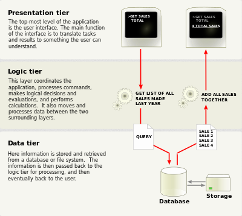
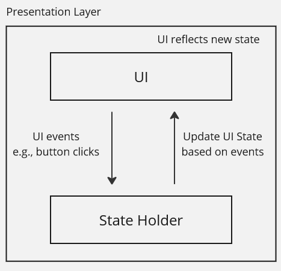
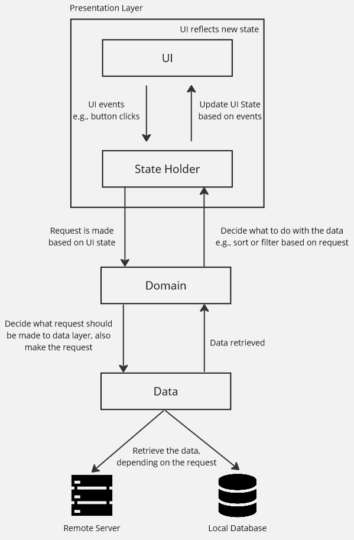

**Main Source :**

- **[Multitier architcture - Wikipedia](https://en.wikipedia.org/wiki/Multitier_architecture)**
- **[Guide to app architecture - Android Developers](https://developer.android.com/topic/architecture)**

**Layered architecture**, also known as **multitier** or **n-tier architecture**, is an architecture that organizes the system into distinct layers, each responsible for specific functionality.

Layers are arranged in hierarchical, where layer are stacked on top of other layer, with higher layers depending on the services provided by lower layers. This architecture promotes [separation of concerns](/software-engineering/software-principles#separation-of-concerns-soc) and [modularization](/software-engineering/modularization).

### Architecture

The architecture itself is flexible; it doesn't have to be two, three, or four layers. We can customize the architecture with as many layers as we want. Just note that having too few layers can result in a monolithic and tightly coupled system, where each component are too dependent on each other. On the other hand, having too many layers can introduce unnecessary complexity.

One of the common layered architecture is the three-tier architecture, which divide the layers by three :

1. **Presentation / UI layer** : The topmost layer is responsible for handling user interactions and presenting information to the users. It typically includes components like user interfaces such as button, dialog, or web pages.
2. **Domain layer** : This layer contains the core logic and functionality of the application. It's the layer that is responsible for processing and manages data, implements business rules, make decision based on input, and coordinates the application's behavior. It is independent of the user interface and data storage layers.
3. **Data layer** : This layer is responsible for managing the storage and retrieval of data. It interacts with databases, file systems, or external services to persist and retrieve data for the application.

     
   Source : https://en.wikipedia.org/wiki/Multitier_architecture#/media/File:Overview_of_a_three-tier_application_vectorVersion.svg

#### Unidirectional Data Flow

Consider a music app, you are in the ranking page to see the topmost song this year. If the app uses a layered architecture, the typical data flow might look like :

1. **User Interaction** : The presentation layer presents UI such as a button, which might says "Top 10 songs". The user then click the button, triggering an event.
2. **UI State** : The presentation layer might keep track a UI state, which is the state of the UI. It may contain information, such as on what page is the user at right now, or what filtering option is currently applied.

   Initially, the UI state describe that the user is still on the ranking page. When the event is triggered from the previous step (clicking the "Top 10 songs" button), the presentation layer updates the UI state to reflect the change in the user interface.

The steps we just discussed is a form of **unidirectional data flow (UDF)**. UDF is a pattern typically used in layered architecture, where data flows in a single direction through the layers of the architecture, typically from the user interface to the data layer and back.

UDF is typically associated with UI state, which as we talked about before, the state of the UI. The UI state will be updated upon the trigger of an event. Typically, the UI state is held by another entity in the presentation layer, which can be called as **state holder** or **UI controller**. They are entity that keeps track UI state, as well as manipulating or updating the state based on UI events.

  
Source : Inspired from https://developer.android.com/topic/architecture#ui-layer

Depending on the interaction, the presentation layer doesn't need to communicate with the lower layer all the time. To continue with our example, checking the top 10 songs does indeed require interaction with the data layer because we are essentially retrieving data.

3. **Domain Layer** : Based on the event and UI state kept by state holder, it will make a request to the domain layer. The domain layer interprets the request and decide what should it do to fulfill the request. For example, determining whether the request can be fulfilled solely by querying the local database or if making a request to a remote server is necessary. We typically call local database or remote server as **data sources**, as they produce data for us to present in the UI.
4. **Data Layer** : Data layer receive the request from the domain layer. The data layer can be abstracted with a **repository**. A repository is a pattern where we abstract away the underlying storage mechanism to access data sources. It acts as an intermediary between the domain layer and the data layer, providing a set of methods that the domain layer can use to interact with the data.
5. **Data Retrieval** : After data is retrieved from the data layer, it is sent back to domain layer. The domain layer then applies required business logic, such as sorting or filtering the data based on the request made.
6. **UI Updated** : Domain sent the processed data to presentation layer. The state holder gets the data and update the UI state, reflecting a new UI where we can see the top 10 songs.



The UDF pattern allows for organized data flow. Data flow, actions, or any updates can only happen in one-way manner. UI State can only be updated by the state holder based on the event the UI triggered. The data layer is abstracted with repository, which can be accessed by the domain layer.

### Example

A theoretical Kotlin code that follows layered architecture and UDF might look like this :

```kotlin
fun main() {
    val repository = Repository()
    val domain = Domain(repository)
    val uiState = StateHolder()
    val screen = Screen(uiState)
    val button = Button()
    screen.render(button)

    button.setOnClickListener {
        val songs = domain.fetchData(uiState.sortSetting)
        screen.displaySongs(songs)
    }
}

class StateHolder {
    var sortSetting = "ascending"
}

class Domain(private val repository: Repository) {
    fun fetchData(sortSetting: String): List<String> {
        if (sortSetting == "descending") {
            repository.query("SELECT * ORDER BY DESC")
        } else {
            repository.query("SELECT * ORDER BY ASC")
        }
    }
}

class Repository {
    private val baseURL = "http://www.example.com"
    private val remoteDataSource = HttpClient()
    private val localDatabase = SQLiteDB()

    fun query(q: String): List<String> {
        val localData = localDatabase.query(q)
        if (localData != null) {
            return localData
        } else {
            val remoteData = remoteDataSource.requestTo(baseURL, "/data")
            localDatabase.saveData(remoteData)
            return remoteData
        }
    }
}
```

1. The button listens for click and fetch for data from the domain layer, based on the current `uiState`.
2. The domain layer holds a repository, it will create the appropriate request to the data layer based on the `sortSetting` parameter.
3. The data layer contains two data sources, a local database and remote data source, which is an HTTP client.
4. When a query request is received, it initially retrieves the data from the local database. If the data is not null, meaning its available, it is immediately returned. Otherwise, the data must be obtained from a remote source. An HTTP request is made to a specific URL and endpoint, and the resulting data is saved to the local database. Finally, the retrieved data is returned to the domain layer.
