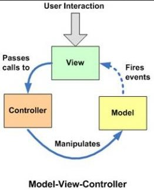
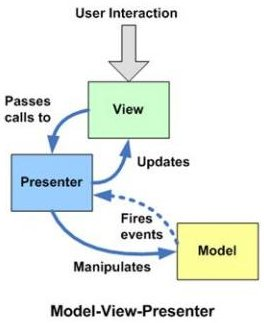
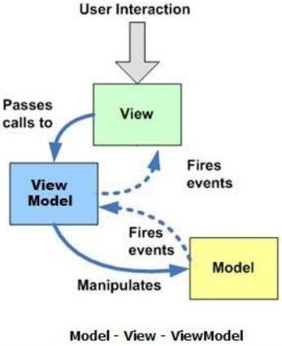
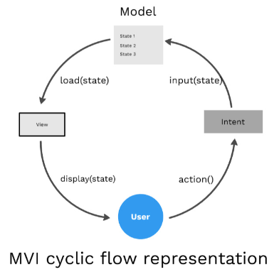
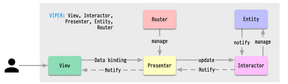

**Main Source:**

- **[What is the difference between MVI compared to MVC and MVVM — stackoverflow](https://stackoverflow.com/questions/59205614/what-is-the-difference-between-mvi-compared-to-mvc-and-mvvm/59336002)**
- **[VIPER-Architecture for iOS project with simple demo example by Bipin Pandey — Medium](https://medium.com/cr8resume/viper-architecture-for-ios-project-with-simple-demo-example-7a07321dbd29)**

This note discusses other architectural patterns, such as MVC, MVP, MVVM, MVI, and VIPER. The five are guidelines on we can organize code and separate concerns in software applications. They are somewhat similar to [layered architecture](/software-engineering/layered) in terms of separating concerns.

### MVC

**MVC (Model-View-Controller)** patterns separate the concerns of the applications into three components, model, view, and controller.

- **Model**: Model represents the data and the business logic of the application. It encapsulates the application's data, state, and behavior. The model is responsible for managing data access, data validation, processing, and implementing business rules and algorithms.
- **View**: View represents the user interface of the application. It is responsible for presenting the data from the model to the user and receiving user input. The view is typically passive and doesn't contain business logic. It observes the model for changes and updates its presentation accordingly.
- **Controller**: The controller sits between the model and the view. It handles user input and manipulates the model based on the user's actions. It contains the application's logic for handling user events, coordinating data flow, and updating the model.

The flow:

1. User interact with the view, such as clicking a button.
2. The view notifies controller about the action.
3. The controller receives the user input, performs necessary operations, and updates the model accordingly.
4. The model updates its state and notifies the view of the changes.
5. The view retrieves the updated data based on the model's state, it also updates its presentation to reflect the changes.

  
Source: https://stackoverflow.com/a/59336002/18335183

### MVP

**MVP (Model-View-Presenter)** patterns separate the application into model, view, presenter.

The model and the view are similar to MVC, but now it's the presenter instead of a controller. The difference between a controller and a presenter is that a presenter acts more as an intermediary. The model no longer directly interacts with the view; instead, it interacts with the presenter, which takes over the role of interacting with the view.

The flow:

1. The user interacts with the view.
2. The view notifies the presenter about the user's action.
3. The presenter receives the user input, performs necessary operations, and interacts with the model to retrieve or update data.
4. The presenter updates the view with the retrieved data or triggers UI updates based on the model's state.

  
Source: https://stackoverflow.com/a/59336002/18335183

### MVVM

**MVVM (Model-View-ViewModel)** separates the application into model, view, and view model.

MVVM is very similar to MVP, view and model is still the same, and the role of presenter is replaced with view model. The view model still acts as an intermediary between the model and the view. The difference is, more [reactive programming](/computer-and-programming-fundamentals/concurrency#reactive-programming) is involved, as they now observe each other.

Typically, a binding mechanism is done between these three components. The view model holds the state of the model, and it is connected or bound to a view. Through this binding, the model's state becomes exposed, and the view should observe any changes in it.

The flow:

1. The view binds to properties exposed by the view model.
2. The view model interacts with the model to retrieve or update data.
3. The view model updates the properties that the view is bound to, triggering UI updates.
4. The view displays the updated data and captures user input.
5. User input is processed by the view model, which may update the model accordingly.

  
Source: https://stackoverflow.com/a/59336002/18335183

### MVI

**MVI (Model-View-Intent)** is an architectural pattern based on a [state machine](/theory-of-computation-and-automata/finite-automata#finite-state-machine), because a user interface can be thought as a predictable machine that has particular states. The state of UI can be updated through user interaction, which is modeled as **intent**.

In the actual implementation, we can still use a presenter or view model, as intent is just a form of coordination between the view and model.

The flow:

1. The user interacts with the UI, generating an intent.
2. The intent is dispatched to the MVI system.
3. The MVI system processes the intent and generates a new model state.
4. The updated model state is emitted to the view.
5. The view receives the new model state and updates the UI accordingly.

  
Source: https://blog.mindorks.com/mvi-architecture-android-tutorial-for-beginners-step-by-step-guide/

### VIPER

**VIPER (View-Interactor-Presenter-Entity-Router)** separates the application into view, interactor, presenter, entity, and router.

- **View**: Represents UI and handles user input to forward it to the Presenter for processing.
- **Presenter**: Acts as the intermediary between the View and the Interactor. It receives input from the View, processes it, and communicates with the Interactor to retrieve or update data.
- **Interactor**: Contains the business logic of the application. It handles data fetching, manipulation, and performs any necessary operations based on the user interactions received from the Presenter.
- **Entity**: Represents the data models or objects used within the application. Retrieved data is sent back to Interactor and Presenter, which will update the View.
- **Router**: Handles the navigation and flow between different screens or modules within the application. It is responsible for presenting new screens, passing data between them, and managing the overall application flow.

  
Source: https://twitter.com/sahnlam/status/1734090361105244533
