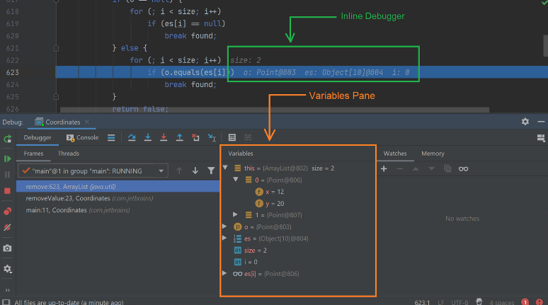

**Main Source :**

- **[Debugging - Wikipedia](https://en.wikipedia.org/wiki/Debugging)**
- **[Software bug - Wikipedia](https://en.wikipedia.org/wiki/Software_bug)**

**Software Debugging** is the process of identifying, analyzing, and fixing errors or **bugs** in computer software. Bugs are error in computer program that causes it to behave in an unintended or incorrect way.

### Software Bugs

#### Source of Bugs

Bugs can be produced by :

- **Syntax errors** : These bugs occur when the code violates the programming language's syntax rules, making the program can't be executed. Syntax error occurs before the program execution, typically catch by the compiler when compiling or static analyzer tools.
- **Logic errors** : Logic error are caused by programmer's fault. They occur when there is a mistake in the program's logic or algorithm, leading to incorrect results or unexpected behavior. These bugs can be subtle and may not always cause the program to crash or produce error messages.

:::tip
See also [Type of errors](/computer-and-programming-fundamentals/programming-concepts#type-of-error).
:::

#### Types of Bugs

Different programming languages may produce different type of bugs. The design and features of a programming language can impact the types of bugs that are more likely to occur.

Some types of bugs :

- **Resource bugs** : Resource bugs are related to the incorrect management or usage of system resources, such as memory, file handles, network connections, or database connections. These bugs can include issues like [memory leaks](/computer-security/other-attack-and-exploit#memory-leak), file handle, or connection leaks.

  In language where the programmer manages the memory manually, such as C or C++, bugs like memory leaks, [buffer overflow](/computer-security/other-attack-and-exploit#buffer-overflow), use-after-free, dangling pointer, double free, etc., becomes more frequent.

- **Type bugs** : Errors or mismatches in the handling of data types. These bugs can arise from using incorrect or incompatible data types, performing operations on variables of the wrong type, or misinterpreting the expected behavior of a particular type.

  In [statically-typed language](/computer-and-programming-fundamentals/computer-and-programming-terminology#typing-strength), such as Java or C++, type bugs can be caught at compile-time, while dynamically-typed languages such as Python or Ruby, these bugs may be encountered during runtime.

- **Concurrency bugs** : Concurrency bugs occur in programs that have multiple threads or processes running concurrently. These bugs are related to the incorrect synchronization, coordination, or sharing of resources among different threads or processes. See [multithreading problems](/operating-system/multithreading#multithreading-problems).

#### Bugs Management

The number of bugs increases as the software gets larger. Bugs are typically documented and tracked in special [issue tracking software](/software-engineering/open-sourcing#issues). These software helps to manage bugs that arise a software.

A bug issue is associated with relevant information, such as bug summary, description, steps to reproduce the bug, severity, and priority.

- **Severity** : Severity refers to the impact or seriousness of a bug on the software system or its users. Severity is categorized into several levels, such as critical, high, medium, and low. **Critical** severity lead to unusable software, **high** may cause major issue but doesn't result in system failures, **medium** has moderate impact on functionality, while **low** are minor or cosmetic issues that have minimal impact.
- **Priority** : Indicates the importance or order in which bugs should be addressed based on various factors, such as business requirements, project goals, and user needs. Priority can be numerical, such as 1 to 5, or named, such as critical, high, medium, low, or deferred.

### Debugging

#### Debugging Process

The first step to debug is to understand the bug and know how to reproduce it. Reproducing a bug require an understanding of bug's behavior and identifying the root cause.

We may try specific condition and various input to know which trigger the bug. After the root cause is identified, say it's function A, then we may isolate function A from others. By isolating it, this mean we are simplifying the code, removing unnecessary dependencies, and focusing on a particular line of code that causes the bug.

```kotlin
val userData = db.loadData()
println(userData)
val result = processData(userData)
println(result)
```

Let's say we are processing some user data. In this case, the bug could originate from either incorrect retrieval of data from the database or an error in the processing itself.

`db.loadData` loads data from the database. After printing the data, we are sure that they are retrieved correctly. However, the printed result is incorrect, then it is possible that the bug originate from `processData`.

We can check the details of the function and see if we can identify it directly. If not, perhaps we should try different input to help us gain more insight. When trying for different input, we do not need to use the real data, we can simplify the input so that it takes a hard coded data instead.

#### Debug Tools

The difficulty of debugging can vary depending on the complexity of the software and bugs. Advanced debugging is done with specialized tools that allows you to step into the program and stops it. The tool will also tell you the state of the program at the time, such as the value of variables and the [call stack](/data-structures-and-algorithms/recursion#call-stack).

These tools work by attaching additional instructions that allow them to monitor the program's execution to gather information for us.

Debugging tools require a **breakpoint**, which indicate the specific lines of code we want to pause the program. When the program reaches a breakpoint, the debugger will take control.

The tool inspects the program state, we can see the value of variables and the call stack, which contains the sequence of function call. We can also :

- **Step in** : Diving into a function or method call.
- **Step over** : Execute current line and move to the next line without stepping into any function calls in that line.
- **Step out** : Exit the current function or method and return to the calling context.
- **Resume** : Resume the program execution after a breakpoint or pause.

  
Source : https://blog.jetbrains.com/idea/2020/05/debugger-basics-in-intellij-idea/

#### Debugging Techniques

- **Debugger tools** : As mentioned previously, debugging tools are very useful because they allow us to stop and pause the program's execution, along with observing its state.
- **Tracing** : We had done this technique in [debugging process](#debugging-process), it involves using print statement to monitor the flow of execution and data progression.
- **Activity tracing** : Activity tracing focuses on tracking the overall time spent by the processor executing specific code segments. It helps identify areas of inefficient processor time allocation or faulty program logic that may require optimization.
- **Divide and conquer** : Systematically narrowing down the scope of investigation to locate the problematic section of code. It involves dividing the codebase or problem into smaller, manageable parts to isolate and identify the source of a bug or issue.
- **Time travel debugging** : Some tools allow to revert the execution of program, which mean we can try different inputs to change the result and see the response.
