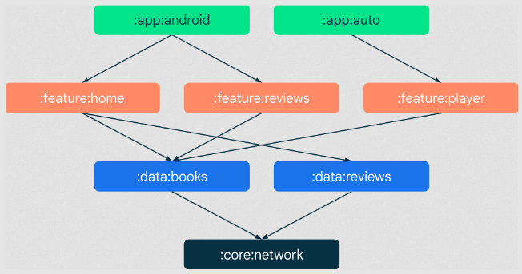
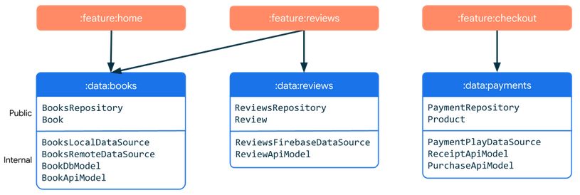
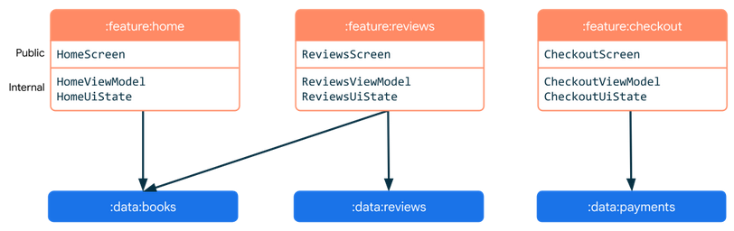
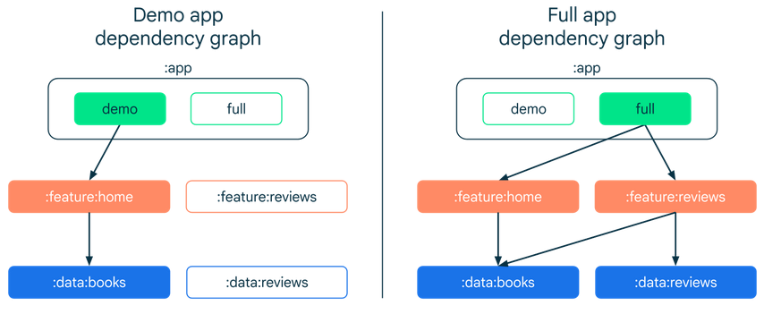
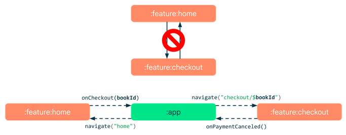

**Main Source:**

- **[Guide to Android app modularization — Android Developers](https://developer.android.com/topic/modularization)**
- **[Common modularization patterns — Android Developers](https://developer.android.com/topic/modularization/patterns)**

**Modularization** is the practice of dividing a software system into separate, independent components called **modules**. Each module focuses on a specific functionality or feature and can be developed, tested, and maintained independently of other modules.

  
Source: https://developer.android.com/topic/modularization

The above is representation of dependency of each module, the `:data:books` module serve as data sources for feature home, reviews, and player.

### Benefits

- **Reusability**: Modules are made independent and self-contained as much as possible, so it can be utilized in multiple parts of an application or even across different projects.
- **Scalability**: Modularization follows the [separation of concerns](/software-engineering/software-principles#separation-of-concerns-soc) principle, making it [loosely coupled](/software-engineering/software-principles#coupling--cohesion) and flexible to be extended or modified.
- **Testability**: Modules can be tested individually, ensuring that each component works correctly in isolation. Additionally, when issues arise, it is easier to isolate and debug problems within a specific module rather than the entire system.
- **Encapsulation**: Modules encapsulate their internal implementation details, exposing only the necessary interfaces or APIs to interact with other modules, making it easier to use.

### Types of Modules

There are several types of modules:

- **Data modules**: Modules which are responsible for handling data-related operations and business logic. They encapsulate the logic (e.g., repository pattern) for data retrieval, storage, manipulation, and communication with data sources such as databases, APIs, or files.

    
   Source: https://developer.android.com/topic/modularization/patterns#data-modules

- **Feature modules**: Groups together related functionality or features of an application. They encapsulate all the components, services, and resources required to implement a specific feature. Feature modules depend on data modules.

    
   Source: https://developer.android.com/topic/modularization/patterns#feature-modules

- **App modules**: Represent the core modules of the application that connects different modules and coordinates the overall behavior of the application. These modules include the entry point of the application, the main user interface, and the high-level application logic.

    
   Source: https://developer.android.com/topic/modularization/patterns#app-modules

- **Common modules**: Contains shared functionality or resources that are used across multiple parts of an application. They encapsulate reusable code, utilities, or resources that are not specific to any particular feature or module. Examples are common UI widget, analytics module, networking module, or utilities such as date time formatter.
- **Test modules**: Modules which are only needed for development. It contains the test code and resources used to test individual modules. Test modules include unit tests or integration tests.

### Communication

Each module can communicate in various ways. One way is through service or API calls, which can be handled by intermediary component called **mediator**. In this approach, modules expose interfaces or APIs that other modules can use to request specific functionalities or retrieve data.

Instead of modules directly invoking each other's services or APIs, they communicate with the mediator, which then routes and manages the requests and responses. Requests are encapsulated in a standardized format understood by the mediator. The mediator receives these requests and determines the appropriate action based on the content and intent of the request.

  
Source: https://developer.android.com/topic/modularization/patterns#communication

#### Dependency Inversion

Modules should communicate with interfaces and depend on abstraction, following the dependency inversion that states "High-level modules should not depend on low-level modules."

See [Dependency inversion principle (DIP)](/software-engineering/software-principles#dependency-inversion-principle-dip).
