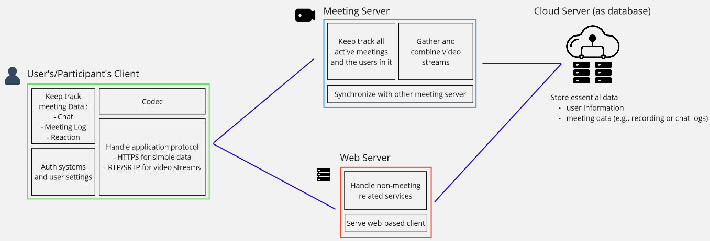
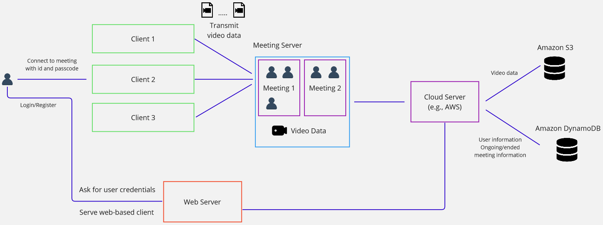
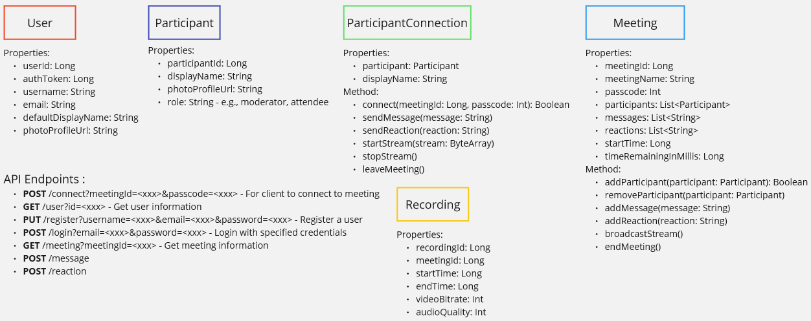

**Main Source :**

- **[How zoom works - architecture explained](https://youtu.be/CgriozF_U20?si=31OZtSTKSTXm6EcO)**
- I made the design myself, of course with some help from chatbot and the reference.

### Meeting Platform

A video conferencing and collaboration platform similar to application like Google Meet or Zoom.

#### Requirements

Functional :

- Users register/login through the client.
- Users configure settings from the client, such as their profile photo and background.
- Users use the app meeting client which will connect them to the meeting. Meeting room is based on ID and passcode.
- In the meeting, they will see other participants video and audio.
- Participant broadcast their video/audio and all the other participant should be able to see it in real time.
- Participant can send chat, reaction, share screen, etc.
- The meeting will end whenever a select participant, acting as host end the meeting. Unless if individual participant chooses to leave themselves, then the client will disconnect them.

Non-functional :

- High availability, it would be an AP system in the context of [CAP theorem](/software-engineering/system-design#cap-theorem).
- Scalable horizontally, because meetings are typically participated by people around the worlds. To suit with business constraints, we can limit the meeting size or duration.
- Meeting should be maximum of 100 people with 60 minutes limit. Assuming a 2 Mbps video bit rate and 128 Kbps audio quality, we would need 2,128 Mbps (per second). Bandwidth of share screen is same as normal stream.

  If we consider 80 people per meeting and 60 minutes (3,600 seconds) in every meeting, we would need 2,128 × 80 × 3600 = 612,864 Mb or ≈ 612 GB per meeting. If we calculate again with the same number, but consider some people turning off their cameras and audio, say 20 people open camera and 4 people actively speaking, then it would be a significant reduce to 145,843.2 MB or ≈ 145 GB per meeting.

  This is a rough estimation, as the real meeting may very on the numbers and actual network condition, which can reduce the bit rate.

#### High Level Design

- Meeting client act as the codecs for video/audio streamed by participant. The codec can be something like [AVC](/digital-media-processing/mp4#mp4-compression-h264) or SVC.
- When a meeting is started, a logical meeting room is created on the meeting server which the participant can connect to.
- Video are sent to meeting server that communicates and synchronizes with each other. The meeting server act as central hub for gathering and combining participant video, which is then sent back to each participant.
- The meeting server will have a connection to a cloud server (e.g., AWS) that stores data, such as user profiles, user settings, chat logs, and meeting recording.
- If the participant share their screen, the video stream will be their window instead of the webcam. This mean the client will also handle the recording.
- Simple data such as chat or reaction can be sent to the server using standard protocol such as [HTTPS](/computer-networking/http-https). The client will also keep track of these.
- Video stream is sent using [RTP](/computer-networking/rtp), specifically the secure RTP.

#### More Detail

Use as many libraries as possible to reduce development time and cost.

- **Client** : The client that will either connect to meeting or web server.

  - Basically we can use any programming languages, let's say we are using Kotlin Compose Multiplatform.
  - We can use this [JCodec library](https://github.com/jcodec/jcodec) for codec. The codec should be adaptive depending on network condition.
  - We can use [libjitsi](https://github.com/jitsi/libjitsi) for media library (RTP protocol implementation).
  - Find a way to set up the streams. We can use [JavaFX media API](https://docs.oracle.com/javase/8/javafx/api/javafx/scene/media/Media.html) to handle the capture of video, audio, and share screen.
  - We can use [Ktor](https://ktor.io/) as HTTP client.
  - Client record and upload to the meeting server on-demand.

- **Meeting Server** : A server dedicated to handle meeting.

  - One choice of backend library is [Ktor](https://ktor.io/).
  - Client connect to the meeting server through some endpoint with `meetingId` and `passcode` as the parameters, initially using HTTP.
  - If there exist such ID with the correct password, then client and server will start exchanging streams, also upgrading the protocol to RTP.
  - The server listens to participants that broadcast their video, and also shares the data with other meeting server. Received broadcast is gathered and sent to all nearby participants.
  - Could use [message broker](/backend-development/message-broker) technology like RabbitMQ to handle the distribution of messages and events among meeting server instances.

- **Web Server** : We will have another server for serving web-based client. This server will also be used for serving request that aren't meeting related, such as authentication.

  - Provide [REST API](/backend-development/rest-api) services. Similarly, we can use [Ktor](https://ktor.io/) for this. Ktor provide a simple way to create authentication, serialization, and other server stuff.
  - Also, deploy the Compose Multiplatform app for the web.

- **Cloud Server** : Used for database. There are many options, such as Amazon S3 for video, Amazon DynamoDB for user's data, and Amazon CloudFront for static data.

  - API keys or any configuration to connect to the cloud can be saved on meeting and web server.
  - As users upload their profile photos, they will be stored on the CDN server, and the user information will include the specific URL for the photo.

#### Object & API Design

That's all I currently have in mind. Additional properties, methods, and endpoints could be included in the implementation.

- We store only the necessary information in these objects, additional information may exist in the database schema.
- `User` is a logical representation of a user. `Participant` is derivative of `User`, representing a participant in the meeting. `ParticipantConnection` represent a client connection, which can be established using `connect` method. It has a `startStream` method that takes a stream of bytes to be sent to the meeting server. The meeting is represented as a `Meeting`, and it has a `broadcastStream` method, which will send all the received streams from individual participants to every other participant.

- User related data could be retrieved via `/user` endpoint.
- Web server or client may provide a way to see ongoing / ended meeting history, so they will be stored as well, and accessed via `/meeting` endpoint.

#### Scale & Other Measures

- **Horizontal Scaling** : We can indeed scale the system horizontally by adding more meeting server. By default, we should connect user to the nearest meeting server. In some cases, we may sacrifice proximity by using a load balancer to balance the workload.
- **Availability** : The important thing is the meeting server, they should have high availability. We can implement failover mechanism to redirect traffic to healthy instances in case of server failures. Use service like AWS backup to back up important data such as meeting recording.
- **Caching** : Cacheable data such as web page static assets, meeting information, and profile photo can be cached to CDN server.
