**Main Source :**

- **[Introduction to Theory of Computation - Neso Academy](https://youtu.be/58N2N7zJGrQ?si=ApDqs6e96kyBP1XJ)**
- **Book chapter 1.0 - 1.3**
- **Neso Academy playlist 2-7**
- **Neso Academy playlist 10-13**
- **Neso Academy playlist 15-19**
- **Neso Academy playlist 20-24**

In automata theory, an **automaton** is an abstract model of digital computer. Automaton consist of several components which vary depending on the type of automaton.

- **Input file** : Automaton has a way to read input written in an input file. The automaton can only read a certain language, and the input file must be written in the language it accepts.

  The input file is divided into cells, each capable of storing one symbol. The automaton cannot overwrite the input file; if it needs to retain information, it should be stored in the storage component.

- **Control unit** : The control unit is the component where the internal state of an automaton exists. It also has mechanisms to transition from one state to another.
- **Storage** : Some automata have storage to store temporary information, which is theoretically unlimited.

  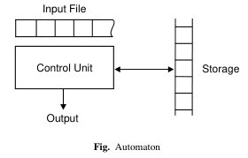  
   Source : Book page 58

:::info
When referring to language, string, and other terminologies, we are referring to those explained in [TOC Fundamentals](/theory-of-computation-and-automata/toc-fundamentals).
:::

### Finite State Machine

**Finite state machine (FSM) or Finite automata** is the simplest model of computation. It is an abstract machine and a type of automaton that **consist of finite number of states** and transitions between those states. The transitions between states is the response of the machine when taking certain input.

Components of FSM :

- **States** : Represents the possible configurations or conditions of the system being modeled.
- **Alphabet** : A finite set of symbols or inputs (possibly a formal language) that the automaton can read or process.
- **Transitions** : A set of rules that specify how the automaton transitions from one state to another based on the input symbol it reads. Each transition is associated with a specific input symbol and defines the state change that occurs when that symbol is encountered.
- **Start state** : A designated initial state from which the automaton begins its operation.
- **Accepting states** : A subset of the states that are designated as accepting or final states. When the automaton reaches an accepting state after reading the entire input, it indicates that the input is accepted or recognized by the automaton. Not all finite automata have accepting states.

  
Source : https://brilliant.org/wiki/finite-state-machines/

An example of state machine is a vending machine. A vending machine is initially locked (start state). If it is being pushed, it kept locked (transition at locked state with "push" as input). If a coin is inserted, then it will be unlocked, and so on.

#### Acceptors

An automaton that recognizes or accepts certain input strings is called **acceptors**. Acceptors don't take action as input, but instead an input string belonging to a specific language or set of strings.

The purpose of an acceptor is to determine whether the input string belong to certain language. If the input string satisfies the criteria defined by the acceptor, it is accepted. If it does not meet the criteria, it is rejected.

A complex example of acceptors is a [compiler](/compilers). It is a program that determine whether a code from certain programming language follows the grammar rules and syntax of that language.

Finite state machine can be categorized into to, DFA and NFA.

### DFA

**Deterministic Finite Automata (DFA)** is an FSM in which each transition is deterministic, or simply predictable based on current state and input.

A DFA is defined with a 5-tuple : $M = (Q, \Sigma, \delta, q_0, F)$

- $Q$ = Finite state of "internal states"
- $\Sigma$ = Finite set of symbols called "input alphabet"
- $\delta$ = Transition function, and it's defined as $\delta: Q \times \Sigma \rightarrow Q$, or simply it maps a pair consisting of a state and an input symbol to a new state. For example a $\delta(q_0, a) = q_1$ means with state $q_0$ and input $a$, it will transition to state $q_1$.
- $q_0 \in Q$ = Initial state
- $F \subseteq Q$ = Set of final states.

#### DFA first example

A visualization of DFA would look like this :

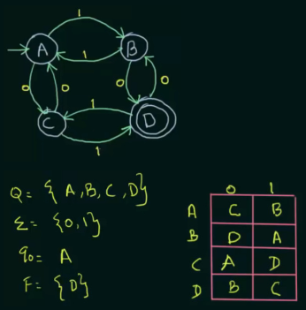  
Source : https://youtu.be/Qa6csfkK7_I?si=iZ5Nn8DVGVJoGGs4&t=648

- It has four states, namely $A$, $B$, $C$, and $D$
- The language it takes is just $0$ and $1$ symbols
- The initial state is $A$, it is depicted by arrow without source
- The final state is $D$, depicted by double circle
- The transition function is described in the table. For example, if we are at the initial state $A$, inputting $0$ would bring us to state $C$, conversely, inputting $1$ will transit to state $B$.

#### DFA with self-loop and dead state

Let's say we are designing a DFA that accepts certain type of strings from a language. The DFA should accept any strings that start with "0", such as "0", "00", "01", and so on. If a DFA has reached the final state (even if there is more input), then we can say it accepts the string, otherwise it rejects it.

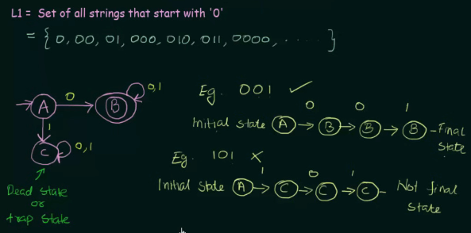  
Source : https://youtu.be/40i4PKpM0cI?si=q-EDJZKbKjcsmYAK&t=569

To do that, we can make a DFA consisting three states, $A$ as the initial state, $B$ as the final state, and $C$ as a dead state.

A dead state refers non-accepting or non-final state from which there are no outgoing transitions for any input symbol in the input alphabet. Once the DFA enters a dead state, it remains in that state indefinitely, regardless of the input symbols it receives. Dead states are often used to represent invalid or rejected inputs.

So, this DFA will immediately transition to final state if the first input is "0". If the first input is "1", it will be brought to dead state. We will also create a self-loop on state $C$ and $B$, this is to make sure that the DFA needs to stay in a particular state while processing a specific input symbol.

:::info
FSM, DFA, and NFA (covered later) are the simplest automata that doesn't have memory, so it requires a careful consideration to design the structure and transition of DFA so that it accepts or rejects a certain string.
:::

#### DFA with the same transition function across different inputs

This DFA is designed to accept sets of all strings over $\{0, 1\}$ of length 2, including "00", "01", "10", and "11".

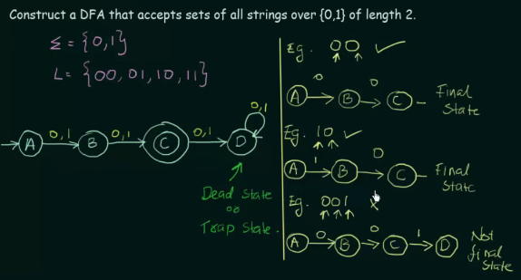  
Source : https://youtu.be/2KindKcLjos?si=Um-ERDdwC_PGrjON&t=592

The transition function is defined the same for input 0 and 1, this is because the constraint is the string being length 2. The DFA won't reach final state with input empty string and string of length 1. An input string with length greater than 2 will be in a dead state.

#### DFA with complex example

  
Source : https://youtu.be/_2cKtLkdwnc?si=aGpdnvn6TGJhN0q4&t=779

This DFA is more complex, it must be able to accept string over $\{a, b\}$ that contains the string "aabb". Because it says "contains", then the placement of "aabb" can be anywhere. So, the DFA will not be included with a dead state, because who knows if there is "aabb" somewhere in the input.

After the first occurrence of "a", if "b" comes after it, then the state will be reverted to initial state, making sure that two "a" is consecutive. Similarly, inputting "b" after "aab" reverts it back to the state $B$. In the case of "a" is keep being inputted after two "a", it will be self-looped.

If the problem is worded differently, such that the DFA accepts all string that _does not_ contain the string "aabb", then we can do few changes.

1. Flip the states
2. Switch final state to non-final state
3. Switch non-final state to final state.

This will effectively negate the logic, rejected string becomes accepted, and vice versa.

  
Source : https://youtu.be/_2cKtLkdwnc?si=A1LaV3Hv92fqQBHm&t=1011

These are four examples of DFA. More complex variants, such as having multiple states transitioning to the same dead state, more complex languages, or anything else, are also possible.

### NFA

**Nondeterministic Finite Automata (NFA)** is the nondeterministic version of DFA, in which having multiple possible choices or transitions at a given state for a particular input symbol. It means that the behavior of the automaton is not uniquely determined by the current state and the input symbol, and decision as well as randomness is involved.

The nondeterministic property of NFA introduces additional complexity during simulation and analysis. If there are multiple possible transitions at a given state for an input symbol, the automaton can theoretically explore all those paths simultaneously. This exploration of multiple paths can be visualized as a branching tree of possible computations.

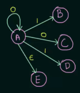  
Source : https://youtu.be/ehy0jGIYRtE?si=pHDZ82c2vvwXu1Jr&t=349

When taking input 0 on state $A$, this NFA can transition to $A$ itself or $C$ in parallel. It is also possible to accept empty string $\epsilon$.

An NFA is defined with a 5-tuple : $M = (Q, \Sigma, \delta, q_0, F)$

- $Q$ = Finite state of "internal states"
- $\Sigma$ = Finite set of symbols called "input alphabet"
- $\delta$ = DFA and NFA differs here, $\delta = Q \times \Sigma \rightarrow 2^Q$. In other words, for a given state and input symbol (or epsilon transition, can be denoted by $\lambda$ or $\epsilon$), the transition function can have multiple possible outcomes, and will take any subset from the powerset $2^Q$. In contrast, a DFA transition state only returns a set containing one state.
- $q_0 \in Q$ = Initial state
- $F \subseteq Q$ = Set of final states.

Because there are many possibilities in NFA, we can say input is accepted by NFA if there exists at least one path that leads to a final state.

#### NFA first example

  
Source : https://youtu.be/egXhe55dAIk?si=bt0-l4Y6EsF1Prgj&t=443

For example, there are $2^2 = 4$ ($Q = 2$) number of possibilities for this particular NFA.

The possible transitions from the initial state are: $A \rightarrow A, B, AB, \phi$. With any input, starting from state $A$, we can :

- Transition to state $A$ itself (by taking input 0).
- Transition to state $B$ (another possibility by taking input 0).
- Transition to state $A$ first and then to the second possibility, $B$ (by taking input two zeros).
- If a particular state doesn't have a transition function for the given input, we denote it as going nowhere, represented by $\phi$.

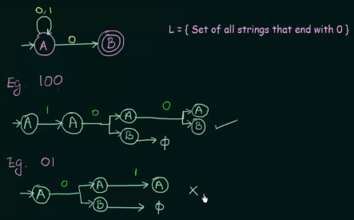  
https://youtu.be/4bjqVsoy6bA?si=e-Ee-hsc97lniQqE&t=321

It turns out that this NFA is capable of taking all set of strings over language $\{0, 1\}$ that ends with 0. With input "100", there is one possibility that it reaches final state $B$. With input "01", it reaches final state, but it hasn't processed the entire input string.

#### NFA that simplify certain DFA versions

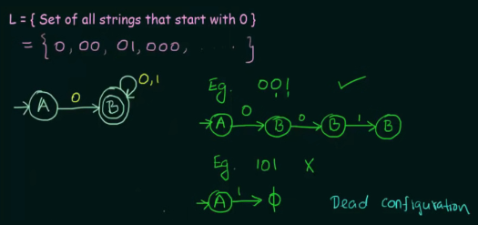  
Source : https://youtu.be/Bcen1W_uFEU?si=eNKSxWqfA_Adi0CD&t=313

This NFA is similar to [this DFA version](/theory-of-computation-and-automata/finite-automata#dfa-with-self-loop-and-dead-state).

DFA has to be deterministic, it requires us to include all possible input and transition. In contrast, in this NFA, we don't need to include the transition from state $A$ to $C$ with input 1. This is because the nondeterministic nature of NFA that allows for taking input symbol for which there is no defined transition from a particular state. It simply does not take that transition and continues its computation.

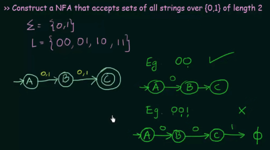  
Source : https://youtu.be/Bcen1W_uFEU?si=tPOEujmw6MGqWYoh&t=518

Another example, related to [this](/theory-of-computation-and-automata/finite-automata#dfa-with-the-same-transition-function-across-different-inputs), we don't need to include the dead state beyond state $C$.

### Equivalence of DFA & NFA

Two finite acceptors are equivalent if they accept the same language. Both DFA and NFA are able to recognize the same language. DFA can be considered as special case of NFA, where there is no non-determinism, or there is exactly one transition defined for every state and input symbol.

We can say that every DFA is an NFA, but not vice versa. Also, there is an equivalent DFA for every NFA.

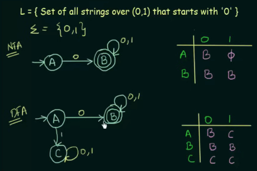  
Source : https://youtu.be/--CSVsFIDng?si=hfykBdMisFntJn5e&t=546

This DFA and NFA are the same examples as before. Although they have different formal definitions (distinct transition functions and states), we can say they are equivalent because the definition of equivalence arises when they accept the same language.

### Conversion of NFA to DFA

It is possible to convert an NFA to DFA because every DFA is an NFA (through a process called **subset construction** or **powerset construction**). Converting NFA to DFA require us to keep the same transition function and fill out the empty transition by possibly adding new states and transitions.

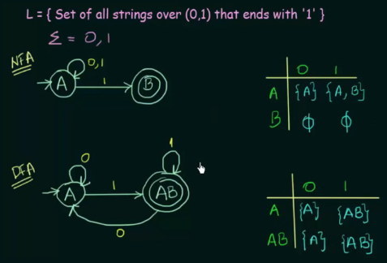  
Source : https://youtu.be/pnyXgIXpKnc?si=QfnTh8kttGDWrVsp&t=529

In the NFA, taking input 1 on state $A$ can result in transition to $A$ itself or $B$. However, DFA doesn't allow this multiple transition, and we have to alter the NFA structure.

The author of the video decided to combine the state $A$ and $B$, creating a new state called $AB$. Regardless of the two letter state, it is considered as a single state (it can also be named as $B$).

#### Complex Conversion

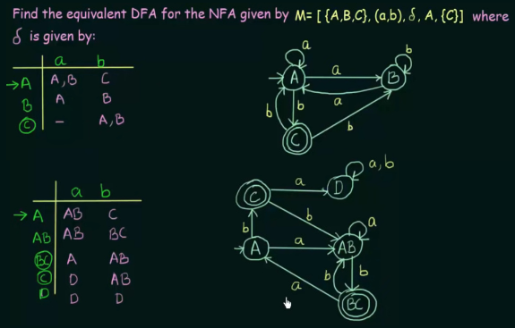  
Source : https://youtu.be/i-fk9o46oVY?si=Afuzhcyp8GXaT6XW&t=697

By combining two states, all possible transitions are merged to effectively represent the behavior of the original NFA. In the original NFA, upon receiving input "a" in state $A$, it can transition to either $A$ or $B$. Thus, a new state called $AB$ is created to represent both states $A$ and $B$. The new state $AB$ will transition to itself with input "a", reflecting the possibility of transitioning from both $A$ and $B$ to either $A$ or $B$ (it is the same as doing union operation to both state).

### Minimization

Minimization is the process of reducing the number of states in a DFA while preserving the language it recognizes. There are two main steps of minimizing DFA :

1. Try inputting various combination of input and determine if there are states unreachable from the initial state. Typically, they are depicted if no arrow are directed to it. Unreachable states can be safely removed without affecting the DFA.

   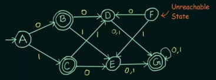  
   Source : https://youtu.be/kYMqDgB2GbU?si=5Os46YAwi6tYSP_j&t=101

2. Combining two states into one state if they are equivalent. Two states are considered equivalent if, for every input symbol, they transition to states in the same equivalence class.

Specifically, two states are equivalent if :

- $\delta(A, X) \rightarrow F$ and $\delta(B, X) \rightarrow F$, or
- $\delta(A, X) \nrightarrow F$ and $\delta(B, X) \nrightarrow F$

If both are able to transition to the final state with the same input string, or if both are unable to do so.

If the length of string $|X| = n$, then $A$ and $B$ are said to be $n$ equivalent. For example, given an input string of length 4, and $A$ and $B$ exhibit the same behavior with the input, then they are said to be 4 equivalent.

#### First example

An example of DFA and its transition table :

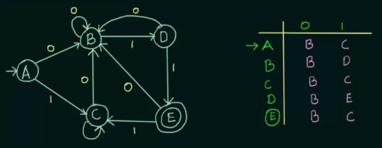  
Source : https://youtu.be/0XaGAkY09Wc?si=aYXQ8rokA9oRLbEY&t=471

Next, we list the states in a set belonging to some equivalence group. If states belong to the same set within the equivalence group, it means they are equivalent.

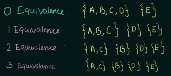  
Source : https://youtu.be/0XaGAkY09Wc?si=rPwa6mZpKVfUiPWW&t=718

The purpose of representing states in sets based on their number of equivalence is to group together states with similar behavior, meaning states that transition to the same state with the same input. The intuition is that if they exhibit similar behavior, then we can group them together into a single state.

At 0 equivalence, which signifies when receiving an input string of length 0, obviously $A$, $B$, $C$, and $D$ will be equivalent because they haven't received any input yet. $E$ is listed in a different set because it is the final state and does not meet the definition of two states being equivalent.

At 1 equivalence, $A$, $B$, and $C$ exhibit the same behavior upon receiving any input 0 or 1. Although we see in the transition table, $B$ and $C$ is different on input 1, $C$ is still equivalent with $A$, so it's fine. While $D$ starts to be different with any of $A$, $B$, or $C$, so it is listed in different set.

When two rows of different equivalence class are giving the same result (i.e., the 2 equivalence and 3 equivalence have the same set of states), then we can stop listing the equivalence.

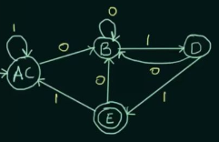  
Source : https://youtu.be/0XaGAkY09Wc?si=JJbtZFijynhE7DeK&t=935

And the above is the result, $A$ and $C$ are combined into new state called $AC$.

#### Minimize by combining final states

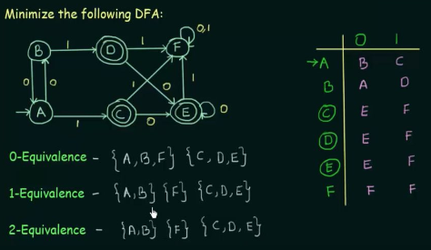  
Source : https://youtu.be/DV8cZp-2VmM?si=AElvyhBxDWbI4YHM&t=341

The above is a DFA with multiple final states. After listing out the equivalence class, it turns out that the three final states are all equivalent, therefore, we can combine them all together.

  
Source : https://youtu.be/DV8cZp-2VmM?si=f2Kx9Li0LJ7Dkh-F&t=530
