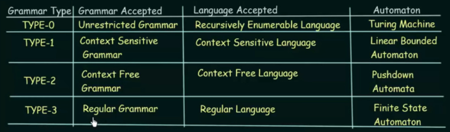
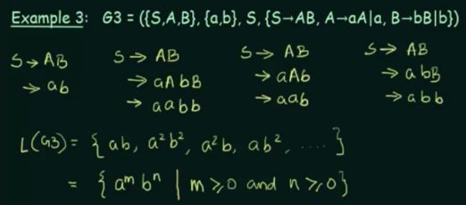

**Main Source :**

- **Book chapter 2.1**
- **Neso Academy playlist 63-64**

**Formal Grammar** is the formalization of grammar, which is the rules to describe languages.

### Chomsky Hierarchy

There are many types of formal grammar, the types of grammar based on [Noam Chomsky](https://en.wikipedia.org/wiki/Noam_Chomsky) are [regular grammar](#regular-grammar), [context-free grammar](/theory-of-computation-and-automata/context-free-grammar), context-sensitive grammar, and unrestricted grammar.

  
Source : https://youtu.be/WgEsPTAL55Q?si=4LOZ1qtkL1hunWmf&t=70

Every grammar generates its own language, which is recognized by a specific automaton.

### Grammar

As explained in [grammar](/theory-of-computation-and-automata/toc-fundamentals#grammar), in general, a grammar is defined as quadruple : $G = (V, T, S, P)$.

With grammar $G_1 = (\{S, A, B\}, \{a, b\}, S, \{S \rightarrow AB, A \rightarrow a, B \rightarrow b\})$, we have three categories of symbol, $S$ (also known as the start symbol), $A$, and $B$. The category itself doesn't mean anything in language, the actual character that appears in the language are $a$ and $b$. The production rules describe that the start symbol $S$ can be replaced with $AB$. The $A$ and $B$ itself can be replaced by $a$ and $b$, respectively.

For example, starting from $S$  
$S \rightarrow AB$ (by $S \rightarrow AB$)  
$\rightarrow aB$ (by $A \rightarrow a$)  
$\rightarrow ab$ (by $B \rightarrow b$)

The production rule of a general grammar is in the form of $A \rightarrow \alpha$, where $A$ is a non-terminal symbol, and $\alpha$ is a string of terminal or non-terminal symbol (formally $\alpha = \{V \cup T\}$). The production rule allows the transformation from non-terminal symbols to another non-terminal or terminal symbols, making it possible to expand the language recursively.

:::tip
The book also notate the production rule in the form of $(V \cup T)^+ \rightarrow (V \cup T)^*$. In other word, one or more terminal or non-terminal symbol can be transformed to zero or more (so includes empty string) terminal or non-terminal symbol.
:::

For example, when the production rule generates another start symbol, such as $S \rightarrow SAB$, then, starting from $S$, we can produce $SAB$, then further apply the same production rule to obtain $SABAB$, and continue this process until we replace all non-terminal symbol to terminal symbol.

#### Example

The process of generating language from grammar is also known as **derivation**. The set of all language generated by some grammar is denoted as $L(G)$. The language generated by the previous grammar example, $L(G_1)$, consists of only a single string: $\{ab\}$.

Another example from the video :

  
Source : https://youtu.be/ejXgLRSIxsA?si=K8kIBdPOzhFgqsQW&t=573

This grammar has a recursive production rule. We can replace $A$ with $aA$, which mean we can potentially generate infinite amount of "a"'s. The language generated by this grammar creates a pattern $a^m b^n$, therefore the $L(G)$ is a set of string with that patterns.

### Regular Grammar

Regular grammar is the grammar that describes [regular language](/theory-of-computation-and-automata/regular-languages-part-1), which is the languages recognized by finite automaton like [DFAs](/theory-of-computation-and-automata/finite-automata#dfa) and [NFAs](/theory-of-computation-and-automata/finite-automata#nfa).

#### Left & Right Grammar

The formal description of regular grammar is same as the [general grammar](#grammar), except the production rule follows either left or right types of grammar. With $A$, $B \in V$ and $x \in T$, right and left grammar is in the form :

- **Right linear grammar** : $A \rightarrow xB|x$, example $S \rightarrow abS|b$.
- **Left linear grammar** : $A \rightarrow Bx|x$, example $S \rightarrow Sbb|b$.

In right grammar, the production rule places non-terminal symbols on the right, while in a left grammar, it is the opposite.

Additionally,

:::info
The "|" in the notation $S \rightarrow A|a$ is a shorthand to describe two $S \rightarrow A$ and $S \rightarrow a$.
:::

### Context-Free Grammar

See the [next topic](/theory-of-computation-and-automata/context-free-grammar).
