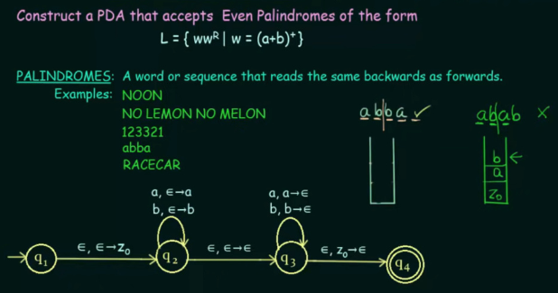

**Main Source :**

- **Book chapter 3.1, 3.2**
- **Neso Academy playlist 85-89**
- Neso Academy playlist 91-93

### PDA

A [finite automaton](/theory-of-computation-and-automata/finite-automata) has a very limited memory to keep track its computation. If we were to design an automaton that determine the length of string, a finite automaton wouldn't work. **Pushdown Automata (PDA)** is the extension of finite automaton that has more memory, specifically a [stack memory with the LIFO principle](/data-structures-and-algorithms/stack). A PDA recognizes context-free languages governed by [context-free grammar](/theory-of-computation-and-automata/context-free-grammar). Similar to finite automaton, it can either accept or reject the language.

Component of PDA :

- **Input file/tape** : Contains the input symbols that the PDA reads from left to right.
- **Finite state control** : The control unit of the PDA that determines its state.
- **Pushdown store** : It's the stack that is used to store symbols from the input tape. It has infinite size, and it allows for two stack operations : push (adding a symbol to the stack) and pop (removing the top symbol from the stack).

  
Source : Book page 160

#### Formal Definition

Formally, a PDA is defined as 7 tuples : $P = (Q, \Sigma, \Gamma, \delta, q_0, z_0, F)$

- $Q$ is the finite set of states.
- $\Sigma$ is the finite set of input alphabet/symbols.
- $\Gamma$ (uppercase gamma) is the finite stack alphabet.
- $\delta: Q \times (\Sigma \cup {\epsilon}) \times \Gamma \rightarrow Q \times \Gamma*$ is the transition function, where $Q \times \Gamma^*$ represent a power set. The power set contains all the possible combination of the pair of states and stack contents.
- $q_0$ is the initial or start state.
- $Z$ is the initial or start stack symbol.
- $F$ is the set of accepting or final states.

The thing worth to note is the transition function, it takes the current state $Q$, input symbols $\Sigma$, including the empty string $\epsilon$, and the current topmost symbol of the stack $\Gamma$. When transitioning, the topmost symbol may or not be popped, a new state will be produced, and a new symbol may be pushed onto the stack.

For example, $\delta(q_1, a, X)$ could yield a set of pairs $\{(q_2, XY), (q_3, YZ), (q_4, \epsilon)\}$, indicating that from state $q_1$ reading input symbol "a" while having "X" on topmost of the stack, the PDA could :

- Transition to state $q_2$ with "XY" on the stack, meaning it pushes "Y" onto the stack.
- Transition to state $q_3$ with "YZ" on the stack, meaning it pop "X", then pushes "YZ".
- Transition to state $q_4$ with $\epsilon$ on the stack, meaning it will pop "X" from the stack, leaving the stack to be empty.

We see that the primary difference between finite automaton and PDA is, a PDA takes extra argument (the stack symbol) and produce an output (modifying the stack).

In the case when the topmost stack is $\epsilon$ or empty, then the stack is simply not being read or popped.

#### Example

  
Source : https://youtu.be/eY7fwj5jvC4?si=eRqTnkjH7ODIc1kN&t=627

The PDA should accept language with equal length of "0"'s and "1"'s.

In the video, the notation $\epsilon, \epsilon \rightarrow z_0$ denotes that the transition takes input $\epsilon$, pop symbol on the left-hand side, and push the symbol on right-hand side. A symbol $\epsilon$ means the transition does nothing to the stack. An $\epsilon$ on the left-hand side means the transition doesn't pop, while on right-hand side, it doesn't push.

In state $q_2$, upon receiving input "0", it checks if the topmost symbol is $\epsilon$. Because it is just $\epsilon$, then it does nothing. Then, on the right-hand side, there is a symbol "0", signifying that it should be pushed onto the stack. If the input is "1", it checks if "0" is the topmost symbol; if it is, then it should be popped. After that, on the right-hand side, this $\epsilon$ denotes that nothing is pushed onto the stack.

The concept behind this PDA is that, in state $q_2$, we push as many "0"s as the input remains "0". Then, upon encountering "1" in the input, transition to state $q_3$ and start popping all the "0"s every time "1" is inputted. Upon reaching the final state $q_4$, the PDA checks if the stack is empty. If it is, we can conclude that the number of "0"s matches the number of "1"s. If not, it indicates that either too many "0"s or "1"s were pushed (due to inputting them in the input string), preventing them from being popped altogether, thus leaving the stack not empty.

:::tip
Sometimes, the symbol $z_0$ is pushed at the beginning of the PDA and popped at the end of PDA. This symbol is used to indicate the last element on the stack.
:::

#### PDA Even Palindrome

  
Source : https://youtu.be/TEQcJybMMFU?si=NcawjrirsnjL8ybx&t=803

This PDA should accept even-length palindrome, meaning the string length should be even, and it is palindrome, or can be read the same from the front or backward (e.g., try reversing the string "abba", we will obtain the same thing, but not with "abab").

The idea of this PDA is, in $q_2$, we push any symbol that appears on the input. After an empty input $\epsilon$ is encountered in the middle, it means that we can transition to state $q_3$ and start popping the stack to check if the input is palindrome. In the $q_3$, anything we read as input will be popped from the stack. If the topmost symbol on the stack is not equal to the input, then the PDA will not transition to anywhere from the state $q_3$, indicating the string is not accepted.

As always, when the input is $\epsilon$ again, we transition to state $q_4$ and check if the stack is empty (denoted by $z_0$ on top of the stack). If it is, then the string is accepted, as we have reached the final state.

For example, with the input "abab", we will have $z_0$, $a$, and $b$, respectively from the bottom of the stack.

However, the problem with this analysis is, how can we assume that an input is $\epsilon$ or empty? Typically, input is $\epsilon$ when we have reached at the end of the input, but in the PDA, we keep expecting for input even after the $\epsilon$ transition from the $q_2$ to $q_3$.

  
Source : https://youtu.be/BxA-aI2dyRo?si=mmMY52_ormtTd3bB&t=152

We can make assumption that $\epsilon$ symbol appears before and after every input. After that, we can list all possible transition when input has or not $\epsilon$ symbol. We will also include the current state and stack content for each of the path. If at least a single path exist in the list that leads from the start state to the final state, we can say that the PDA accepts the string.

This is similar to [NFA](/theory-of-computation-and-automata/finite-automata#nfa), in which it is possible to transition to every path with any input and theoretically, each transition is done in parallel.

  
Source : https://youtu.be/BxA-aI2dyRo?si=K0ysvgZgszM3dMsH&t=555 (combined images)

### PDA & CFG

#### Equivalence

#### Conversion
