**Main Source :**

- **Book chapter 4.1, 4.2, 4.3, 4.4, 5.2**
- **Neso Academy playlist 94-98**
- **Neso Academy playlist 101-105**
- **Neso Academy playlist 99**
- **[Church–Turing thesis - Wikipedia](https://en.wikipedia.org/wiki/Church–Turing_thesis)**
- **Neso Academy playlist 108**

### Turing Machine

Turing Machine is even more advanced abstract model of computation. It is capable of recognizing a language called **recursively enumerable language**.

#### Components

It consists of several components :

- **Tape** : Turing machine doesn't have input in an original sense; instead, it uses a tape. A tape consist of infinite number of discrete cells spanning in two directions, left and right. The tape is initially filled with some symbols and then modified afterwards, so we can think the tape as the input. The modified tape after the computation has ended also serve as the output. It's worth noting that not all symbols is required to be read in order to produce an output.
- **Head** : The head of the Turing machine is positioned over a single cell on the tape and can read or write symbols on the tape, as well as moving in either directions for one cell.
- **Control Unit** : Similar to [FSM](/theory-of-computation-and-automata/finite-automata) or [PDA](/theory-of-computation-and-automata/pushdown-automata), the control unit specifies how the machine transitions between states based on its current state and the current symbol being read. The transition function determines the next state of the machine, the symbol to be written on the tape, and the direction to move the tape head (left or right).

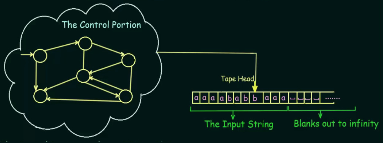  
Source : https://youtu.be/GPSk9tRsK2I?si=_D1CVWF00TLAyk0H&t=92

#### Formal Definition

Turing machine $M$ is a 7-tuple $(Q, \Sigma, \Gamma, \delta, q_0, \char"2423, F)$.

- $Q$ is a set of states
- $\Sigma$ is a finite set of symbols, the input alphabet
- $\Gamma$ is a finite set of symbols, the tape alphabet
- $\delta: Q \times \Gamma \rightarrow Q \times \Gamma \times \{L, R\}$ is the transition function. In other words, it takes the current state and reads the symbol on the tape to produces a new state, updates the tape, and moves to the left or right. For example, $\delta(q_0, a) \rightarrow (q_1, y, R)$ means transitioning from state $q_0$ to $q_1$ by reading "a" on the tape, writing "y", and moving the head to the right.
- $q_0 \in Q$ is the initial state
- $\char"2423 \in T$ or $\#$ or $b$ is the blank symbol. The empty cells on the infinite tape will be filled with this special symbol. Keep in mind that it doesn't belong to input alphabet.
- $F \subseteq Q$ is a set of final states.

:::tip
We can also define the transition function as $\delta: Q \times \Sigma \rightarrow Q \times \Sigma \times \{L, R\}$, as $\Gamma$ is the tape symbols that includes input symbols $\Sigma$.
:::

:::info
Linear bounded automaton, the automaton that accepts context-sensitive grammar in the [Chomsky hierarchy](/theory-of-computation-and-automata/formal-grammar#chomsky-hierarchy), is not explained in this note. It is essentially a [Turing machine](/theory-of-computation-and-automata/turing-machine) with finite-length tape. The number of cell in the tape is $\alpha \times n$, where $\alpha$ is some constant associated with the Turing machine, and $n$ is the length of input string.
:::

#### Rules

Turing machine can also undergo final state. In final state, the machine can either at **accept state** or **reject state**. The machine accepts when it satisfies the problem criteria, rejects when it doesn't, and **halts** when the machine terminates and doesn't make any further progress. So, a computation can either halt and accept, halt and reject, and loop, in which the machine fails to halt.

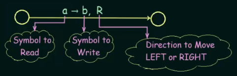  
Source : https://youtu.be/GPSk9tRsK2I?si=h1YKXTmrviD8U_Cx&t=357

:::info
The video visualize a Turing machine using notation like the above image.
:::

The operations of a Turing machine are as follows : read the current symbol, update by writing a new symbol or keeping the same one at the current cell, and then move exactly one cell either to the left or right. If the machine is at either the leftmost or rightmost end of the tape, it stays at that end.

#### Regular Language Example

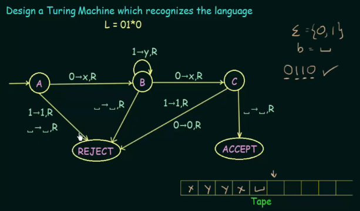  
Source : https://youtu.be/D9eF_B8URnw?si=5KTCnrXqU_QCnIhX&t=455

This particular example is quite simple, as the input language is just [regular language](/theory-of-computation-and-automata/regular-languages-part-1) that can even be recognized by a [finite automaton](/theory-of-computation-and-automata/finite-automata). The visual notation of this Turing machine is explained in [rules](#rules).

It accepts any string that starts and ends with "0", and one or more "1" in the middle. The input string can be written on the tape, and the machine will overwrite it.

With the first symbol being "0", the machine writes "x" and move to right, as well as transitioning to state $B$. Afterwards, the machine writes "y" and move to right every time it encounters "1". If "0" is entered, then, it writes "x" again and move to right. However, the next state will be $C$, in which it checks if the current symbol on the tape (after moving last time) is blank. If it is, it means we have reached at the end of input, thus the language is accepted. Otherwise, transition to REJECT state.

#### Context-Free Language Example

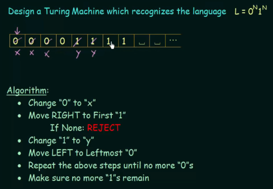  
Source : https://youtu.be/cR4Re0YfoOo?si=ko6FT4Q0yM-rlW_H&t=303

This example is more complex, as it requires memory to keep track of the number $N$, which finite automata can't. A [pushdown automata](/theory-of-computation-and-automata/pushdown-automata) would work for this, we don't even need to use the full power of Turing machine to recognize this language.

The idea of two symbols being of equal length implies that one must match the other. If there is three "0", then there should be three "1" as well. If all symbols match each other, we can conclude that they occur with equal frequency in the string.

We start by scanning for "0" and replacing it with "x" to mark it as encountered. Later on, we skip anything that has been marked, including the "1" that we marked as "y". If we encounter one of "0" or "1" but not the other, we can conclude that they do not occur with equal frequency.

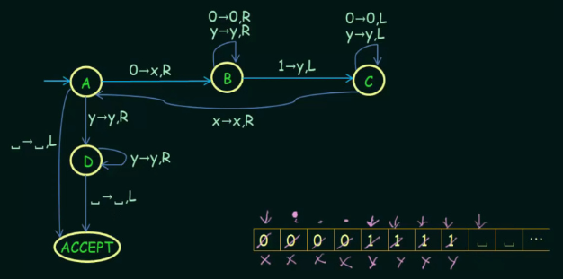  
Source : https://youtu.be/cR4Re0YfoOo?si=qt46zOZaYkuZpHWc&t=681

That is the transition for the designated Turing machine. Any missing transitions will result in transitioning to the REJECT state.

### Turing Machine Modification

#### Turing Machine Programming Techniques

There are various approaches to design and implement Turing machine. Turing machine programming techniques help in solving computational problems and manipulating input sequences using the capabilities of a Turing machine.

Some techniques :

1. **Starting Symbol** : We can mark the left end of a Turing machine tape using a symbol like $\char"0024$. Obviously we won't overwrite the existing tape, but rather shifting them all one cell to the right.

   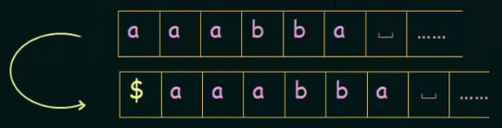  
   Source : https://youtu.be/BKhQJP4sa_8?si=GGdfkAKHMHk9O-se&t=169

   This is similar to what we do in [pushdown automata](/theory-of-computation-and-automata/pushdown-automata), that is, using a $z_0$ as the last (or first) element of the stack. We can use the $\char"0024$ as an indicator that we have reached the left end, and we may transition to REJECT state if it's invalid according to the problem criteria.

2. **Subroutines** : A Turing machine can be made modular and reusable for different problems. This means, we encapsulate specific functionality of Turing machine, then call it from other or different parts of programs.

   For example, the problem in [context-free language example](#context-free-language-example) told us to make a Turing machine that recognize a language $0^N 1^N$. What if the problem becomes more complex, such as recognizing the language $0^N 1^N 0^N$.

   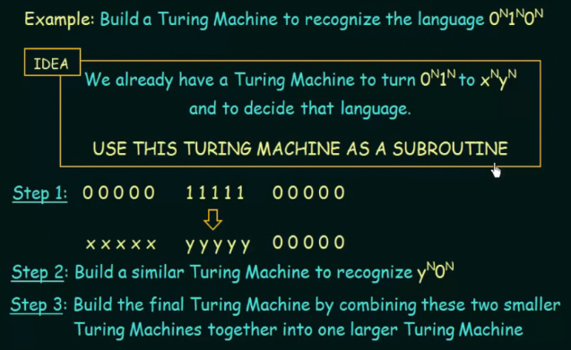  
   Source : https://youtu.be/23vQEJWXc-k?si=Tty8bKNS6RNnOp3X&t=559

   One way is to create two Turing machine, one is checking if the first "0" and "1" have equal occurrence, and the other is checking if the second "0" and the "1" also equal.

   Similar to the previous example, we turn the "0" to "x" and "1" to "y". We can utilize the previous Turing machine in the example to do this task. Afterwards, we build another Turing machine that is similar to first one, but it is focused on recognizing the $y^N 0^N$. If both machine accepts, we can conclude that the language is accepted.

3. **Use as many symbols** : This one is more like a strategy of a particular problem. The given language is two strings separated by the $\#$ symbol. The objective is to compare the two string, if they are equal, then the machine should accept it.

   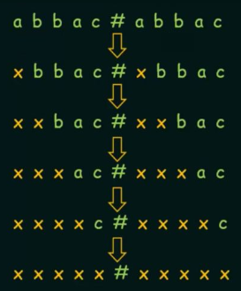  
   Source : https://youtu.be/CyB3aQhH9u4?si=lMWqmVsjgjpWpUiQ&t=117

   We can achieve this by comparing each symbol in the string and marking them with a some symbol, such as "x". The technique matches each symbol in the left string to the corresponding symbol in the right string, marking every match with the symbol "x".

   However, this approach modify the input string. Alternative way without modifying the input is, replacing each symbol with unique symbols instead of just one symbol. We will map each symbol to a unique symbol, then we can revert them back at the end if needed.

   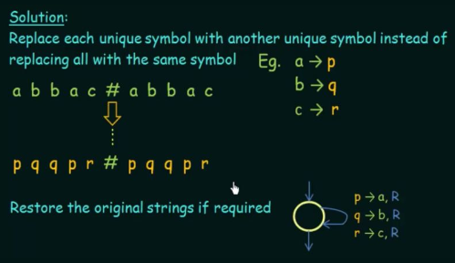  
   Source : https://youtu.be/CyB3aQhH9u4?si=c8MTpcI-8NzSncum&t=447

#### Multitape Turing Machine

Multitape Turing machine is a modification of the original Turing machine that incorporates multiple tapes instead of a single tape. Several tapes are independent, may have different symbols, and can run in parallel and be accessed simultaneously.

A multitape Turing machine is said to be valid if the tape is defined correctly (i.e., have defined symbols, valid head movement). The theory is, multitape Turing machine has an equivalent single tape Turing machine. There exist a standard Turing machine for each individual tape on the multitape Turing machine.

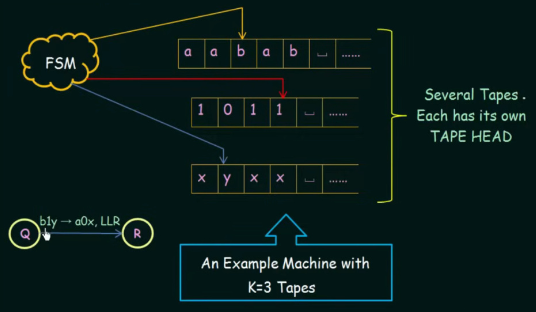  
Source : https://youtu.be/CLLutxGVDY4?si=kdDRfGdQAkO4QhZH&t=437

This is an example of Turing machine with three tapes. The three tapes are combined to make a state transition decision. For example, if the first tape is "b", second is "1", and third is "y", then write "a" on first tape, "0" on second tape, and so on, as depicted on the transition in the image.

In fact, all the tape in a multitape Turing machine can be combined altogether in a single tape Turing machine, such as separating each tape with some symbol like $\#$.

#### Nondeterministic Turing Machine

Nondeterministic Turing machine incorporates nondeterminism to Turing machine, just like how [NFA](/theory-of-computation-and-automata/finite-automata#nfa) to [DFA](/theory-of-computation-and-automata/finite-automata#dfa).

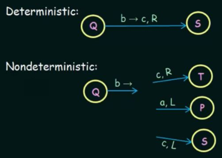  
Source : https://youtu.be/gQnPM6sydkk?si=bh5dsj6fnTSke-AG&t=208

The transition function for deterministic Turing machine (the one we had been discussing) is $\delta: Q \times \Gamma \rightarrow Q \times \Gamma \times \{L, R\}$. In contrast, the transition function for nondeterministic Turing machine is $\delta: Q \times \Gamma \rightarrow P(Q \times \Gamma \times \{L, R\})$, where $P(x)$ is defined as the power set.

As we did in [NFA](/theory-of-computation-and-automata/finite-automata#nfa) and [pushdown automata](/theory-of-computation-and-automata/pushdown-automata#pda-even-palindrome), we have to create a branch of computation to determine if the machine accepts certain string or not. The nondeterministic Turing machine will only accept it if there's a path that leads to ACCEPT state. If all the branches HALT and REJECT, machine is considered to reject it.

The video creates a "computation history" to capture the entire state of a Turing machine.

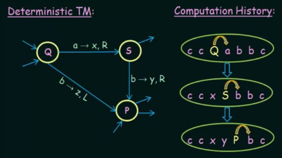  
Source : https://youtu.be/gQnPM6sydkk?si=5BLht7o2mIhtZsbu&t=466

A deterministic Turing machine will only have a single branch. The uppercase letter denotes the current state and the arrow represents the head movement. In contrast, in nondeterministic Turing machine, each node in the branch can have children.

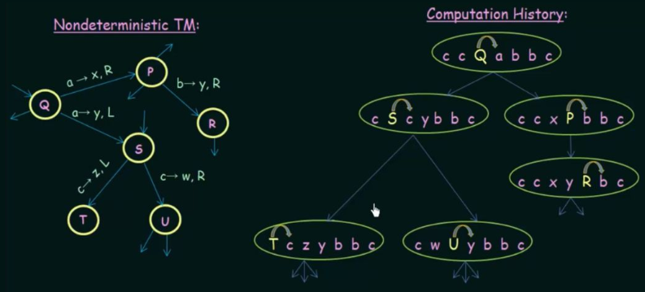  
Source : https://youtu.be/gQnPM6sydkk?si=31iIGrTMPfwhyOVo&t=700

### Church-Turing Thesis

Church-Turing Thesis is a fundamental hypothesis about the nature of computation in theoretical computer science. It was formulated by Alonzo Church and Alan Turing, which both independently developed equivalent computation model.

Alonzo Church introduced [lambda calculus](/computer-and-programming-fundamentals/declarative-functional-programming#lambda-calculus), a way to express computation in formal system, while Alan Turing introduced the concept of a Turing machine as a theoretical device for performing computations. More formal system are also introduced at the time.

The Church-Turing Thesis states that :

> Any function that can be effectively computed by any intuitive notion of computation, such as by a human following a systematic procedure, can be computed by a Turing machine.

This implies that the Turing machine model represents a universal computational model that can theoretically simulate any computation that can be performed by any other computational device or method. This property is known as **Turing completeness**. When we say something is Turing complete, it means that it has the same expressive power as a Turing machine. Many programming languages, such as Python, Java, C++, and others, are considered Turing complete because they provide the necessary constructs and features to express any computable function or algorithm.

:::tip
When we describe a problem or a computational task in terms of a Turing machine, we are essentially describing an algorithmic approach to solving that problem.
:::

Turing machine can be enhanced with many modifications as discussed before. The thesis states that any computational device or model that can effectively simulate a Turing machine is equivalent in terms of computational power. This means that if two computational models can simulate each other's behavior, they are considered computationally equivalent.

The variation of Turing machine introduces more features or capabilities, but they do not exceed the computational power of a standard Turing machine. We saw this in the [multitape Turing machine](#multitape-turing-machine), i.e., we can construct a single tape Turing machine with a separator between each tape. Similarly, a [nondeterministic Turing machine](#nondeterministic-turing-machine) can simulate a deterministic Turing machine by considering all possible computation paths.

### Classes of Languages

With Turing machine, there are a total of four languages that we have covered so far.

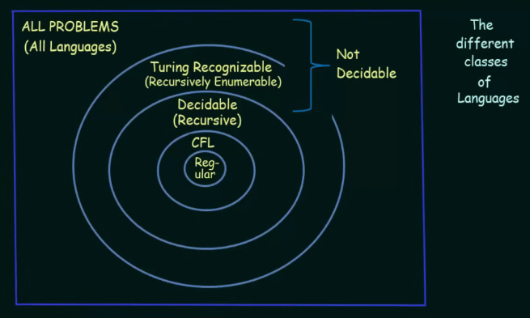  
Source : https://youtu.be/0D7yInuKvKs?si=DmhXS_NOnGgAYbWt&t=774

1. **Regular Language** : These languages are represented by [regular grammar](/theory-of-computation-and-automata/formal-grammar#regular-grammar) and can be recognized by [finite automata](/theory-of-computation-and-automata/finite-automata).
2. **Context-Free Language** : Recognized by [pushdown automata](/theory-of-computation-and-automata/pushdown-automata), represented by [context-free grammar](/theory-of-computation-and-automata/context-free-grammar).
3. **Decidable or Recursive Language** : This language can be recognized by a Turing machine, but the machine will always halt on any input. For example, it is always possible to determine if a string belongs to a recursive language, such as giving a "yes" or "no" answer.
4. **Partially Decidable or Recursively Enumerable Language** : It is also known as Turing recognizable, but the machine may or may not halt on all inputs. For strings not belonging to the language, the Turing machine may either reject them or run indefinitely without halting.
5. **Undecidable** : Additionally, anything outside the scope of the previous language is not recognized by the Turing machine, and the machine always halts for any inputs. One example of undecidable language is the [Halting Problem](/theory-of-computation-and-automata/undecidability#halting-problem) (see next notes).
