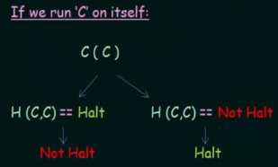
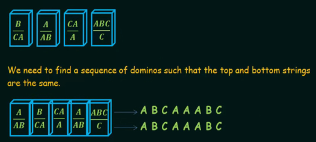
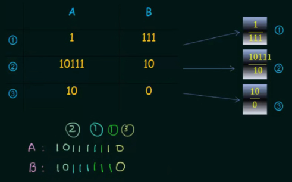
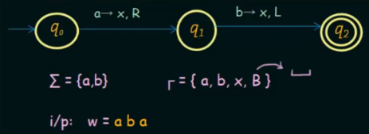
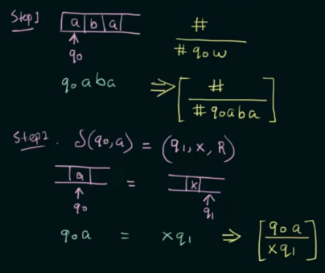
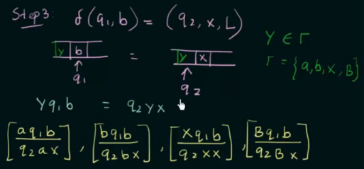
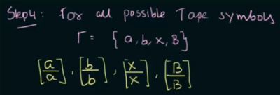
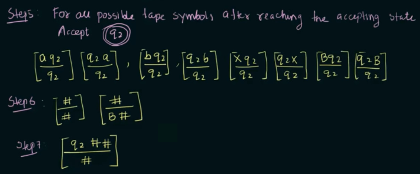
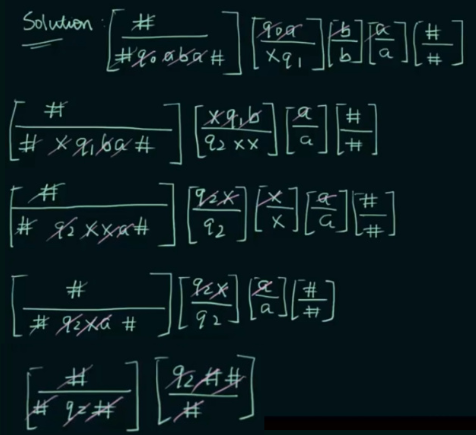

**Main Source :**

- **[Undecidable problem - Wikipedia](https://en.wikipedia.org/wiki/Undecidable_problem)**
- **Neso Academy playlist 107-113**
- **Book chapter 4.5**

A decision problem is the problem that asks something and require a yes-or-no answer. For example, determining whether a given number is prime or not is a decision problem. The answer to this decision problem is either "yes" if the number is prime or "no" if it is not.

A decision problem is called undecidable if we cannot construct an algorithm or find any computational equivalents to Turing machines that can solve it. When a problem is undecidable, it means that there is no general algorithm that can always provide a correct yes-or-no answer for every instance of the problem.

### Universal Turing Machine

Universal Turing machine is a concept that extends the Turing machine's capabilities to accept another Turing machine as input. It is a Turing machine capable of taking as input the description of any other Turing machine, along with its input, and then simulating its behavior, such as determining whether the inputted Turing machine will accept or reject its input.

Given a Turing machine $M$ and string $w$ string accepted by $M$, a universal Turing machine (UTM) would be such that $UTM(M + w) = M(w)$. In other word, it will be able to produce output as the original Turing machine itself.

It will behave as an original Turing machine would :

- When $M$ accepts $w$, the UTM should halt and accept.
- $M$ rejects $w$, the UTM halt and reject.
- $M$ loops on $w$, the UTM will not halt likewise.

A UTM is a recognizer for the language $A_{TM} = \{\langle M, w\rangle \space | \text{ M is a TM and M accepts w}\}$.

### Halting Problem

Halting problem asks whether a given program will halt (terminate) or continue to run indefinitely for a particular input. The halting problem can be stated as follows :

> Given a description of a program (such as a Turing machine) and an input for that program, is there an algorithm that can determine whether the program will eventually halt or run forever on that input?

A more realistic description of this problem would be :

> Is it possible to create a program that can determine, for any given program written in any programming language like Python, whether that program will run indefinitely (in an infinite loop) or eventually halt.

The answer is **NO**. One proof of this problem is the proof by contradiction.

#### Halting Problem Proof

Let us assume that there exists such program, call that program $H(P, I)$, where $P$ is the program, and $I$ is the input. This program can produce "Halt" or "Not halt" depending on the result.

Assume that there exist another program $C(X)$, the program would be like :

```
C(X):
    if H(X, X) == HALT:
        LOOP FOREVER
    else:
        RETURN
```

The program $C(X)$ will call $H$, inputting $X$ as the program and the input. When $H(X, X)$ returns "Halt", we will make $C(X)$ to loop forever, or stop its execution otherwise.

The contradiction arise when we input $C$ on itself, that is $C(C)$.

  
Source : https://youtu.be/_eM0-KfAmhQ?si=DjY75G07LAhN-BAJ&t=379

:::note
Inputting a program made in some languages to itself is actually common. In fact, a program made in language like C++ can be recognized (compiled) by a compiler made in C++.
:::

Here's the problem, $H(C, C)$ is supposed to determine whether running $C$ halts or not. Based on the description of $C(X)$, when $H$ halts, the program $C(X)$ will not halt. Similarly, when $H(X, X)$ does not halt, then $C(X)$ will halt.

This creates a contradiction, why does $H$ says $C$ halts while it is actually run by $C$ that doesn't halt? By this contradiction, we can conclude that $H$ does not exist.

### Post’s Correspondence Problem

Post's Correspondence Problem (PCP) is another undecidable problem.

The PCP involves finding a sequence of dominoes that can be arranged in such a way that when the top and bottom strings of the dominoes are concatenated, they match.

  
Source : https://youtu.be/VZNN1OGoqr8?si=1uAuHTAy8afcMb4h&t=326

Remember that classic domino game requires us to concatenate two matching ends of dominoes. For example, if one end of a domino has a 3 and the other end has a 5, we can only connect it to another domino that has a 3 or a 5 on one of its ends. It can either be "3|5-5|x" or "5|3-3|x".

Formally, given a set of dominoes, where each domino has a top and bottom string over some fixed alphabet, the PCP asks whether there exists a non-empty sequence of dominoes, with repetitions allowed, such that the concatenation of the top strings is equal to the concatenation of the bottom strings.

  
Source : https://youtu.be/VZNN1OGoqr8?si=4ANfxBUvLm2fZSfs&t=537

We can also represent PCP in simpler way, making only limited symbols, such as "0" and "1" as the alphabet and enumerate the distinct dominoes.

Some of PCP problem can be solved, but not all in general. It is possible that a program that is supposed to solve PCP infinitely loops trying to match the sequence of domino. We won't know whether the program is "still trying" or whether the particular PCP is just unsolvable.

#### PCP Proof

The undecidability of PCP involves making a program that can determine whether a solution to the PCP exists or not. To prove the undecidability of PCP, we will use a technique called **reduction**.

Reduction is used to show that if we had an algorithm that could solve problem A, we could use it to solve problem B. This is done by transforming instances of problem B into instances of problem A in such a way that the solution to problem A can be translated back to a solution for problem B.

If we know that a problem has been proven to be undecidable (e.g., the Halting problem), then we can attempt to convert that problem into an equivalent PCP instance to prove the undecidability of the PCP.

Consider the Turing machine follows :

  
Source : https://youtu.be/7w9elZjJ9Ko?si=EOQewOfQS_SR3owB&t=364

The machine is configured such that it can be encoded in PCP.

  
Source : https://youtu.be/7w9elZjJ9Ko?si=rYyUOiCI7BtNEwqg&t=498

We will associate each symbols and transition function with a domino of some symbols. The steps are :

1. The initial state $q_0$ will start with a domino with $\#$ in both ends. With input "aba", the bottom end, which is used as output is modified into $\#q_0aba$.
2. The top end is for input, so with state $q_0$ and "a", the top end becomes $q_0a$. The bottom end becomes $xq_1$, signifying that we write "x" on the tape and move to right.

     
   Source : https://youtu.be/7w9elZjJ9Ko?si=8rUo4BLYZA_qLhUL&t=738

3. When moving to left, there might be another symbols that we wrote. We will have to consider every possible tape symbol in $\Gamma$. This transition alone produces 4 distinct dominoes.

4. All the tape symbols are also enumerated into dominoes.

     
   Source : https://youtu.be/7w9elZjJ9Ko?si=6sCZC4svEwcYDK7T&t=802

5. Enumerate each tape symbols with the final state (step 5). Also, create the initial domino and the domino for blank symbol (step 6). Lastly, create the domino for final state (step 7).

     
   Source : https://youtu.be/7w9elZjJ9Ko?si=br0Va4ee-gHMQcxB&t=974

After creating the set of dominoes from all the symbols and transition, we can then try solving certain a PCP with it.

  
Source : https://youtu.be/7w9elZjJ9Ko?si=S9GLpkgV-mYALp9_&t=1554

It is shown that we can solve a particular PCP with this model reduced from a Turing machine. We have successfully converted an instance of the Turing machine into an equivalent instance of the PCP. We know that the halting problem has no general algorithmic solution, so we can conclude that the **PCP is also undecidable**.
