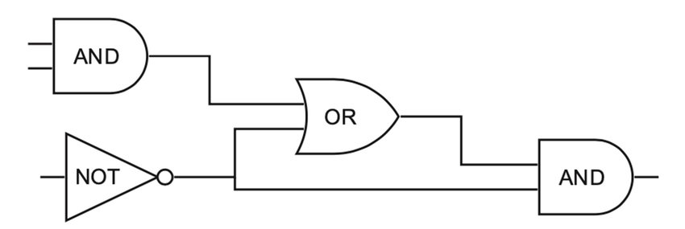
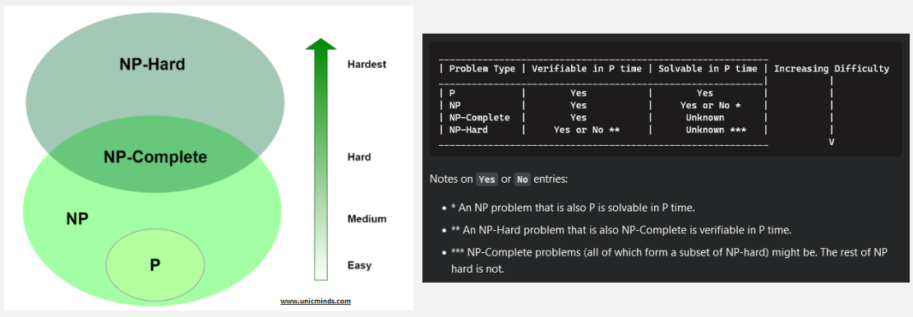
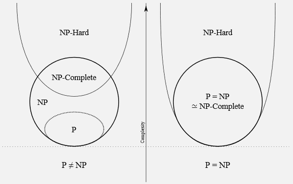

**Main Source:**

- **[Complexity class — Wikipedia](https://en.wikipedia.org/wiki/Complexity_class)**
- **[P, NP, CoNP, NP hard and NP complete | Complexity Classes — Geeks for Geeks](https://www.geeksforgeeks.org/types-of-complexity-classes-p-np-conp-np-hard-and-np-complete/)**
- **[What are the differences between NP, NP-Complete and NP-Hard? — stackoverflow](https://stackoverflow.com/questions/1857244/what-are-the-differences-between-np-np-complete-and-np-hard)**
- **[P vs. NP and the Computational Complexity Zoo — hackerdashery](https://youtu.be/YX40hbAHx3s?si=QfbZiNnWSdlRf0mM)**

**Complexity Theory** is the study of the behavior of computational problems, particularly in the difficulty and efficiency of solving problems, in the terms of time and space complexity.

Some concepts are:

- [Time Complexity](/data-structures-and-algorithms/analysis-of-algorithms#time--space-complexity): The amount of time required by an algorithm to solve a problem as a function of the input size.
- [Space Complexity](/data-structures-and-algorithms/analysis-of-algorithms#time--space-complexity): The amount of memory or storage space required by an algorithm to solve a problem as a function of the input size.
- [Big-O Notation](/data-structures-and-algorithms/analysis-of-algorithms#big-o-notation): Mathematical notation used to describe the upper bound or worst-case behavior of an algorithm as the input size increases.
- [Reduction](/theory-of-computation-and-automata/)
- [Complexity Class](#complexity-class)
- [P vs NP Problem](#p-vs-np-problem)

### Complexity Class

Complexity class is the classification of problems into a common level of computational complexity. Grouping together similar problems in terms of complexity could help us to solve them. To analyze the behavior and the complexity of algorithms, [Turing machine](/theory-of-computation-and-automata/turing-machine) is often used.

Terminology:

- **Decision problems**: Problem that requires yes-or-no answer. For example, determining whether number 7 is prime or not is a decision problem.
- **Polynomial time**: Mathematical expression that involves one or more variables raised to non-negative integer powers, multiplied by coefficients. For example, $n^1$ or simply $n$, $n^2$, $n^3$, $3n^2 + 3$. When we say a problem can be run in polynomial time, it means the running time of the algorithm for the problem grows no faster than a polynomial function of the input size.
- **[Reduction](/theory-of-computation-and-automata/undecidability#pcp-proof)**: Reduction is a concept where we transform one problem into other problem. The purpose of this is to use the solution of another solved problem. For example, we have solved problem B, but haven't solved problem A. If we can somehow reduce problem A to problem B, then we can use the same solution of problem B to solve problem A.

#### Time Complexity

The time complexity class is classified into five.

##### P

- P: Polynomial Time
- P is the complexity class that consists of decision problems that can be solved by a [deterministic Turing machine](/theory-of-computation-and-automata/turing-machine#turing-machine) in polynomial time. In other word, it can be solved relatively quickly.
- P problem's solution are also easy to find.
- Example of P algorithms includes [sorting algorithm](/data-structures-and-algorithms/sorting), it can be solved quickly and can be checked easily.

##### NP

- NP: Nondeterministic Polynomial Time
- NP is the complexity class that consists of decision problems that can be solved by a [nondeterministic Turing machine](/theory-of-computation-and-automata/turing-machine#nondeterministic-turing-machine) in polynomial time.
- The "yes" solution of an NP problem can be verified efficiently in polynomial time using [deterministic Turing machine](/theory-of-computation-and-automata/turing-machine#turing-machine).

Example of NP problem is the **Subset Sum**.

> Given a set of integers and a target value, determine if there exists a subset of the integers that sums up to the target value.

For example, let's say we have the set of integers {2, 4, 7, 9} and the target value is 13. The problem is to find out if there is a subset of these numbers that adds up to 13. In this case, the subset {4, 9} sums up to 13, so the answer would be "yes."

To verify a potential solution, we can simply sum up the numbers in the subset and check if the sum equals the target value. This verification process can be done in polynomial time. However, finding the subset itself is the challenging part, as the set of integers increase, it becomes more difficult.

##### Co-NP

- Co-NP: Complement of NP
- It consists of decision problems for which the "no" instances can be verified in polynomial time.
- While NP focuses on verifying or checking if a solution is valid, Co-NP, on the other hand, does the opposite by verifying or checking if a solution is invalid or incorrect.

It is not known whether NP and Co-NP are the same or different classes. If they belong to the same classes (NP = Co-NP), it would imply that every problem for which a "yes" instance can be verified in polynomial time also has a polynomial-time verification for "no" instances. In other words, if a solution can be quickly checked for correctness, then its invalidity can also be quickly determined.

An example of a problem in Co-NP is the problem of determining if a given number is not prime. The check can be done efficiently by dividing the number with any integer between 2 and the square root of the number without a remainder.

##### NP-Hard

- NP-Hard: Nondeterministic Polynomial-Time Hard
- NP-Hard is a class of decision problems that are at least as hard as the hardest problems in NP.
- Do not necessarily need to be in NP themselves.
- NP-Hard problems are believed to be computationally intractable (can be solved in theory but not in practice) and do not necessarily have a polynomial-time algorithm for their solution (again, because they may not be in NP).
- Solving an NP-Hard problem does not imply solving all problems in NP, but it indicates that the problem is at least as difficult as the hardest problems in NP.

Example of an NP-hard problem is the **traveling salesman problem**. The problem is to find the shortest possible route that visits a set of cities once and returns to the starting city. This problem is considered NP-Hard because we wouldn't know if some answer is really the shortest route. To verify this, we would need to check every possible route, which takes a long amount of time.

  
Source: https://makeagif.com/gif/traveling-salesman-problem-visualization-GZeMvl

##### NP-Complete

- NP-Complete: Nondeterministic Polynomial-Time Complete
- An NP-Complete problem is one that is believed to be among the most difficult problems in NP, it is the subset of NP and NP-hard.
- If a polynomial-time algorithm exists for any NP-Complete problem, it implies that a polynomial-time algorithm exists for all problems in NP.
- NP-Complete problems are considered to be of equal difficulty, meaning that solving one NP-Complete problem would effectively solve them all. This property is known as "completeness" because the complexity of all problems in NP is "complete" with respect to the complexity of NP-Complete problems.

An example of an NP-Complete problem is the **Circuit satisfiability problem (CSAT)**. This problem ask whether a circuit that consist of [boolean gates](/computer-organization-and-architecture/boolean-logic#logic-gates) can produce output 1, while ensuring that the inputs consistently remain as either 0 or 1.

To know if CSAT is NP-complete, we would need to proof it belongs to NP and NP-hard.

- CSAT is indeed in NP, we know that we can verify the solution efficiently in polynomial time.
- To know if it's NP-hard, we can find another problem that is already known to be NP-hard and reduce that problem to CSAT. The known NP-hard problem that can be reduced to CSAT is the **Boolean satisfiability problem (SAT)** problem.

  
Source: https://www.researchgate.net/figure/An-example-of-circuit-satisfiability-problem-The-answer-should-be-yes-here-as-an-input_fig2_354459093

The complexity classes diagram (P != NP) and comparison table:

  
Source: [diagram](https://unicminds.com/complexity-classes-p-np-of-problems-in-computer-science-coding/), [table](https://stackoverflow.com/questions/1857244/what-are-the-differences-between-np-np-complete-and-np-hard#answer-19510170)

#### Space Complexity

These are the complexity classes for space complexity:

- **L (Logarithmic Space)**: L is the class of decision problems that can be solved using a logarithmic amount of space on a deterministic Turing machine. It represents problems that can be solved efficiently with a very limited amount of memory.

- **NL (Nondeterministic Logarithmic Space)**: NL is the class of decision problems that can be solved using a logarithmic amount of space on a nondeterministic Turing machine. It represents problems that can be efficiently solved in logarithmic space with the help of nondeterministic choices.

- **PSPACE (Polynomial Space)**: PSPACE is the class of decision problems that can be solved using a polynomial amount of space on a deterministic Turing machine. It represents problems that can be solved efficiently with a reasonable amount of memory.

- **NPSPACE (Nondeterministic Polynomial Space)**: NPSPACE is the class of decision problems that can be solved using a polynomial amount of space on a nondeterministic Turing machine. It represents problems that can be efficiently solved with polynomial space when nondeterministic choices are allowed.

- **EXPSPACE (Exponential Space)**: EXPSPACE is the class of decision problems that can be solved using an exponential amount of space on a deterministic Turing machine. It represents problems that require a significant amount of memory to solve and grow exponentially in space complexity.

- **NEXPSPACE (Nondeterministic Exponential Space)**: NEXPSPACE is the class of decision problems that can be solved using an exponential amount of space on a nondeterministic Turing machine. It represents problems that can be efficiently solved with exponential space when nondeterministic choices are allowed.

### P vs NP Problem

**P vs NP** is a very famous question in computer science and mathematics. It asks whether every problem for which a solution can be verified in polynomial time (belonging to the class NP) also has a polynomial-time algorithm to find the solution (belonging to the class P).

If the answer for the question is true, meaning P problems belong to the same class to NP, or P = NP, it would mean that there is a polynomial-time algorithm for solving NP problems, indicating that difficult problems could be efficiently solved.

If the answer for the question is false, meaning P problems *does not belong* to the same class to NP, or P != NP, it would confirm that solving NP problems are indeed computationally difficult and that finding efficient algorithms for them is unlikely.

Below are the diagram of complexity classes if P = NP and P != NP:

  
Source: https://upload.wikimedia.org/wikipedia/commons/a/a0/P_np_np-complete_np-hard.svg
