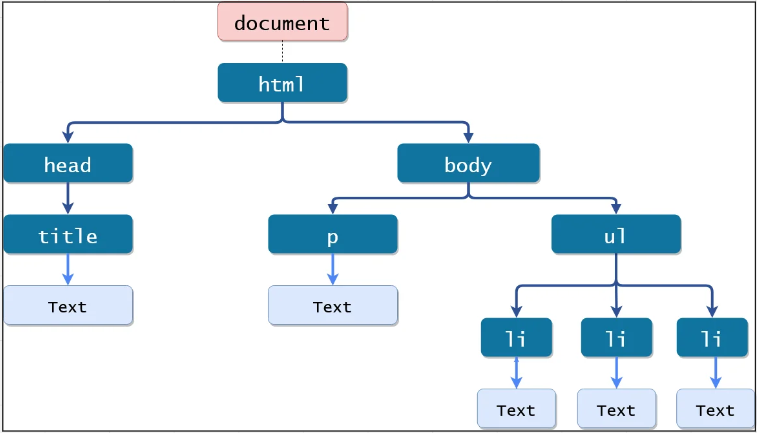

**Main Source :**

- **[What is the DOM? The Document Object Model Explained in Plain English](https://www.freecodecamp.org/news/what-is-the-dom-explained-in-plain-english/)**
- **[Wikipedia Document Object Model](https://en.wikipedia.org/wiki/Document_Object_Model)**

**HTML DOM** stands for HTML Document Object Model. It is a programming interface for HTML documents that provides a hierarchical representation of the document structure, along with a set of methods and properties for manipulating the content and structure of the document.

:::tip
DOM is not limited to HTML it is also used in **[Extensible Markup Language (XML)](https://en.wikipedia.org/wiki/XML)** which is markup language used to store and transport data in a structured format. XML allows developers to define their own custom tags and elements, making it highly extensible and adaptable to a wide range of applications.
:::

### DOM Tree

DOM is represented as tree-like structure, with each HTML element represented as a node in the tree and is represented as an object, with properties. The root of the tree is the document object, which represents the entire HTML document.

Objects and properties make each HTML element in the document possible to be accessed and manipulated using JavaScript. For example, the document object has properties such as title and URL, while HTML elements have properties such as innerHTML, className, and style.

Developers can use JavaScript to access and modify individual elements in the document, change their attributes and styles, add or remove elements from the document, and respond to user interactions.

Find out more about [DOM Manipulation](/web-development/html-css-javascript#dom-manipulation)

  
Source : https://www.tutorialstonight.com/js/js-dom-introduction

### Nodes Type

There are several different types of nodes in the Document Object Model (DOM), with each type of node representing a different kind of object in an HTML or XML document. Here are the most common types of nodes in the DOM :

- **Element Nodes** : Element nodes represent the actual elements in an HTML or XML document, such as `
`, `
`, and ``.
- **Text Nodes** : Text nodes represent the text content of an element, such as the text between two HTML tags.
- **Attribute Nodes** : Attribute nodes represent the attributes of an element, such as the src attribute of an `` element.
- **Comment Nodes** : Comment nodes represent comments in an HTML or XML document, such as `<!-- This is a comment -->`.
- **Document Nodes** : Document nodes represent the entire HTML or XML document and are the root node of the DOM tree.
- **Document Type Nodes** : Document type nodes represent the document type declaration in an HTML or XML document, such as `<!DOCTYPE html>`.
- **Processing Instruction Nodes** : Processing instruction nodes represent processing instructions in an XML document, such as `<?xml version="1.0" encoding="UTF-8"?>`.

### DOM Level

The Document Object Model (DOM) has evolved over time, with different versions or levels of the DOM being developed to support new features and capabilities. Here are some of the key levels of the DOM :

- **DOM Level 1** : The first level of the DOM was released in 1998 introducing the basic concepts of the DOM, such as nodes, elements, and attributes, and provided a set of core methods and properties for working with these objects.
- **DOM Level 2** : The second level of the DOM was released in 2000 and added support for new features such as CSS, event handling, and user interface controls. It introduced new interfaces and methods for working with stylesheets, events, and user interface elements, and improved support for XML namespaces and namespaces.
- **DOM Level 3** : The third level of the DOM was released in 2004 and included support for additional features such as XPath, keyboard navigation, and validation. It introduced new interfaces and methods for working with XPath expressions, keyboard events, and XML Schema validation, among other things.
- **DOM Level 4** : The fourth level of the DOM was released in 2015 and has since become the standard. DOM Level 4 offers notable enhancements in areas such as performance, security, internationalization, and accessibility. Additionally, it introduces new elements and attributes to the model.
