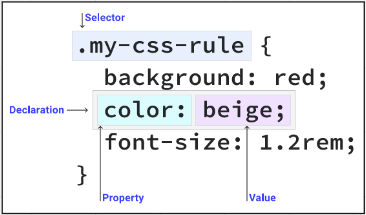
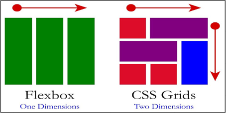

**Main Source : [Wikipedia CSS](https://en.wikipedia.org/wiki/CSS)**

CSS stands for Cascading Style Sheets, and it is a stylesheet language used for describing the presentation and formatting of a document written in HTML or XML. CSS separates the presentation of a webpage from its content, allowing designers to define the layout, fonts, colors, and other visual aspects of a webpage without affecting the underlying content.

CSS file is typically saved with a .css file extension and linked to an HTML document using a `<link>` element in the head section of the HTML file.

CSS works by searching specific HTML elements in the DOM tree and applies styles to elements using a cascading model, which means that multiple styles can apply to the same element, and the final style is determined by a set of rules that prioritize styles based on their specificity, inheritance, and other factors.

### HTML Selectors

HTML Selectors are used to identify each HTML elements, this includes :

- **Tag Selectors** : These selectors target all elements with a specific tag name, such as `<p>` or `<h1>`.
- **Class Selectors** : These selectors target elements with a specific class attribute, which **can be applied to multiple elements on a page**. Class selector can be specified like `<div class="my-class">`.
- **ID Selectors** : These selectors target elements with a specific ID attribute, which **should be unique on a page**. ID selector can be specified like `<div id="my-div">`.
- **Attribute Selectors** : These selectors target elements with a specific attribute or attribute value, such as `<a href="#">`.

### CSS Selectors

CSS selectors are used to apply styles to specific elements or groups of elements on a webpage and it often uses HTML Selectors to identify the elements. There are many types of CSS selectors, including :

- **Type Selectors** : These selectors target elements of a specific type, such as `<p>` or `<h1>`.
- **Class Selectors** : These selectors target elements with a specific class attribute.
- **ID Selectors** : These selectors target elements with a specific ID attribute.
- **Descendant Selectors** : These selectors target elements that are descendants of other elements, such as `<ul>` elements inside `<li>` elements.
- **Child Selectors** : These selectors target elements that are direct children of other elements, such as `<li>` elements that are direct children of `<ul>` elements.
- **Attribute Selectors** : These selectors target elements with a specific attribute or attribute value. For example using `input[type="text"]` means that it will apply style to all input elements which has type of text.
- **Pseudo-Selectors** : These selectors target elements based on their state or position, such as `:hover` or `:first-child.` For example defining a style on :hover means that style will be applied if such elements is hovered.

### Applying Styles

When the browser encounters a CSS file linked to an HTML document, it reads the CSS code and matches the selectors in the CSS rules to the elements in the DOM tree.

The syntax is :

- Selectors is specified which can be class, ID, attribute, type, or any other selector.
- Define the style property and value wrapped in curly brackets, CSS has various style property such as `color`, `font-size`, `font-weight`, and etc.

For example, if a CSS rule specifies that all `<p>` elements should have a font size of 16 pixels, the browser will apply that style to all `<p>` elements in the DOM tree.

```css
p {
  font-size: 16px;
}
```

This image below shows how style is applied using class selectors.  
We specify the class name and put a dot behind it `.<class name>`

  
Source : https://web.dev/learn/css/selectors/

If we are using id selector, then we will use `#` instead of `.` in front of the HTML selector name.

### CSS Features

CSS supports many feature such as :

- **Responsive Design** : We can apply different styles to adapt to different webpage based on the screen size, orientation, resolution, or other features of the device used to view the webpage.

  ```css
  /* If height of the screen is less than 768px, then apply the following styles */
  @media screen and (min-height: 768px) {
    body {
      background-color: #f0f0f0;
    }

    /* Sets the height of the header element to 50% of the vh (viewport) height 
       which is the part of the webpage that is visible to the user */
    header {
      height: 50vh;
    }
  }
  ```

- **Flexbox and Grid** : These are two layout models that allow you to create complex and flexible layouts for webpages. Flexbox is designed for one-dimensional layouts, such as rows or columns, while Grid is designed for two-dimensional layouts, such as grids.

    
  Source : https://codepolitan.com/blog/css-grid-vs-flexbox-5b4336849183d

- **Transition and Animation** : CSS transitions and animations allow you to create dynamic and interactive effects, such as hover effects, fade-ins, slide-outs, and more. Transitions and animations can be applied to various style properties, such as color, position, size, and opacity.  
  Transition can be defined by specifying transition effect and the duration while animation can be defined using keyframes.

  ```css
  /* Will make opacity transition in exactly 1 second and uses easing function which 
     starts the animation slowly, accelerates through the middle of the animation, 
     and then slows down again at the end */
  .button {
    transition: opacity 1s ease-in-out;
  }
  ```

  ```css
  /* Will animate the element opacity from 0 to 1 which creates fade out effect */
  @keyframes my-animation {
    0% {
      opacity: 1;
    }
    50% {
      opacity: 0.5;
    }
    100% {
      opacity: 0;
    }
  }
  ```
