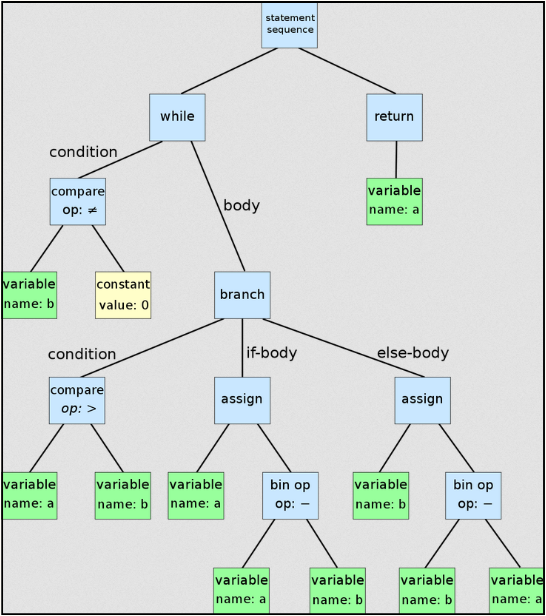
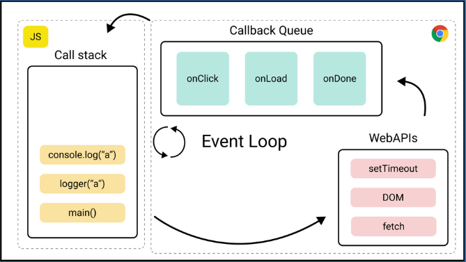

**Main Source :**

- **[Wikipedia Javascript](https://en.wikipedia.org/wiki/JavaScript)**
- **[Wikipedia V8 (Javascript Engine)](<https://en.wikipedia.org/wiki/V8_(JavaScript_engine)>)**
- **[V8 Hidden Classes](https://blog.bitsrc.io/secret-behind-javascript-performance-v8-hidden-classes-ba4d0ebfb89d)**

**JavaScript** is a high-level programming language first introduced in 1995, it is mostly used for web development. JavaScript was specifically created to be run in web browsers, which means it can integrate with the browser and access the [DOM (Document Object Model)](/web-development/html-dom) to change or manipulate it such as adding or deleting elements, changing style like color, modify content and etc.

Javascript is based on ECMAScript (ES) which is a scripting language specification or the standard that defines Javascript language. Javascript is now based on the ES6 (ECMAScript 2015) which was released in 2015.

### V8 Javascript Engine

Javascript is an interpreted language meaning that it is executed line-by-line at runtime rather than being compiled before execution. JavaScript code is executed by a **JavaScript engine** which is typically included in web browsers.

One of a Javascript engine is V8 which was developed by Google and is used in Google Chrome. The V8 engine is a just-in-time (JIT) compiler that compiles JavaScript code into machine code at runtime. The engine consists of several components that work together to execute JavaScript code efficiently :

1. **Parsing and Bytecode Generation** : The first step is V8 engine parse Javascript and turns it into an abstract syntax tree (AST) which is a tree-like data structure that represents the abstract syntactic structure of a program in a programming language. The parser checks the syntax of the code for correctness and creates a tree structure that represents the structure of the code.  
   After it's parsed, bytecode is generated and will be interpreted in the next step.

     
    Source : https://en.wikipedia.org/wiki/Abstract_syntax_tree

2. **Interpreter** : Once AST has been created, V8 engine executes the code using an interpreter called Ignition reading the codes line by line following the control flow.

3. **Profiler & Optimizer** : V8 engine includes a profiler that collects information about how the code is being executed. The information collected by the profiler, the V8 engine uses an optimizing compiler to generate more efficient machine code.

4. **Hidden Class** : Hidden Class is one of the optimization technique to improves the performance of object creation. V8 generate a class based on the structure of the objects we create in our JavaScript code. Javascript is a dynamic language which means variables, data types, and function calls are evaluated and executed at runtime. This can slows down the process of accessing properties, because the engine need to do type checks. Hidden classes provide certainty for the engine about the types of object properties which can improve efficiency of property accessing and object creation.

5. **Garbage Collector** : V8 engine manages memory allocation and deallocation using a garbage collector. The garbage collector identifies objects that are no longer needed by the code and deallocates the memory they occupy.

6. **Code Generation** : After everything is parsed and optimized, the code is compiled into machine code by the V8 engine's compiler. The machine code is then executed directly by the CPU, which results in faster execution times compared to interpreting the bytecode.

### Javascript Run-Time Environment

Javascript relies on run-time environment for managing the execution of JavaScript code. Javascript runs on a single-threaded environment which means it can only execute one task at a time. Javascript uses **call stack** which is a data structure that keeps track of the currently executing functions in the JavaScript call hierarchy.

The environment also includes **callback queue** which is a data structure that holds callback functions that are waiting to be executed such as asynchronous events like waiting for user input or making a network call.

Another mechanism to manages the execution is the **event loop**. When the call stack is empty, the event loop checks the callback queue for new events. If there is a callback function waiting in the queue, the event loop retrieves the function and adds it to the call stack for execution. This allows JavaScript to handle asynchronous events without blocking the execution of other code.

