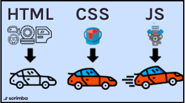

HTML, CSS, and Javascript are three different technologies that work together to create modern web applications.

- HTML (Hypertext Markup Language) define the structure and content of a web page. It consists of a series of elements that define the various parts of a web page, such as headings, paragraphs, images, and links.
- CSS (Cascading Style Sheets) is used to style and layout the content created with HTML. It allows developers to control the visual presentation of a web page, including its colors, fonts, spacing, and layout.
- JavaScript is used to add interactivity and dynamic functionality for the behavior of a web application. It allows developers to create interactive elements such as dropdown menus, sliders, and pop-up windows, and to perform actions in response to user input.

    
   Source : https://scrimba.com/articles/html-css-javascript/

### DOM Manipulation

When a web page is loaded in a browser, the browser creates a DOM tree based on the HTML code in the page. The browser parses the HTML code and creates a tree of nodes that represent the elements in the page. This DOM tree can be accessed and manipulated using JavaScript.

This allows developers to manipulate HTML and CSS in a web page. Javascript will access specific element by searching the DOM tree based on ID, class, selector, and tags.

For example consider the following code that shows how Javascript access an element based on id selector :

```html
<div id="myDiv">Hello, world!</div>
```

```javascript
// Get the element with the ID "myDiv"
var myDiv = document.getElementById("myDiv");

// Change the text content of the element
myDiv.textContent = "Hello, JavaScript!";
```

DOM manipulation with JavaScript can do a lot of things to a web page, including :

- Changing text content of an element using `.textContent`.
- Change attribute of an element using `.setAttribute`, for example changing an img src.
- Adding or removing classes from an element by `.classList.add("anotherClass")` or `.classList.remove("existingClass")`.
- Modify style with `.style` followed by the style element such as `backgroundColor`.
- Creating new elements and adding them to the DOM like below :

  ```javascript
  var newParagraph = document.createElement("p");
  newParagraph.textContent = "This is a new paragraph.";
  document.body.appendChild(newParagraph);
  ```

And many other methods and techniques...
