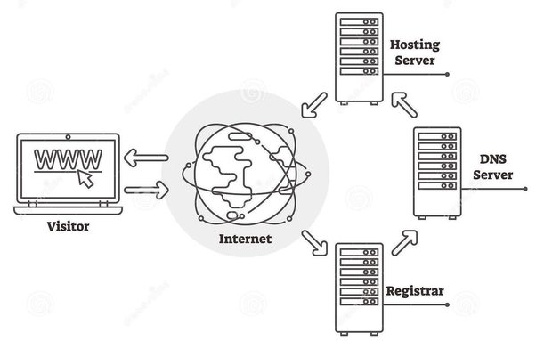

**Main Source : [What is web hosting?](https://www.hostinger.com/tutorials/what-is-web-hosting/)**

**Web hosting** is a service that allows you to store your website's files and data on a server that is connected to the internet. A web is typically hosted in a [server](/computer-networking/server), a web hosting service means that we pay someone to keep their computers on and process request and respond to any user who wants to visit our website. This make anyone who communicate with the server possible to access or visit your website.

When someone access a server from their web browser, it sends a request to the server where your website is hosted, and the server responds by sending the necessary files and data back to the user's browser, which displays the website on their screen.

There are several types of web hosting services available, these are some of the most common types :

- **Shared Hosting** : This is the most popular type of web hosting, where multiple websites share the same server resources. Shared hosting is typically the most affordable option, but it can also be slower and less secure than other types of hosting.

- **Virtual Private Servers (VPS)** : VPS hosting is similar to shared hosting, but each website is hosted on a virtual server that has its own dedicated resources. VPS hosting is faster and more secure than shared hosting, but it can also be more expensive.

- **Dedicated Hosting** : With dedicated hosting, you get an entire server to yourself. This option is the most expensive, but it also provides the highest level of performance, security, and flexibility.

- **Cloud Hosting** : Cloud hosting uses a network of servers to host your website, which provides better scalability and redundancy than traditional hosting options.

  
Source : https://www.quora.com/How-does-web-hosting-work
