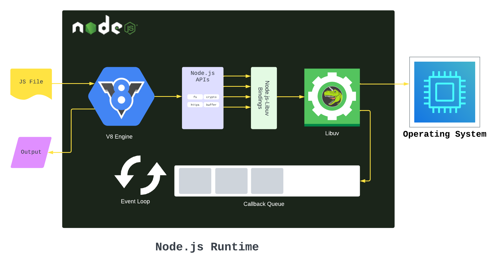

**Main Source : [Wikipedia Node JS](https://en.wikipedia.org/wiki/Node.js)**

**Node.js** is a JavaScript runtime environment that allows developers to run JavaScript on the server-side.

JavaScript is a client-side language, meaning that it runs in the context of a web browser on the client-side (i.e., the user's computer). However, with Node.js which provide runtime environment, developers can also run JavaScript code on the server-side.

Node.js is able to make javascript to run on server because it uses V8 engine which is the same engine used by Google Chrome in the client-side to run Javascript. Node.js instead uses this engine to run Javascript on server.

### Node JS Features

Node.js also provides a collection of modules related to server such as file system I/O, networking (DNS, HTTP, TCP, TLS/SSL, or UDP), binary data (buffers), cryptography functions, data streams, and other core functions.

Node.js uses an event-driven, non-blocking I/O model, single event loop to handle incoming requests. This means that instead of waiting for a request to complete before moving on to the next one, Node.js processes incoming requests in an asynchronous manner. Node.js registers a callback function, meaning another task will be executed once the currently executing task is completed.

  
Source : https://www.freecodecamp.org/news/what-exactly-is-node-guide-for-beginners/
