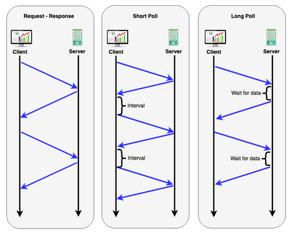
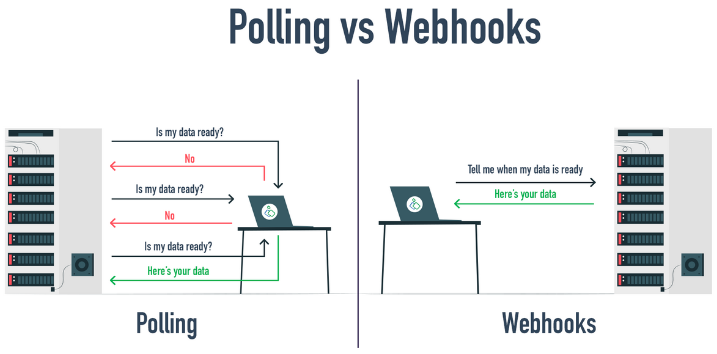

**Main Source:**

- **[HTTP Polling and Long Polling by Mitikaa Sama — Medium](https://medium.com/cache-me-out/http-polling-and-long-polling-bd3f662a14f)**
- **[How WebHook works — ByteMonk](https://youtu.be/oQaJn6RdA3g?si=LSFC4wRBjQBQTZx0)**

#### Polling

Polling is a process in which a client or system repeatedly checks or requests information from a server or data source. The client will first initiate an initial request to the server, after that the client will send a request again periodically. The server will send a response that include requested data or a message that indicate no update are available.

There are different type of polling:

- **Regular Polling**: In regular polling, the client sends periodic requests to the server at fixed intervals.

- **Long Polling**: Long polling is a variation of regular polling where the server keeps the request open for an extended period, even if there is no new data. Basically it waits for a moment before closing the request.

- **Interval Polling**: Interval polling is similar to regular polling, but instead of sending requests at fixed intervals, the client adjusts the polling interval dynamically based on factors like network conditions, server load, or previous response times.

    
   Source: https://dzone.com/articles/real-time-stock-data-updates-with-websockets-using

### Webhook

**Webhook** is a mechanism for two system to communicate with each other in real-time. The system will make an automated [HTTP request](/computer-networking/http-https#http-request--method) containing notification or data to a specific URL (called **Webhook URL**) whenever particular event or trigger occurs. Webhooks are event-driven, it helps to address the continuous request in pooling that waste resource.

#### Webhook Process

1. **Registration**: The system or application that wants to receive WebHooks (called receiver) exposes an endpoint or URL to accept incoming WebHook requests. This endpoint is usually provided by the receiver as part of its WebHook registration process.

2. **WebHook Configuration**: The sender or the one that will trigger the WebHook needs to configure the WebHook including the URL to specify where the WebHook requests should be sent, as well as additional required by the receiver.

3. **Monitor Event**: The sender system monitors for specific events or triggers that should initiate a WebHook. These events could be actions performed by users, changes in data, or any other predefined conditions.

4. **WebHook Request**: When an event or trigger occurs, the sender system constructs an HTTP request with relevant data (can be in [JSON](/digital-media-processing/json) format) and sends it to the WebHook URL provided during the configuration step.

5. **Receiver Processing**: The receiver system receives the WebHook request at the specified URL. It parses the request and process it based on the information received.

6. **Response (optional)**: After processing the WebHook request, the receiver system may send a response back to the sender system to acknowledge the receipt and processing of the WebHook. This response can be a simple HTTP status code or a more detailed response.

  
Source: https://www.zoho.com/blog/id/general/apa-itu-webhooks-dan-bagaimana-cara-pakainya.html
