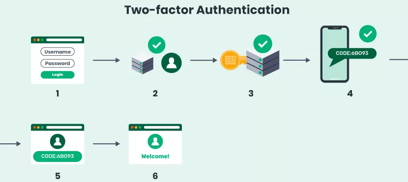
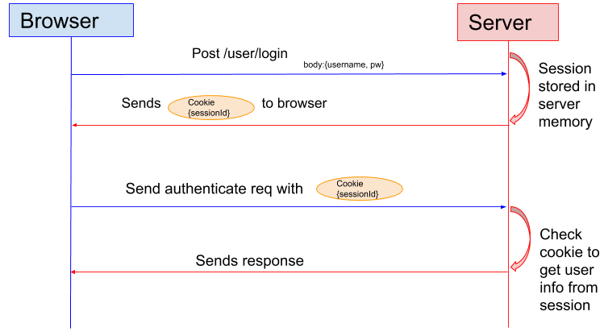
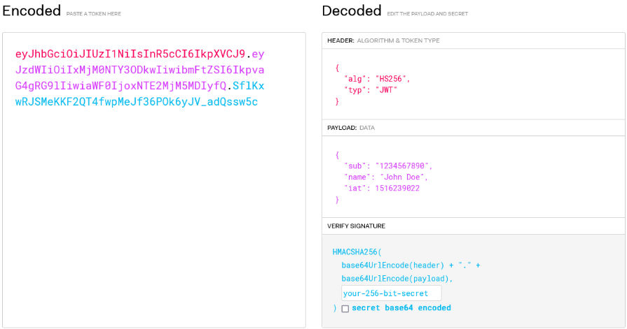
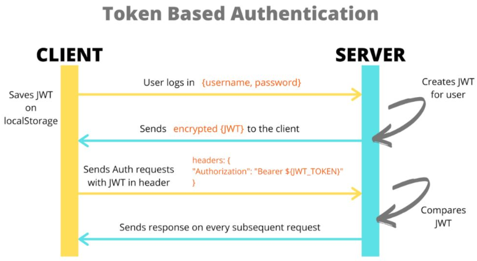
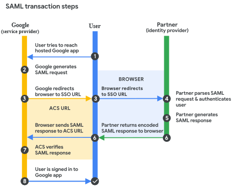

**Main Source:**

- **[Authentication factor - definition & overview — sumo logic](https://www.sumologic.com/glossary/authentication-factor/)**
- **[authentication factor — TechTarget](https://www.techtarget.com/searchsecurity/definition/authentication-factor)**
- **[Session Based Authentication | Authentication Series — the roadmap](https://youtu.be/gKkBEOq_shs?si=wCIoAb65N0x3oOhz)**
- **[Session vs Token Authentication in 100 Seconds — Fireship](https://youtu.be/UBUNrFtufWo?si=IGz6Uo6OpzPTywjq)**
- **[Token Based Authentication Made Easy — Auth0](https://auth0.com/learn/token-based-authentication-made-easy)**
- **[Components of JWTs Explained — FusionAuth Docs](https://fusionauth.io/articles/tokens/jwt-components-explained)**
- **[What Is Single Sign-on (SSO)? How It Works — ByteByteGo](https://youtu.be/O1cRJWYF-g4?si=4vqTPiWb4DheFCF8)**

**Authentication** is the process of verifying the identity of a user or system attempting to access a resource or perform an action. User's identity are typically stored in the system local storage such as database in a server or owned by the user itself in some authentication technique. The system will verify user's credentials by checking it if it's available in the storage.

The process of establishing user's identity in the system is called **register** or **sign up**. Common identity required are username, email, and password. The process of accessing the system with previously established identity is called **sign-in**. Last but not least, **logout** or **sign-out** which is the process of ending current access to the system.

### Authentication Factor

The characteristics of someone's identity can be categorized into 5, these are called **authentication factor**:

- **Knowledge Factors**: Knowledge factors rely on something the user knows, such as a password, passphrase, PIN, or answers to security questions.
- **Possession Factors**: Involve something the user possesses, typically physical object or devices such as smart cards or mobile devices.
- **Inherence Factors**: Also known as **biometric factors**, these are unique physical or behavioral characteristics of the user. Biometric authentication factors include fingerprint scans, iris or retinal scans, voice recognition, facial recognition, or even typing patterns.
- **Location Factors**: Location factors takes account the geographic location or network information associated with the user. For example, a system may authenticate a user based on their [IP address](/cs-notes/computer-networking/ip-address), GPS location, or proximity to a specific [Wi-Fi](/cs-notes/computer-networking/wi-fi) network.
- **Behavior Factors**: Behavior factors focus on the user's patterns and habits such as user's typing speed, mouse movements, navigation patterns, or even the timing and frequency of their interactions.

### Authentication Factor Number

Authentication may also include more than just one evidence from the user, there can be more than one factor of consideration, this is called **authentication factor number**.

- **Single-Factor Authentication (SFA)**: This involves just a single authentication factor, typically a password or PIN.

- **Two-Factor Authentication (2FA)**: 2FA requires the user to provide two different authentication factors to verify their identity. For example, the first factor is password and the system may generate some number which is sent to user's mobile device as the second factor.

- **Multi-Factor Authentication (MFA)**: MFA is the use of two or more authentication factors. It can include a combination of all authentication factor including the 5 listed above (knowledge, possession, inherence, location, behavior).

### General Authentication Process

1. **User Request / Login**: The authentication process begins when a user sends a request to access a protected resource or initiate a login operation, the user will also enter their credentials.
2. **User Identification**: The backend system receives the user request and verify it against the stored credentials. Based on the verification, the system decide whether to grant access to the user or not.
3. **Additional Factors (optional)**: Depending on the auth factor number used, the system may need additional credentials.
4. **Session Establishment**: Upon successful authentication, the system establishes a session for the authenticated user. A session is a period of time the user has been actively authenticated in a system, typically the user will receive their own session identifier, which will be used for subsequent access and is limited in time (expirable).
5. **Authorization & Access Grant**: The system decide whether the user has appropriate permission to do certain actions, if the user is allowed, the system will grant access to the user's requested resource or operation. The user can proceed to interact with the system or perform the desired actions.
6. **Session Termination**: After the user is done with their activity, the session can be terminated, whether explicitly through a logout operation, or automatically by the system after a period of inactivity or upon reaching the session expiration time.

  
Source: https://swoopnow.com/user-authentication/

### Authentication Techniques

Many types and techniques are used to implement authentication system, these methods can be categorized into two general types which are **session-based authentication** and **token-based authentication**.

#### Session-based Authentication

Session is a period of time the user has been actively authenticated in a system . After a user provide a valid credentials and successfully authenticated, the system will generate a unique session identifier. These are used to uniquely identify and track the user's session throughout their interaction with the system or application, this way the user doesn't need to authenticate everytime they made a request.

The session identifier (often referred as session ID) is typically also stored in user's device. They are stored in small piece of data called **cookie**. Cookie is a small text files sent by web server and stored in user's browser. Web browsers use cookies to store information about a user's preferences, activity, or session ID.

##### Session-based Authentication Process

1. **User Authentication**: The authentication process begins when a user submits their credentials such as a username/email and password to the server. The server verifies the provided credentials against its user database or authentication system. If the credentials are valid, the user is considered authenticated.
2. **Session Establishment & Generation**: After successful authentication, the server creates a session for the user. The server generates a unique identifier or session ID for the session. Session ID is stored on the user's device in the form of cookie, when the user wants to make request to the system, the browser will send this along with the request to identify the user.
3. **Session Validation**: Whenever the server receives a request from the user, it validates the session ID. It checks whether the session ID is valid, associated with an authenticated user, and has not expired or been invalidated.
4. **Expiration & Session Termination**: Sessions often have a defined expiration time to ensure security by allowing limited access to the system. Session can also be terminated before the expiration time, for example, if the user remains inactive for a specified period (idle timeout), or manually logs out, the session is terminated. The session ID is invalidated, and subsequent requests with that session ID will not be accepted.

  
Source: https://sherryhsu.medium.com/session-vs-token-based-authentication-11a6c5ac45e4

Session-based authentication has some downsides:

- **Session Management**: The server needs to store each of the user's session ID, in a large-scale application with high user traffic, this can be memory-intensive. The server also need to validate and maintain the session state which require additional processing. In a load balancing server architecture, session data also needs to be shared or replicated across servers to maintain session continuity.
- **Security Concern**: Session-based authentication can raise some security concern including [cookie hijacking](/cs-notes/computer-security/web-security#cookie-hijacking) and [cross-site request forgery](/cs-notes/computer-security/web-security#cross-site-request-forgery) which steal user's session ID to make request on behalf of the user.

#### Token-based Authentication

Token-based authentication is a method of authentication where a token is used to verify the identity of a user. A token is a unique and encoded string of characters that contains all the necessary information to authenticate user.

In session-based authentication, the user stores session ID and the server also store it as well along with the session state. Instead of that, when the user wanted to authenticate, the server send the user a token encoded in a secret key which only the server has. When the user makes a request, the server will verify if it is encoded using the same secret key. This way, we can reduce the burden of the server. However, token-based authentication still have some security downsides similar to session-based authentication, because the information is still stored on the client-side, it can still be stolen by an attacker.

##### JWT

In token-based authentication, JSON Web Token (JWT) is typically used as the implementation. JWT is encoded in [base64](/cs-notes/computer-and-programming-fundamentals/data-representation#base64) uses [JSON](/cs-notes/internet-and-web) as the format for representing the token's actual data. JWT consists of header, payload, and signature.

- **Header**: Header specify algorithm used to sign the token and the type of the token (which is "JWT").
- **Payload**: Payload contains the actual user's data such as username and email.
- **Signature**: Signature contains a string which is generated by signing the concatenated string of the header and payload with `.` using the algorithm specified in the header and the secret key owned by the server. While making request, the user send the token and the server will unsign the token and verify it.

  
Source: https://jwt.io/

##### Token-based Authentication Process

1. **User Authentication**: The user provides their credentials (e.g., username and password) to an authentication endpoint or service.
2. **Authentication & Token Generation**: The authentication server verifies the user's credentials and if successful, the server generates a token. This token is associated with the authenticated user and contains relevant information such as user ID, roles, and permissions.
3. **Token Issuance**: The server issues the token to the client in the response. The token is typically returned as part of the authentication response payload.
4. **Token Usage**: The client stores the token securely and include it in subsequent requests to the server. This is done by adding the token to request header, such as the authentication bearer method. This is done by including the token in the HTTP header, for example: `Authorization: Bearer abc123`.
5. **Token Validation**: When the server receives a request with a token, it validates the token using the secret key as well as other checks such as expiration time, token format, and any additional custom validation rules.
6. **Authorization & Access Grant**: Once the token is validated successfully, the server will only allow user action they are allowed to do based on the information in the token.
7. **Token Expiration**: Tokens may have an expiration time to ensure security and session management. If a token expires, the client needs to obtain a new token by repeating the authentication process.

  
Source: https://www.freecodecamp.org/news/how-to-sign-and-validate-json-web-tokens/

### SSO

**Single Sign-On (SSO)** is an authentication solution to authenticate user to log in once and gain access to multiple device without needing to authenticate again. SSO is implemented by protocol, the two popular are **Security Assertion Markup Language (SAML)** and **OpenID**. The difference is SAML uses XML while OpenID uses JWT to exchange data, both provide secure connection.

In SSO, a **service provider (SP)** is an application that relies on **identity provider (IdP)**, the one who provide user's identity. This is how SSO works in general using SAML:

1. **User Accesses an Application**: The user initiates the SSO process by attempting to access an application or service that supports SAML-based SSO.
2. **Application Redirects to Identity Provider (IdP)**: IdP is a service that authenticate user and provide identity information to other system, it is responsible for verifying user's identity. The application will redirect the user to the chosen IdP.
3. **User Authentication at IdP**: The user is presented with the IdP's login page or authentication form. The user enters their credentials (e.g., username and password) to authenticate themselves to the IdP.
4. **IdP Generates SAML Assertion**: Upon successful authentication, the IdP generates a SAML assertion, which contains information about the user's authentication status and attributes. The SAML assertion is digitally signed by the IdP, meaning it is encrypted using a [public/private key encryption](/cs-notes/computer-security/encryption#public--private-key) so that only the IdP and SP itself knows the information to ensure the integrity and origin of the data.
5. **SAML Assertion Sent to Service Provider**: The IdP sends the SAML assertion back to the original application or browser and sent it to the service provider. The assertion is sent to Assertion Consumer Service (ACS) URL, which is a specific endpoint provided by service provider used when the authentication is successful.
6. **SP Validates the SAML Assertion**: The SP receives the SAML assertion from the IdP. The SP validates the assertion by verifying the digital signature to ensure the assertion's integrity and authenticity.
7. **User Authorized & Session Established**: Upon successful validation of the SAML assertion, the SP considers the user authenticated and establishes a session for the user. The session allows the user to access the application or service without providing additional credentials, basically the authentication process will be skipped.
8. **SAML Assertion Expiration**: SAML assertions have an expiration time, typically set by the IdP. If the assertion expires, the SP may need to request a new assertion from the IdP to continue the SSO session. The SP may also support single logout, which is a mechanism to log out from the SP and terminate the SSO session.

  
Source: https://support.google.com/a/answer/6262987?hl=id
