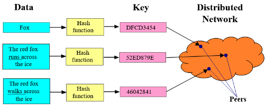
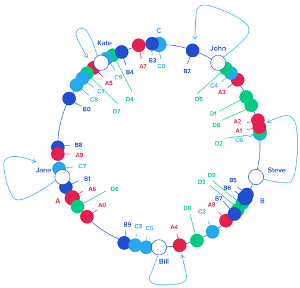

**Main Source:**

- **Mostly from previous notes**
- **[Task Assignment Approach in Distributed System — tutorialspoint](https://www.tutorialspoint.com/task-assignment-approach-in-distributed-system)**
- **[Distributed hash table — Wikipedia](https://en.wikipedia.org/wiki/Distributed_hash_table)**
- **[Simple basic explanation of a Distributed Hash Table (DHT) — stackoverflow](https://stackoverflow.com/questions/144360/simple-basic-explanation-of-a-distributed-hash-table-dht)**
- **[Rendezvous hashing — OpenGenus](https://iq.opengenus.org/rendezvous-hashing/)**

Communication and coordination is an important topic in distributed systems. **Coordination** involve managing and synchronizing the activities and behavior of multiple nodes in the distributed system. While **communication** is concerned with the exchange of information, messages, or data between components or nodes in a distributed system.

### Coordination

There are numerous coordination concerns in a distributed system. These include the synchronization and handling of concurrent operations, scheduling tasks as well as assigning them to nodes, and the ordering of message to ensure they are delivered in the correct order.

#### Synchronization & Concurrency Control

This includes:

- To avoid [concurrency issues, such as race condition](/cs-notes/operating-system/multithreading#multithreading-problems), we can utilize [locking mechanism](/cs-notes/cloud-computing-and-distributed-systems/distributed-database#locking) to treat resource access as exclusive. With exclusive access, we restrict a resource to be accessed by only a single node.
- When a node generates a value, maybe from executing business logic or processing data, all other nodes need to be aware of it. In other words, all nodes should maintain a synchronized view of the shared data to achieve consistency. Such techniques can be employed with techniques like [consensus](/cs-notes/cloud-computing-and-distributed-systems/distributed-systems-model#consensus), with one implementation being the [Paxos protocol](/cs-notes/cloud-computing-and-distributed-systems/distributed-systems-model#paxos).

#### Task Assignment

To make sure that nodes have a balanced workload or meet some performance constraints, we require a component capable of assigning and scheduling tasks.

Based on "who" will assign the task:

- **Centralized**: A central controller or scheduler is responsible for receiving task requests and making assignment and scheduling decisions. The central controller maintains information about the state and availability of nodes and assigns tasks based on predefined policies or algorithms. It is possible to optimize task assignment because the centralized system have a system-wide knowledge, but it can also introduce a single point of failure and scalability challenges.

  The controller can be chosen with [leader election algorithm](/cs-notes/cloud-computing-and-distributed-systems/distributed-systems-model#leader-election), with one example being the [Bully algorithm](/cs-notes/cloud-computing-and-distributed-systems/distributed-systems-model#bully-algorithm).

- **Decentralized**: In decentralized approach, each node makes its own decisions regarding task assignment and scheduling. Nodes can communicate with each other to exchange information about their capabilities, workload, and availability. This approach provides more fault tolerance and scalability but may require communication overhead within nodes. One algorithm for decentralized approach is the [distributed hash table](#distributed-hash-tables).

- **[Load Balancer](/cs-notes/software-engineering/system-design#load-balancer)**: We can own a dedicated component that handles task distribution among nodes. Load balancing algorithm consider factors like the current workload, processing capabilities, and network conditions to make task assignment decisions. Task assignment strategies includes round-robin, which assign task in circular manner, or least-loaded, where task is assigned to node with the least workload.

  Additionally, to make sure message or request received and processed in the correct order, we can employ a message queue, which can included within the load balancer. The message queue holds the submitted tasks in a [queue](/cs-notes/data-structures-and-algorithms/queue), ensuring that they are stored in the order of arrival.

  
Source: [Colored server icon](https://www.iconfinder.com/icons/4706235/data_server_database_datacenter_main_server_server_icon)

### Distributed Hash Tables

A distributed hash table (DHT) is a [hash table](/cs-notes/data-structures-and-algorithms/hash-table) that is decentralized across a network of nodes. Just like a traditional hash table, a key, which is the unique identifier is associated with a value, the actual thing that we store.

There are two reasons why traditional hash table can't be used in distributed systems:

- **Duplication**: If we were to copy all the content of hash table from one node to others, making the nodes maintain the same hash table, this will be a significant duplication and require additional overhead for synchronization. In a scenario where node joins or leaves the network (which is a common), this will require us to redistribute the entire data set whenever a node joins or leaves.

- **Load Balancing & Fault Tolerant**: The idea of DHT is, rather than having a centralized system keeping track all the data, we will instead spread the data across nodes. When there is a data retrieval, we will redirect the request to node whom own the data. This will obviously balance the workload of nodes, and will also be beneficial in case of node failure, as we can still redirect the request without needing to duplicate the data (back to first reason).

    
   Source: https://upload.wikimedia.org/wikipedia/commons/9/98/DHT_en.svg

The general DHT process:

1. **Node Identification**: Each node in the DHT network is assigned a unique identifier, which is used to determine the node's position in the DHT's addressing space.
2. **Key Space Partitioning**: The key space, which represents all possible keys in the DHT, is divided among the participating nodes. This partitioning or mapping between keys and nodes is based on algorithm like **consistent hashing** or **rendezvous hashing**.
3. **Data Storage and Lookup**: When an application wants to store or retrieve a key-value pair in the DHT, it performs a lookup operation to determine the node responsible for storing that key. The lookup algorithm will depend on the key space partitioning algorithm.
4. **Routing Table**: Additionally, each node maintains a routing table that helps facilitate key lookup and routing. The routing table contains information about neighboring nodes and their positions in the DHT's addressing space.
5. **Node Joins and Leaves**: Whenever a node joins, leaves, or fails, reinitialization and redistribution will be performed.

#### Consistent Hashing

Consistent hashing uses a ring or circle to represent the key space. Nodes are mapped to positions on the ring using a [hash function](/cs-notes/computer-security/hash-function) applied to their identifiers. Keys are also hashed and assigned to the closest node encountered on the ring.

For retrieval, the key will be hashed, and an algorithm to find the closest node on the ring to the hash value will be used. When a node joins or leaves the system, only a fraction of the keys needs to be remapped. The initialization that occurs when a node joins is determining its position on the ring. Whenever a node leaves, the other node closest to the position will take responsibility for its associated key.

  
Source: https://www.toptal.com/big-data/consistent-hashing

#### Rendezvous Hashing

Rendezvous hashing involves calculating a hash value for each key-node pair using a hashing function. Given a node identifier and a key, we will apply hash function, and we call the result as **hash weight**. Whatever nodes with the highest resulting hash weight will be assigned with the key.

For retrieval with rendezvous hashing, we would keep track all the node identifier, so we can produce all the hash weight for each node and find the node associated with the key. When a node joins, a recalculation of hash weight by each server may be done. When a node leaves, the associated keys with the particular node will be rehashed and redistributed to other nodes.

### Message Passing

There are several mechanisms to exchange message between nodes:

- **[Remote Procedure Calls (RPC)](/cs-notes/backend-system/rpc)**: Involve making a request for other node to execute particular procedure or method as if it were a local procedure call. The caller sends a message containing the procedure name and arguments to the remote process, which executes the procedure and returns the result.
- **[Message Broker](/cs-notes/backend-system/message-broker)**: Message broker with a message queue can also be used to store and deliver messages.
- **Publish-Subscribe (Pub/Sub)**: Publish-subscribe is actually a model of message broker, in which there exists publishers and subscribers. Subscribers express interest in specific types of messages by subscribing to the corresponding topics. Publishers send messages to the topics, and the pub/sub system delivers the messages to the interested subscribers.
