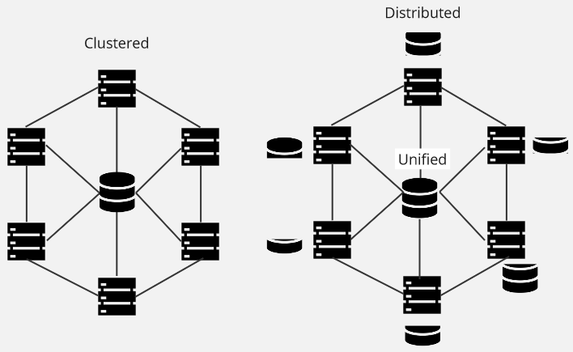

**Main Source:**

- **[Clustered file system — Wikipedia](https://en.wikipedia.org/wiki/Clustered_file_system)**
- **[Apache Hadoop, File systems — Wikipedia](https://en.wikipedia.org/wiki/Apache_Hadoop#File_systems)**

Distributed File System (DFS) is a [file system](/cs-notes/operating-system/file-system) that spans multiple servers or nodes in a network. The point of DFS is, to provide a unified and transparent view of the file system as a whole to users or applications, even if it's stored across multiple servers.

:::tip
In contrast, there is also **clustered file system**. Instead of each node managing their portion of file system, a clustered file system shares the same storage and each node have direct access to it.
:::

Benefits of DFS:

- **Scalability**: DFS allows for horizontal scalability by distributing files across multiple servers. As the storage needs grow, additional servers can be added to the system to increase the overall storage capacity.
- **Performance**: We can leverage the distributed nature of DFS by accessing files from multiple servers in parallel.
- **Fault Tolerance & High Availability**: We can replicate data across server and use an alternative if one is failing.
- **Transparency**: The client wouldn't be aware of how the file is stored, whether it spans across multiple servers or locations globally.

A typical distributed file system:

- The DFS owns a node responsible for keeping track the location of data (typically called metadata server), as well as the file metadata across all nodes.
- Client would interact to some interface, which contact the metadata server to make decision about file operations.

### HDFS

**HDFS (Hadoop Distributed File System)** is an example of distributed file system used in Hadoop, which is a framework for distributed storage and processing of large datasets.

:::tip
See also [MapReduce](/cs-notes/cloud-computing-and-distributed-systems/mapreduce), the programming model for Hadoop that is used for data processing.
:::

HDFS is built with [master-slave architecture](/cs-notes/cloud-computing-and-distributed-systems/master-slave). Hadoop provides 5 services:

- **Name Node**: Hadoop keeps track a master node, which acts as the central repository for the file system. It stores the file system namespace, including file and directory metadata such as file names, permissions, and block locations.
- **Data Node**: The data node is also known as the slave node, it stores the actual data as blocks. They are responsible for storing and serving data, as well as report their status to the master node.
- **Secondary Name Node**: A helper component for Name Node, provide check pointing functionality in case of Name Node fails. It's worth noting that it doesn't act as backup.
- **Job Tracker**: It is the master node responsible for managing the execution of MapReduce jobs submitted by clients, including asking the Name Node which node has the particular data.
- **Task Tracker**: The slave node for MapReduce, responsible for actually executing the tasks.

:::tip
In contrast to distributed/clustered file system that typically uses [master-slave architecture](/cs-notes/cloud-computing-and-distributed-systems/master-slave), a file system that uses [client-server architecture](/cs-notes/cloud-computing-and-distributed-systems/client-server) typically called network file system (NFS). NFS provide a remote file access mechanism where clients mount remote file systems to local environment provided by the server.
:::
