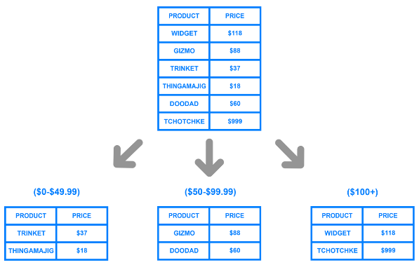
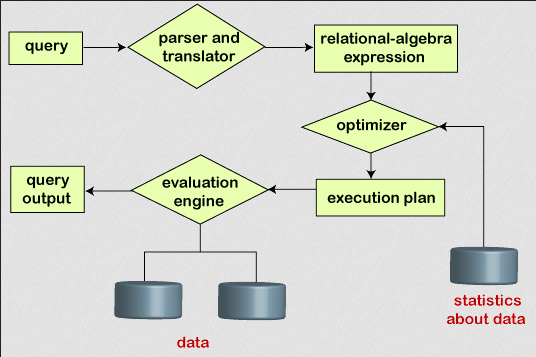
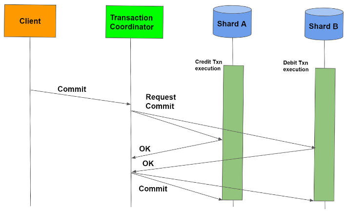

**Main Source:**

- **[Distributed database — Wikipedia](https://en.wikipedia.org/wiki/Distributed_database)**
- **[Distributed transaction — Wikipedia](https://en.wikipedia.org/wiki/Distributed_transaction)**
- **[Query Processing in Distributed Database System — IEEE Transactions on Software Engineering](<https://www.pdma.gov.pk/sub/uploads/query%20proceessing%20(1).pdf>)**

Distributed Database is a database system that is spread across multiple nodes or servers, often located in different physical locations or connected through a network. Data is partitioned and stored on multiple nodes, allowing for parallel processing and improved scalability, fault tolerance, and performance.

In order for distributed database to be useful, each node being able to serve content, it should be up-to-date.

- **[Replication](/database-system/logging-and-recovery#replication)**: Every change in one node, all other nodes should replicate the change by following some protocol. This process can be intensive and time-consuming as the size of data and the number of nodes in the system increase.
- **Duplication**: Duplication don't actively copy data from one to another. In duplication, there will be a node acting as a master (related to [master-slave architecture](/cloud-computing-and-distributed-systems/master-slave)). Periodically, the master database will be duplicated to other slave nodes. When making changes to database, only the master can be mutated.

### Database Sharding

Database sharding is a technique used to horizontally partition a database into multiple smaller and independent pieces called **shards**. Horizontal partitioning involves splitting a large dataset with a high number of rows into smaller shards, each consisting of a subset of the rows. These shards can be hosted on separate servers or nodes in a distributed system.

:::info
In contrast, a vertical partition split the dataset by columns, and what [normalization](/database-system/normalization) also does similarly.
:::

To actually know which node stores a particular data, we can use [consistent hashing](/cloud-computing-and-distributed-systems/distributed-systems-communication#consistent-hashing) technique.

Benefits of sharding:

- **Performance**: Less number of rows means the reduction in [index](/database-system/database-index) size, which potentially improves search performance.
- **Scalability**: We can scale the system horizontally by adding more nodes and shards.
- **Availability & Fault Tolerance**: If one shard becomes unavailable or experiences a failure, the remaining shards continue to function, minimizing the impact on the overall system.

  
Source: https://www.digitalocean.com/community/tutorials/understanding-database-sharding

### Distributed Query

The distribution of database across multiple nodes enables query to be parallelized. The process of query in distributed system:

1. **Query Decomposition**: Complex query is broke down into subqueries that can be executed in parallel across multiple nodes. Each subquery operates on a subset of the data distributed across the nodes.
2. **Query Optimization**: Query optimization aims to find the most efficient execution plan for a query. In a distributed setting, query optimization considers factors such as data distribution, network latency, and the cost of data transfer between nodes to determine the optimal plan. Distributed query optimizers often use techniques like cost-based optimization and statistical information about the distributed data.
3. **Data Localization**: Get the data that needs to be accessed to execute a query and identifying the nodes where that data resides. Data localization will reduce latency by minimizing unnecessary data transfer across the network.
4. **Parallel Execution**: Each node processes its portion of the query and returns the intermediate results to be combined at a later stage.
5. **Data Exchange & Communication**: During the execution of a distributed query, nodes need to exchange intermediate results and coordinate their actions.
6. **Result Aggregation**: Once the subqueries are executed in parallel, the intermediate results need to be combined or aggregated to produce the final result of the query. Aggregation can involve merging or joining intermediate results, sorting, grouping, or applying other operations to obtain the desired output.

  
Source: https://www.javatpoint.com/query-processing-in-dbms

### Concurrency Mechanism

With a bunch of nodes communicating and potentially sharing data, concurrency will always be a concern. Mechanism used to manage and coordinate concurrent access to shared resources in a distributed system are required.

A data operation can be classified as **read** or **write**. A read retrieves the value of a data item from a storage location or a shared resource, without modifying. A write operation modifies the value of a data item, updating or overwriting the existing value. A concurrency problem typically occurs when there are two nodes accessing the same resource, and one of them are writing operation.

Consider a scenario of node A and node B, where node A writes and node B reads, both accessing the resource C. Assume that node A and B execute their operation at the same time. Even if their operation is started at the same time, the end result depend on the actual execution. If the initial value of C is 100, B is supposed to read 100, but if node A executed first, then it will read whatever node A was writing. This scenario is often called [race condition](/operating-system/multithreading#multithreading-problems), and may lead to unexpected results.

#### Locking

Access of resource by nodes are exclusive, meaning a resource can only be accessed by a single node. A lock can be acquired by a node, meaning that particular node gain exclusive access to the resource, or released, the node makes it available for other node to acquire.

The component that holds the resource should implement the locking mechanism, keeping track of which node is currently acquiring the lock. When a node wants to access a resource, it will need to request the lock to the lock tracker. If there's another node acquiring the lock, then the access request will simply be delayed. Otherwise, that particular node will now acquire the lock and gain access to the resource.

:::tip
See also [mutual exclusion](/operating-system/multithreading#locks--mutex) and [two-phase locking](/database-system/concurrency-control#two-phase-locking).
:::

### Distributed Transactions

[Transactions](/database-system/transactions) done in traditional database system can also be applied to distributed database. A transaction is a logical unit of work that consists of multiple operations that need to be executed atomically, or as an indivisible unit.

#### Atomic Commit

Atomic commit is the protocol or mechanism that ensures a set of operations or transactions are either all committed or all aborted, maintaining consistency across multiple nodes or databases.

If any part of the transaction fails, all changes made by the transaction are rolled back, leaving the system in its original state. On the other hand, if all parts of the transaction succeed, all changes are committed, and the system reflects the updated state.

##### Two-Phase Commit

One implementation of atomic commit is the **two-phase commit (2PC)** protocol. This protocol consist of two phases, prepare and commit phase.

1. A coordinator node responsible for managing the transaction communicates with all participating nodes and asks them to prepare for the commit. Each participating node performs its portion of the transaction and prepares to commit. If any node encounters an issue during this phase or cannot prepare for the commit, it indicates a failure.
2. Based on the responses received during the prepare phase, the coordinator makes a final decision about whether to commit or abort the transaction. If all nodes are prepared to commit, the coordinator sends a commit message to all participating nodes, instructing them to permanently apply the changes. If any node is unable to commit or if there is a failure detected, the coordinator sends an abort message, instructing all nodes to roll back the changes.

  
Source: https://medium.com/geekculture/distributed-transactions-two-phase-commit-c82752d69324

:::tip
See also similar topic about [concurrency control in database system](/database-system/concurrency-control).
:::
