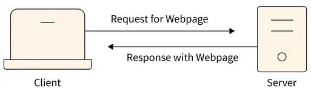

**Main Source:**

- **[Client–server model — Wikipedia](https://en.wikipedia.org/wiki/Client%E2%80%93server_model)**

**Client-Server model** is a type of architecture, typically used in distributed computing, where there exist two entity, namely **client** and **server**. A client can request a service or resource, and the server will be the one that response to the request, such as processing or computing the request, or retrieving the requested data.

  
Source: https://www.scaler.com/topics/nodejs/client-server-architecture/

One of the biggest application that uses client-server model is the **World Wide Web (WWW or the web)**. For example, when we open a website from our browser, we are essentially sending a request to a server. The browser act as the client that requests to that server. In the case of opening a website, we are requesting webpage resources ([HTML, CSS, JavaScript code](/cs-notes/internet-and-web/javascript#html--css--javascript)), which the browser will use to show us the website. The server is run by the organization or individual responsible for hosting the website or providing the service.

### Communication

The interaction between client and server is done in a specific protocol. They are specific rules and format that controls how the two should exchange data. Typically, we are only concerned with the application-level protocol.

The examples are:

- **[HTTP/HTTPS](/cs-notes/computer-networking/http-https)**: HTTP is a protocol used for communication between web browsers (clients) and web servers. HTTPS is the secure version of HTTP that adds encryption and authentication using [SSL/TLS protocols](/cs-notes/computer-networking/network-encryption#ssltls).
- **[FTP](/cs-notes/computer-networking/ftp)**: FTP is a protocol used for transferring files between a client and a server. The protocol will specify commands, which are used for file operations such as uploading, downloading, renaming, and deleting files on a remote server.
- **[SMTP](/cs-notes/computer-networking/email-protocol#smtp)**: SMTP is a protocol for sending email messages between clients and servers. It provides a set of commands and responses for the transfer of email across networks.

For example, the HTTP protocol specify that the client (web browser) must send a request consisting:

- **Request Line**: Specify the HTTP method, which specifies our desired action of requesting, target URL or resource, and HTTP version.
- **Headers**: Provide additional information about the request, such as content type, authentication credentials, or cookies.
- **Body (optional)**: If we are sending data to the server (e.g., submitting a form), they are sent along with the request.

The server that responses to the request must also follow the format rules:

- **Status Line**: Includes the HTTP version, a three-digit status code indicating the result of the request (e.g., 200 for OK, 404 for Not Found), and a brief status message.
- **Headers**: Additional information about the response, such as content type (specify what type of data is returned), caching directives, or authentication challenges.
- **Body (optional)**: Contains the requested resource or additional data sent as part of the response.

Here are a simple HTTP request and its response:

```http
GET /example-page HTTP/1.1
Host: www.example.com
User-Agent: Mozilla/5.0 (Windows NT 10.0; Win64; x64) AppleWebKit/537.36 (KHTML, like Gecko) Chrome/100.0.1234.56 Safari/537.36
Accept: text/html,application/xhtml+xml
```

This request specifies that we are requesting the `www.example.com` webpage. The `User-Agent` is a header that provides information about the client application making the request (in this case, a web browser).

```http
HTTP/1.1 200 OK
Date: Fri, 19 Feb 2024 12:00:00 GMT
Server: Apache/2.4.29 (Ubuntu)
Content-Type: text/html; charset=utf-8
Content-Length: 1234

<!DOCTYPE html>
<html>
<head>
   <title>Example Page</title>
</head>
<body>
   <h1>Welcome to the Example Page</h1>
   <p>This is a sample page for demonstration purposes.</p>
</body>
</html>
```

The response is an HTML page, which the browser will render and show it to us.
