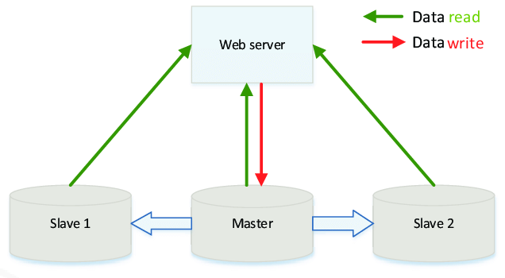
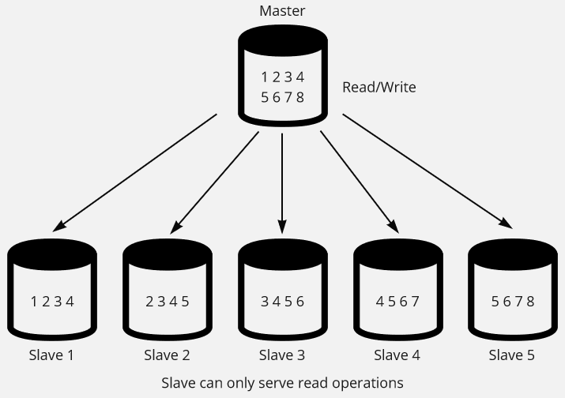

**Main Source:**

- **[Master–slave (technology) — Wikipedia](<https://en.wikipedia.org/wiki/Master%E2%80%93slave_(technology)>)**

**Master-Slave** architecture is a system architecture in which one component, called the **master**, controls one or more other components, called **slaves**.

The master component acts as a central authority and is responsible for making decisions, distributing work, and coordinating the activities of the slave components. The slaves are designed to carry out specific tasks assigned to them by the master. Slaves typically operate in parallel and independently, executing their assigned tasks without direct communication with each other.

The master-slave architecture is often used in systems where the workload needs to be distributed and parallelized to improve performance, scalability, or fault tolerance. The master component handles the high-level coordination and management tasks, while the slave components handle the lower-level processing or computation tasks.

  
Source: https://www.researchgate.net/figure/Master-slave-architecture_fig1_317299391

### Example

One common example of the master-slave architecture is [database replication](/database-system/logging-and-recovery#replication). Database stores a bunch of data, having a copy of them would minimize data loss. The concept of database replication is storing all or some subset of data in different device.

Any database operation that involves writing new data will only be applied to a single master database. One or more slave databases contains the replicate of the data. They are only responsible for handling read operation. The slave database will synchronize their data with the master over time.

Not only increasing fault tolerance, this also increase read performance, as we have multiple device that is capable of serving read operations.

