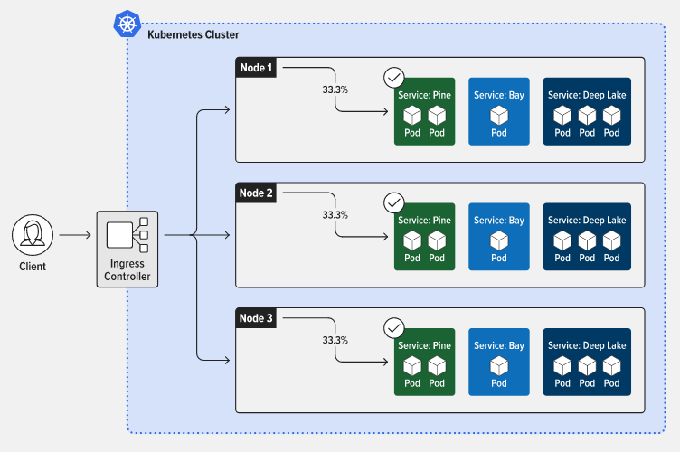

**Main Source:**

- **[Docker (software) — Wikipedia](<https://en.wikipedia.org/wiki/Docker_(software)>)**
- **[Kubernetes — Wikipedia](https://en.wikipedia.org/wiki/Kubernetes)**

### Docker

**Docker** is a platform that provides [OS-level virtualization](/cloud-computing-and-distributed-systems/virtualization#level-implementation) or [containerization](/cloud-computing-and-distributed-systems/containerization), allowing developers to package their applications in a format that can be easily distributed and run on any system that supports Docker.

Docker uses the idea of **containers**, these are isolated environment of our application. A container is fully-fledged format that contains all the necessary components to run an application, including the application's code, dependencies, libraries, and runtime environment.

Docker includes a **container engine**, which is the software that makes possible for our application hosted on it, to interact with the underlying system that the container is run on.

:::tip
Find more about [containerization](/cloud-computing-and-distributed-systems/containerization) and [virtualization](/cloud-computing-and-distributed-systems/virtualization).
:::

#### How containers are made

A Docker container is made using a **Docker images**, the "images" doesn't refer to images we see every day. An image is a set of instruction to build a container, images can be thought as a template of making container.

- **Dockerfile**: A Dockerfile is a text file containing the dependencies and configurations required by the application. Docker containers are designed to be lightweight, containing only the necessary dependencies. More general dependencies, such as the requirement of the system being a Linux kernel, may be included in a **base image**, which is specified in the Dockerfile.

  A base image is a pre-built image that serves as the starting point for building a Docker container. It may contain a minimal operating system and other basic components needed to run an application.

- **Build Command**: Docker provide a CLI to perform various operations, such as building Docker images, running Docker containers, and managing Docker networks and volumes. Once the Dockerfile is created, we can use the Docker CLI to build the image.

- **Image Registry**: Once the image is built, it can be stored in a registry—a repository for storing and distributing Docker images. _Docker Hub_ is an example of a registry, it as a public repository for distributing many pre-built Docker images. For instance, there may be Docker images created by other developers that can run an application with specific dependencies.

- **Container Creation & Management**: A Docker container is created from a Docker image using the `run` command. The `run` command creates a container based on the image, and it will start the container in a Docker environment. Once the container is running, we can use the Docker CLI to manage the container, such as starting, stopping, and deleting it.

  
Source: https://itnext.io/getting-started-with-docker-facts-you-should-know-d000e5815598

### Kubernetes

While Docker is used to build containerized applications, **Kubernetes**, on the other hand, is a container orchestration platform—or simply, a platform that helps manage and automate the deployment, scaling, and management of containerized applications.

Kubernetes becomes useful when application is containerized at scale, across multiple nodes or machines. This includes task scheduling of containers, ease of adding or removing containers, a way to monitor the health of containers, as well as restarting or replacing them. Additionally, Kubernetes provides a [load balancing](/cs-notes/software-engineering/system-design#load-balancer) service, capable of distributing incoming traffic across the available replicas of the service.

#### Concepts

Kubernetes organizes containers into something called **pods**, they are the smallest deployable unit in Kubernetes and can contain one or more containers. Containers within a pod share the same network namespace and can communicate with each other.

One or more pods grouped together and run on a machine is called a **node**. Node is responsible for running Pods of containers and provide resources like CPU and memory for the Pods running on it.

When there is a set of nodes that run containerized applications, these are called **Kubernetes cluster**. A cluster can be managed from a **control plane**, which is the component that is used to manage the state of the cluster and provide the API interface for managing and deploying containerized applications.

#### Component of Control Plane

- **API Server**: The API server is the front-end for the Kubernetes control plane and provides a REST API for managing and deploying containerized applications. It processes REST API requests, validates them, and updates the etcd datastore with the desired state of the cluster.

- **etcd Datastore**: The etcd datastore is a distributed key-value store that stores the desired state of the Kubernetes cluster. It serves as the single source of truth for the cluster's configuration, state, and metadata. This will help application deployed across multiple physical server to be able to synchronize their data.

- **Controller Manager**: The controller manager is responsible for managing the state of the cluster by running a set of controllers that watch the etcd datastore for changes and take actions to ensure that the actual state of the cluster matches the desired state. For example, the replication controller ensures that the desired number of replicas of a Pod are running, and the node controller monitors the health of Nodes and takes action if a Node becomes unhealthy.

- **Scheduler**: The scheduler is responsible for scheduling Pods to run on Nodes in the cluster based on factors like resource availability, node affinity, and anti-affinity. The scheduler selects the most suitable Node for each Pod and assigns it to that Node.

  
Source: https://www.nginx.com/resources/glossary/kubernetes/
