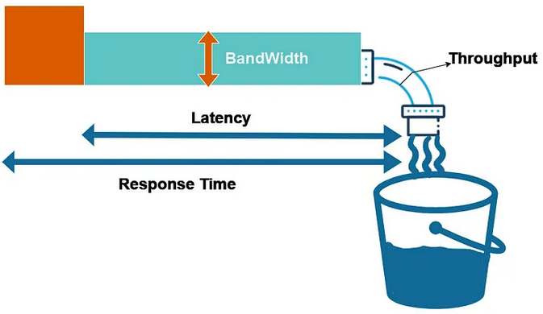

**Main Source:**

- **Various Google searches**
- **[The 25 Most Important Cloud Metrics For SaaS Companies To Monitor — CLOUDZERO](https://www.cloudzero.com/blog/cloud-metrics/)**
- **[MTBF, MTTR, MTTA, and MTTF — ATLASSIAN](https://www.atlassian.com/incident-management/kpis/common-metrics)**

### Terminology & Metrics

The quality of cloud computing services are measured by various metrics. Some common metrics are:

1. **Availability**: Refer to the ability of a system to remain operational and accessible to users.

   - **Uptime Percentage**: The percentage of time that the cloud service is available without interruptions or downtime within a specified timeframe (e.g., 99.9% uptime means the system is up 99.9% of the time).
   - **Mean Time Between Failures (MTBF)**: The average time between system failures.
   - **Mean Time to Repair (MTTR)**: The average time it takes to repair the system.
   - **Mean Time to Recover (MTTR)**: The average time it takes to restore service after a failure or outage.
   - **Mean Time to Resolve (MTTR)**: The average time to fully resolve a failure.

     
   Source: https://www.atlassian.com/incident-management/kpis/common-metrics

2. **Performance**: The speed, responsiveness, and efficiency of the system.

   - **Response Time**: The time it takes for the system to respond to a request or action.
   - **Throughput**: The rate at which the system can process or transfer data.
   - **Latency**: The time delay between a request and the corresponding response.
   - **Bandwidth**: The amount of data transferred to and from your cloud server over a given period.
   - **Transactions Per Second (TPS)**: The number of transactions or operations the system can handle in a second.

     
   Source: https://medium.com/@sandeep15mca/latency-bandwidth-throughput-and-response-time-0ee4d9028277

3. **Scalability**: The ability of a system to handle increasing workloads and growing user demands.

   - **Vertical Scalability**: The ability to increase or decrease the resources (such as CPU, memory, storage) of a single instance or virtual machine.
   - **Horizontal Scalability**: The ability to add or remove instances or virtual machines to accommodate increased or decreased workload demands.
   - **Auto-Scaling Efficiency**: The effectiveness and efficiency of the auto-scaling mechanisms in responding to workload changes.

4. **Utilization**: The extent to which computing resources are used.

   - **CPU Utilization**: Measured as the percentage of time the CPU is actively executing instructions.
   - **Memory Utilization**: Can be measured by the percentage of available physical or virtual memory that is actively used by running processes or applications.
   - **Disk Utilization**: Measured by monitoring the I/O operations performed on the disk, such as the rate or the number of read or write requests.

5. **Compliance**: The degree of adherence of cloud providers.

   - **Regulatory Compliance**: The cloud provider's adherence to industry-specific regulations and standards, such as HIPAA, GDPR, or PCI DSS.
   - **Certifications**: The attainment of certifications such as ISO 27001 (information security management), SOC 2 (security and privacy controls), or FedRAMP (for government agencies) to demonstrate compliance with specific security and privacy frameworks.

### Pricing Model

Cloud providers offer some pricing model:

- **Pay-as-you-go (On-Demand)**: Charges customer based on usage, typically on an hourly or per-minute basis. This model offers flexibility and cost-effectiveness as customers only pay for what they use.
- **Reserved Instances**: Customers can commit to a specific usage level for a contracted period (usually one to three years) and receive discounted pricing compared to pay-as-you-go rates. This model is suitable for predictable or steady workloads.
- **Function Pricing**: For [FaaS](/cs-notes/cloud-computing-and-distributed-systems/cloud-models#more-models) services, the pricing can be based on the number of function invocations and the execution duration.

#### Configuration

Customers can configure various settings to match their needs and expectations, and these configurations will impact the price.

- **Type of Services**: Customer choose what services they need, such as compute, storage, networking, databases, machine learning, or serverless functions.
- **Location**: The location of where the services will be hosted, typically based on region.
- **Tenancy**: Decide how cloud services are deployed. Can be **shared instances** in which customer shares the same physical hardware, **dedicated instances**, customers are provided with their own isolated virtual machines, or **dedicated hosts**, customers are provided an entire physical server or host dedicated exclusively to their use.
- **Compute Resources**: Decide the resources, including virtual machine instance type, the number of instances, operating system, how many vCPU (virtual CPU), amount of memory, cache size, and storage capacity.
- **Networking**: Estimate the number of request and responses per period of time, amount of bandwidth, network performance, and scaling options for traffic spikes.

### Examples of Cloud Services

The top three cloud services are Amazon Web Services (AWS), Google Cloud Platform (GCP), and Microsoft Azure. Below is a list of commonly used services on each of them.

#### Amazon Web Services

- **Amazon EC2**: Virtual servers in the cloud
- **Amazon S3**: Object storage service
- **Amazon RDS**: Managed [relational database](/cs-notes/database-system/relational-data) service
- **Amazon VPC**: Virtual private cloud for networking
- **Amazon SNS**: Simple Notification Service for messaging and notifications
- **Amazon SQS**: Simple Queue Service for [message queuing](/cs-notes/backend-system/message-broker)
- **Amazon DynamoDB**: Fully managed [NoSQL database](/cs-notes/database-system/nosql)
- **Amazon CloudFront**: [Content delivery network (CDN)](/cs-notes/software-engineering/system-design#cdn)
- **Amazon Route 53**: Scalable [domain name system (DNS)](/cs-notes/computer-networking/dns) web service
- **Amazon Lambda**: [Serverless](/cs-notes/backend-system/serverless) compute service
- **Amazon Redshift**: Fully managed data warehouse
- **Amazon Elastic Beanstalk**: [Platform as a Service (PaaS)](/cs-notes/cloud-computing-and-distributed-systems/cloud-models#common-models) for deploying and managing applications
- **Amazon CloudWatch**: Monitoring and observability service
- **Amazon Glacier**: Low-cost archival storage service

#### Google Cloud

- **Google Compute Engine**: Virtual machines in the cloud
- **Google App Engine**: Platform as a Service (PaaS) for building and deploying applications
- **Google Kubernetes Engine**: Managed [Kubernetes](/cs-notes/cloud-computing-and-distributed-systems/docker-and-kubernetes#kubernetes) service for container orchestration
- **Google Cloud Storage**: Object storage service
- **Google Cloud SQL**: Fully managed relational database service
- **Google Cloud Firestore**: Flexible, scalable NoSQL document database
- **Google Cloud Functions**: Serverless compute platform for event-driven applications
- **Google Cloud DNS**: Scalable domain name system (DNS) service
- **Google Cloud CDN**: Content delivery network for low-latency and high-throughput content delivery
- **Google Cloud AutoML**: Automated machine learning service for building custom ML models
- **Google Cloud Vision**: Image recognition and analysis service

#### Microsoft Azure

- **Azure Virtual Machines**: Virtual machines for Windows and Linux
- **Azure App Service**: Platform as a Service (PaaS) for building and deploying web and mobile applications
- **Azure Kubernetes Service (AKS)**: Managed Kubernetes service for container orchestration
- **Azure Storage**: Scalable and secure object, file, and block storage
- **Azure SQL Database**: Fully managed relational database service
- **Azure Service Bus**: Cloud messaging service for connecting distributed systems
- **Azure Functions**: Serverless compute service for event-driven applications
- **Azure DNS**: Scalable domain name system (DNS) service
- **Azure CDN**: Content delivery network for fast and secure content delivery
- **Azure Active Directory**: Identity and access management service
- **Azure Monitor**: Monitoring and observability service
- **Azure Log Analytics**: Centralized logging and analytics for collecting and analyzing data
- **Azure Machine Learning**: Cloud-based machine learning service for building and deploying models
- **Azure Databricks**: Unified analytics platform for big data and machine learning
