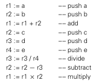

**Main Source:**

- **Book 2 chapter 5**

Compiler translate source code into machine code. In order to translate, it will need to know the source language (the programming language) and the target language. The target language differs depending on the processor's architecture. Every computer system has its own unique architecture, i.e., they have their own way to execute instruction, organize memory, and utilizing other hardware features.

The compiler needs to be aware of the target architecture for which it intends to generate code. It needs to know the available instructions, the way memory is organized, and other details of the architecture. This knowledge enables compiler to perform tasks like register allocation, instruction selection, and optimization.

:::tip
The two popular architecture are [CISC (e.g., x86)](/cs-notes/computer-organization-and-architecture/isa#cisc) and [RISC (e.g., ARM)](/cs-notes/computer-organization-and-architecture/isa#risc), see also [ISA](/cs-notes/computer-organization-and-architecture/isa).
:::

### Memory

There are three types of memory: registers, main memory or RAM, and external device like hard drives. These three are ordered based on their hierarchy, with the higher being faster to access but lower capacity.

- Registers hold the smallest amount of data including intermediate result of the execution of an instruction. Some registers are also used to keep track important information about instruction, such as memory address, stack pointer, bit as flags for ALU operation.
- Main memory hold the program data and codes.
- External devices like hard drive typically used for storing large amounts of data, such as system or files, databases, or multimedia content.

:::tip
See also [registers & ram](/cs-notes/computer-organization-and-architecture/registers-and-ram).
:::

There is another type of memory faster than main memory, though slower than registers, known as **cache memory**. However, compilers do not directly manage cache memory as it is handled by the CPU itself. Nevertheless, compilers can optimize code generation to indirectly improve cache performance. Cache memory relies on frequent data access, so one improvement the compiler can make is rearranging the code to access data stored close together in memory.

Compiler needs to know the characteristics of memory, such as the [minimum memory to address](/cs-notes/computer-organization-and-architecture/coa-fundamentals#word-size), [padding](/cs-notes/computer-organization-and-architecture/coa-fundamentals#padding), [endianness](/cs-notes/computer-organization-and-architecture/coa-fundamentals#endianness), [floating-point representation](/cs-notes/computer-and-programming-fundamentals/floating-number#floating-number-representation), [binary representation](/cs-notes/computer-and-programming-fundamentals/binary-representation#binary-representation) or the size of data types.

:::info
Due to architectural and requirements differences, some computers may store data types, such as integers differently. While the usual integer size is 4 bytes, others may use 2 bytes or even 8 bytes. The compiler needs to be aware of these variations to generate machine code capable of handling different size representations correctly, ensuring the appropriate number of bytes are read or written.
:::

### Instruction Set Architecture

[Instruction set architecture (ISA)](/cs-notes/computer-organization-and-architecture/isa) is the set of instruction offered by the machine that the running program must follow in order to control the CPU.

- **Available instructions**: To generate correct code and possibly optimize it, compilers need to know the complete set of instructions supported by the target architecture. This includes arithmetic instructions, logical instructions, data transfer instructions, control flow instructions, etc.
- **Instruction formats**: Compilers need to know how the target architecture specify its instruction.
- **Register set**: ISA specifies the available registers and their purposes. Compilers need to know this to determine the appropriate machine code instructions and register usage during code generation.
- **Operand types and sizes**: ISA defines the types and sizes of operands that can be used with each instruction. The compiler needs to know these operand types and sizes to ensure proper type checking, generate correct instructions, and handle implicit type conversions, if necessary.
- **Addressing modes**: This describes how memory operands are specified. It determines whether the CPU requires a memory address, register, immediate value, or any other form of data to perform computations.

### Optimization

#### Pipeline

CPU uses technique like [pipelining](/cs-notes/computer-organization-and-architecture/cpu-design#pipelining), in which instruction are executed in parallel. Sometimes, pipeline doesn't always work and may not work optimally, these problems are often called as hazards.

It is possible that parallel instruction access same register, this is called **structural (or resource) hazard**. When an instruction depends on the result that is not available yet, this is called **data hazard**. The CPU also make a prediction of conditional branch to execute instruction more efficiently. A **control hazard** happens when the branch prediction is wrong, making the specific pipeline process unnecessary.

One optimization that could be made by compiler to reduce hazard is, making optimization to loops. Loop optimizations like loop unrolling and loop fusion increase the number of instructions available. While it increases the number of instructions, these can potentially be better for parallel execution. As iterations get more independent, pipeline throughput can be improved.

Another thing is, the compiler itself can rearrange the instruction. Compiler analyzes the dependencies between instructions and rearrange them to maximize parallelism as well as avoiding data hazard. We don't need to strictly follow the sequential order of the program, instead, we can execute instructions based on the availability of operands, this technique is called [out-of-order execution](/cs-notes/computer-organization-and-architecture/cpu-design#out-of-order-execution).

#### Register Allocation

Register allocation is the process of assigning variables and values to physical registers in a computer program during compilation. The goal is to efficiently use registers to keep frequently used data with a constraint of limited number of physical registers.

Compilers use virtual registers during compilation process to represent variables and intermediate values in a program. Register allocation is when a compiler maps virtual registers to physical registers, considering factors such as data dependencies, register availability, variable lifetimes, and interference between variables.

Depending on the architecture, they have the different number of physical registers, size, and types. The arrangement of instruction also affect the availability of registers, a thoughtful scheduling can further optimize register allocation and utilization.

For example, given an expression `(a + b) × (c − (d / e))`. One way to calculate this is using 9 separate register.

```
R1:= a
R2:= b
R3:= c
R4:= d
R5:= e

R6:= R1 + R2   // (a + b)
R7:= R4 / R5   // (d / e)
R8:= R3 - R7   // (c - (d / e))
R9:= R6 * R8   // ((a + b) * (c - (d / e)))
```

The end result is stored at R9. However, registers are limited, and we can't just use all the available registers.

  
Source: Book page 772

This evaluation uses 4 register, reusing the previous register for the new intermediate value. There are many factors in optimizing this, such as reducing the number of registers used, the number of memory accesses, the number of spills (moving values between registers and memory), and the overall performance of the generated code.

:::info
This example uses an intermediate representation called [three-address code (TAC)](/cs-notes/compilers-and-programming-languages/intermediate-representation#linear-ir).
:::

:::tip
More about [register allocation](/cs-notes/compilers-and-programming-languages/compiler-optimization#register-allocation).
:::
