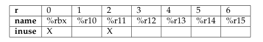
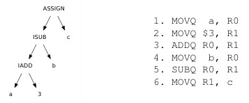
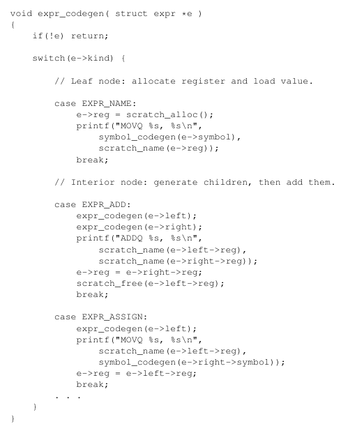
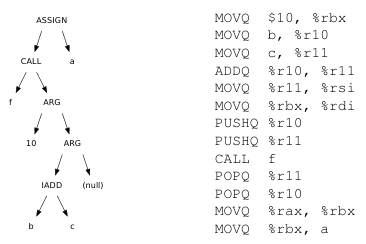
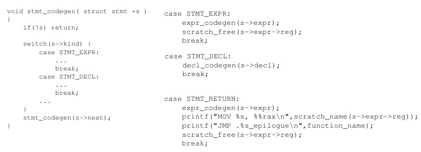
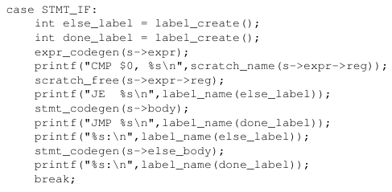
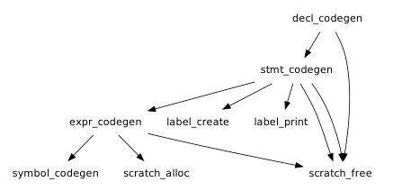

**Main Source:**

- **Book 1 chapter 11**

### Helper Functions

When generating codes, it is useful to create several helper functions.

```
int scratch_alloc();
void scratch_free( int r );
const char * scratch_name( int r );
```

These are helper functions related to registers. We will store register in a table and access them with number.

  
Source: Book 1 page 182

- `scratch_alloc` is used to allocate for free register, mark it as used, and return the register number.
- `scratch_free` marks the register `r` as free for use.
- `scratch_name` return the name of register with the given number `r`.

Scratch registers are also known as registers used to keep intermediate result or value.

In the assembly program, to indicate jumps and conditional branches, we will need many labels. These two function should help us in label management, including generating and retrieving them.

```
int label_create();
const char * label_name( int label );
```

We are going to use generic label name like `L1`, and it is going to be incremented as we use `label_create`. It's function simply increment global counter and return current value. The `label_name` return label in string form given its number. `label_name(15)` would return ".L15".

Then, write a function to map between symbol in program to its assembly language representation.

`const char * symbol_codegen( struct symbol *s );`

It takes the symbol representation, which may contains the scope. Scope will be examined to determine whether to return the corresponding symbol in local or global scope. It should return a string which represent the instruction to compute the address of that symbol. For example, if the given symbol is local variable or function parameters, the address may be computed by doing stack instruction.

### Generating Expressions

To generate an expression, we need to traverse the [AST](/compilers-and-programming-languages/semantic-analysis#abstract-syntax-tree) or [DAG](/compilers-and-programming-languages/intermediate-representation#directed-acyclic-graph).

The AST represents the expression's operands in the left and right child nodes, while the operation performed on them is the parent node itself. A [post-order traversal](/data-structures-and-algorithms/traversal#postorder-traversal) ensures that the left and right child nodes are visited first, so we know what the operands are.

The strategy is to store left and right node's value temporarily in registers. To let the parent node know which register we used, we store an information about it in each node. On each visit to node, we should generate corresponding assembly code.

  
Source: Book 1 page 184

:::note
It's generated in [x86 assembly](/computer-organization-and-architecture/assembly-language#x86-assembly-language).
:::

Each step correspond to each line of the assembly code.

1. A post-order will visit the left-most node, which is `a`. This `a` will be stored in register allocated from the `scratch_alloc`. It should be allocated on the `R0`, and the instruction `MOVQ a, R0` is generated.
2. Next, node `3` is visited, and it will be allocated on the `R1`. Corresponding instruction is also generated.
3. The parent `IADD` is visited. It should know that its children hold values on `R0` and `R1`. It will generate `ADDQ R0, R1`. Since `ADD` is destructive that leaves result in the second argument `R1`, `scratch_free(R0)` will be called.
4. The `b` is visited, similarly, `scratch_alloc` is called to allocate the register `R0`.
5. The parent `ISUB` is visited. It should compute based on registers on `IADD`, which stores its value in `R1` and `b`, which stores in `R0`. Result is stored in `R1` and `R0` is freed again.
6. Visit the `c` node, but this will not produce code, since it is a target assignment.
7. Visit the `ASSIGN` node and produce `MOVQ R1, c`.

We should also call `scratch_name` on each register to obtain the real register name.

```
MOVQ    a, %rbx
MOVQ   $3, %r10
ADDQ %r10, %rbx
MOVQ    b, %rbx
SUBQ %rbx, %r10
MOVQ %r10, c
```

Here is one example of how the traversal can be implemented in code:

  
Source: Book 1 page 186

Consider the case when variables `a`, `b`, and `c` were not so simple, such as a literal in function argument, or an argument that needs to be evaluated.

For example, if `a` is first argument of a function, this would be generated instead: `MOVQ -8(%rbp), %rbx`. The minus 8 indicates that we are moving the base pointer on the stack because a function first argument is located at an offset of 8 bytes below the `%rbp` register (in x86_64 machine).

When multiplication happens, result is always stored in `%rax` and its potential overflow in `%rdx`.

```
MOV   $10, %rbx
MOV     x, %r10
MOV  %rbx, %rax
IMUL %r10
MOV  %rax, %r11
```

This mean that we can't use `%rax` and `%rdx` during multiplication. We better not use `%rdx` anywhere for this purpose.

#### Function Call

  
`a = f(10, b + c)`  
Source: Book 1 page 187

When calling a function, the `ARG` node corresponds to a function argument. Depending on the case, function arguments may be passed by placing them on the stack or by placing them in registers. With the former (also called **stack calling convention**), we will use the `PUSH` instruction. With the latter (also called **register calling convention**), we should copy each of them to the argument registers. The `%rdi` and `%rsi` are typically used for first and second arguments of a function.

Before calling the function with `CALL f`, we have to preserve any registers used before doing this function call. Save caller-saved registers before `CALL` and restore them after it returns. In this case, the caller-saved registers are `%r10` and `%r11`. They contain the value of `b` and `c`, which is computed as argument already, yet we still include them. This is because it is possible that function `f` depends on or modifies them, which means it causes side effects to the registers. By preserving them, we ensure that `f` is provided with the expected values and that the original values are restored afterwards.

The function returns value should be stored in `%rax`, and it will be moved to newly allocated scratch registers `%rbx`.

### Generating Statements

Various statements can be encountered, this includes control flow statements. We should create a function that generates code for any kind of statements. One could look like below.

  
Source: Book 1 page 188

[Recall the AST representation of statements](/compilers-and-programming-languages/semantic-analysis#statements), all information about a statement is encapsulated in the `stmt` struct. The struct includes several optional fields, such as body expression, else expression (if an if statement), declaration (if a declaration).

Each statement may call another specific generator.

- A declaration is simple; it simply calls the code generator for declaration.
- A statement that includes expression will obviously need to generate expression, which can call the previously discussed `expr_codegen` and free the registers used by the expression after.
- A return statement must be evaluated as well, hence `expr_codegen` should be called on the given statement. After a function returns, it is expected that the execution continue to the caller. In other word, we must jump to the return address on the call stack.

#### Control Flow

A control flow like if-else statement should look like:

```
if (expr) {
    true-statement
} else {
    false-statement
}
```

The approach is to evaluate the expression first, then use `CMP` to evaluate to true or false. Depending on the result, jump to the corresponding statement.

The assembly should be like below.

```
expr
CMP $0, register
JE false-label
true-statement
JMP done-label

false-label:
    false-statement

done-label:
    ...next code
```

It evaluates expression, compares whether it is 0 (false). If it's a yes, jump to `false-label`, which contains the false statement. Else, the true statement will be evaluated, and once it is done, skip the `false-label` by jumping directly to the next code (`done-label`).

  
Source: Book 1 page 190

A for loop is:

```
for (init-expr; expr; next-expr) {
    body-statement
}
```

In assembly:

```
            init-expr
top-label:
            epxr
            CMP $0, register
            JE done-label
            body-statement
            next-expression
            JMP top-label
done-label:
            ...next code
```

The initialization expression should be evaluated first. A typical loop is constructed by:

1. Compare result of an expression.
2. Depending on the result, either execute the body statement, execute next expression (e.g., increment counter), then jump back to the start of the loop, or jump to the next code.

### Conditional Expressions

Conditional expression includes comparison between data types that returns boolean values. They can be less than, greater than, equal, etc. It is a form of `left-expr < right-expr`. If we assign the result of comparison to a variable, such as `b: boolean = x < y;`.

```
            left-expr
            right-expr
            CMP left-register, right-register
            JLT true-label
            MOV false, result-register
            JMP done-label
true-label:
            MOV true, result-register
done-label:
            ...next code
```

Left and right expression is evaluated. Both results are stored on their corresponding register. `CMP` is performed on the two, which set the register flag. Depending on the result, it can execute the `JLT` (jump if less than) to the `true-label`, which assign true to the result register, or execute the `MOV false, result-register`, which assign false instead.

### Generating Declarations

Declarations can be local variable declaration, global variable, and function declaration. Global declaration is simple, we just need to generate label on the data section of the assembly code.

```
i: integer = 10;
s: string = "hello";
b: array [4] boolean = {true, false, true, false};
```

```
.data
i: .quad 10
s: .string "hello"
b: .quad 1, 0, 1, 0
```

If there were conflicting declaration, the further declaration will overwrite the previous values. If the declaration contains expression, they will need to be evaluated first, because data section must contain constant values.

A local variable declaration is contained within a function. This mean that it is pushed onto the stack during the function execution.

To declare a function, we will need to generate label for the function name to start executing the function, and another label for the return statement. Inside the function, we will need to do necessary steps, this includes the function prologue and epilogue.

- Prologue: Setting up function's stack frame, including allocating space for parameters and local variables.
- Epilogue: Cleaning up the function's stack frame before returning, such as restoring the stack pointer, restoring the previous base pointer.

Overall, the relationship of the code generator functions can be summarized as follows.

  
Source: Book 1 page 182
