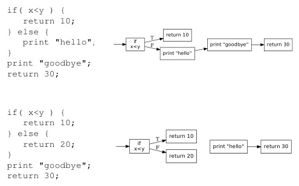
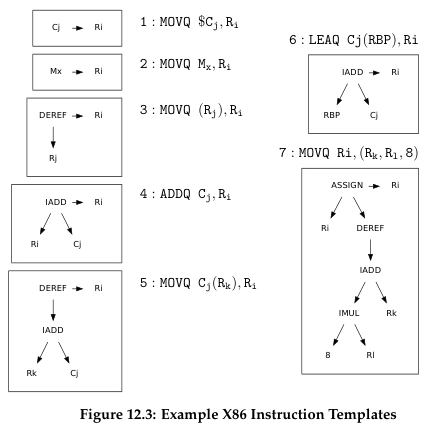
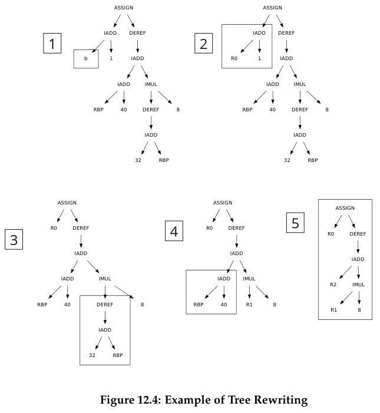
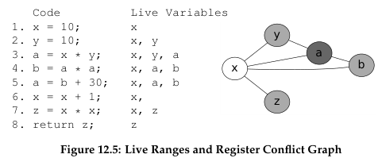

**Main Source:**

- **Book 1 chapter 12.**

Many optimization techniques can be applied to assembly code or intermediate representation (e.g., [AST](/cs-notes/compilers-and-programming-languages/semantic-analysis#abstract-syntax-tree)). Some optimizations occur within local blocks, globally, or even across the entire program. It's worth noting that not all optimizations work in every scenario. Therefore, the compiler should analyze the program to determine whether to apply certain optimizations. This means that optimization can increase compilation time due to additional analysis.

:::note
The point of optimization is to improve the code while also ensuring that the overall program result remains the same. One thing that can prevent optimization is the presence of side effects. For example, a compiler may choose to evaluate one expression before another. However, it turns out that the second expression modifies the result of the first expression, which may change the overall result.
:::

As much as optimization benefits us, it can make debugging and decompilation challenging, since the original code is gone. For example, result, breakpoints, line numbers, and variable values observed during debugging may not directly correspond to the original source code.

Some type of optimization:

- **Simplification**: This includes removing redundancy and removing unnecessary computations.
- **Control flow**: Targets control flow structure (e.g., loops and conditionals), such as reducing the number of branching to reduce [pipelining stall](/cs-notes/computer-organization-and-architecture/cpu-design#pipelining).
- **Memory and registers**: Efficient and correct allocation of registers and memory to reduce their usage and improve speed. For example, we can store frequently used variables in registers instead of the memory to increase access speed.

### Constant Folding

Constant folding simplify expressions (or part of them) that involve constants, which is known during compile-time. For example, the [second calculation in a day](/cs-notes/compilers-and-programming-languages/intermediate-representation#optimization) effectively demonstrate this concept.

During compilation, expressions are checked to determine whether they contain constants or not. Only if all the operands of the expression are known are they calculated. For example, arithmetic operation typically takes two operands.

```
int result = 10 * 10 + 100 - 10

// is optimized to:
int result = 190
```

```
int result = 10 * 10 + x

// is optimized to:
int result = 100 + x
```

### Strength Reduction

Strength reduction replaces an expression to equivalent but less expensive operation.

- `x * 8` is optimized to `x << 3`, as [bit shifting](/cs-notes/computer-and-programming-fundamentals/bitwise-operation#bit-shifting) can be faster than multiplication. This is similar to division.
- `x ^ 2` (exponentiation) is optimized to `x * x`, as exponentiation may use techniques like Taylor series, which may be more expensive than simple multiplication.

### Loop Unrolling

In branching, CPU can try to make an educated guess about the outcome of a branch instruction before it is actually executed. This will avoid [pipeline stalls](/cs-notes/computer-organization-and-architecture/cpu-design#pipelining), which further improves performance.

Loop typically involve branch and jump instruction. These instructions introduce control flow changes, which may result in branch mispredictions. This happens when the CPU fails to make a correct guess. It would need to discard the speculatively executed instructions and fetch the correct instructions at the cost of extra time.

Loop unrolling modifies the structure of a loop by replicating loop iterations and combining them into a larger loop. This will make the loop repeat less, but does more work on each iteration. This will reduce the number of branching, which can increase [instruction-level parallelism](/cs-notes/computer-organization-and-architecture/cpu-design#superscalar), the ability to execute multiple instruction simultaneously.

```
// Original loop
for (int i = 0; i < 4; i++) {
    print(arr[i])
}

// Unrolled loop
for (int i = 0; i < 4; i += 2) {
    print(arr[i])
    print(arr[i + 1])
}
```

The first loop will call `arr[0]`, `arr[1]`, `arr[2]`, and `arr[3]`, with each being called in a different iteration. Notice that the second loop increments `i` by 2 instead. This change causes the second loop to call `arr[0]` and `arr[1]`, and then `arr[2]` and `arr[3]` in just two iterations. It's worth noting that loop unrolling may result in a different kind of loop structure, depending on the loop.

The number of iterations within the unrolled loop is called the **unrolling factor**. It should be adjusted based on the scenario, as too much unrolling can also increase code size.

### Code Hoisting

Code hoisting is optimizing loop by moving constant expression out of the loop. By definition, a constant doesn't change. By doing this, we can reduce the redundancy of executing the same instructions repeatedly within the loop. This can be done by moving out the expression to be calculated beforehand.

```
for (i = 0; i < 10; i++) {
    a[x * y] = i
}
```

Here, we calculate `x * y` in every iteration. While it isn't known at compile-time, it always the same expression which never change every iteration.

```
t = x * y
for (i = 0; i < 10; i++) {
    a[t] = i
}
```

However, this optimization requires an extra memory or register to store the result of the constant expression. Also, we need to be aware if computing the expression cause a side effect, which further cause the iteration to behave differently each time. The compiler must analyze whether the loop is safe to hoist or not. We call the loop that affects subsequent instruction, which mean it can't be hoisted as **loop-carried dependency**.

### Function Inlining

Function inlining is the process of substituting the body of function to the call site. It replaces a function call with the actual body of the called function. The purpose is to reduce the overhead associated with function calls, such as the cost of pushing and popping the stack, saving and restoring registers, and transferring control between functions.

```
int quadratic(int a, int b, int c, int x) {
    return a * x * x + b * x + c;
}

int a = 1;
int b = 5;
int c = 6;
int x = 1;

int result = quadratic(a, b, c, x);
```

This simple calculation can be optimized to:

```
int quadratic(int a, int b, int c, int x) {
    return a * x * x + b * x + c;
}

int a = 1;
int b = 5;
int c = 6;
int x = 1;

int result = a * x * x + b * x + c;
```

### Math Optimization

In relation to math, compiler can apply mathematical-based optimization. This leverage mathematical properties and identities to simplify expressions and reducing redundant computation. For example, using the distributive property to factor out common terms or applying the associative and commutative properties to reorder operations.

### Dead Code Elimination

Dead code refers code that will never be executed or code that has no impact on the program's behavior or output. This can be:

- The unreachable piece of code after a return statement in a function.
- Conditional that rely on constant which is known at compile-time, this mean we can calculate the result of the branch beforehand, further removing the conditional code.
- Unused functions or variables.

The detection of dead code is typically performed on [control flow graph](/cs-notes/compilers-and-programming-languages/intermediate-representation#control-flow-graph).

  
Source: Book 1 page 203

In the top control flow graph, a true evaluation would return 10 immediately, without executing the other code. On the other hand, a false evaluation of `x < y` would print hello, print goodbye, then finally return 30. With this code, we can't eliminate any piece of code because all of them is possible to be executed (unless `x < y` is a known constant).

In the bottom control flow graph, both true and false evaluations return immediately. This makes the print goodbye and return 30 statement not possible to be executed. From the perspective of the control flow graph, the nodes are not connected to each other. It can be thought as a graph reachability problem, asking if it is possible to reach some node from another.

In the implementation, the compiler traverse the graph and mark each node as visited. Unmarked nodes are considered unreachable, thus safe to remove.

### Low-Level Optimization

These optimizations include those that takes account of target machine. It targets to utilize feature of underlying machine.

#### Peephole Optimization

Peephole optimizations are applied on short sequences of instructions, typically within a fixed-size window or "peephole." It is to reduce redundancy and simplify code, while also making safe improvement.

For example, removing unnecessary load to register:

```
MOVQ %R8, x
MOVQ x, %R8

optimized to:
MOVQ %R8 x
```

This instruction moves value of register 8 to x, but moves it back to register 8.

```
MOVQ %R8, x
MOVQ x, %R9

optimized to:
MOVQ %R8, x
MOVQ %R8, %R9
```

A direct move between register can be faster than loading value of `x`.

#### Instruction Selection

Some machine has optimized unit to perform certain operation or able to execute common pattern or sequence of instruction in a single instruction. This optimization involves considering these features.

It uses a technique called **tree coverage**, where we keep track the patterns of tree (also called **tree templates**), and match them during traversal of AST. The visited nodes are compared to the templates (which may be tons).

  
Source: Book 1 page 206

The above is an image of tree templates of some instructions in [x86](/cs-notes/computer-organization-and-architecture/isa#x86).

Then we can perform **tree rewriting**:

  
Source: Book 1 page 207 (included with steps)

For example, if we see a tree of `IADD` with two operands, we should place the first operand in some register `Ri`, the second operand in register `Cj`, then make the instruction as `ADDQ Cj, Ri`, so that the subtree can be omitted and `Ri` can be used directly as the replacement (step 1 to 3).

### Register Allocation

Register allocation decides which register to use to store which variables. The goal is to minimize the number of memory accesses and maximize the usage of fast, low-latency registers, which can significantly improve performance. One problem is that the amount of register is limited, so we have to prioritize one value over another. The objective is to identify which variable is the best candidate to reside in the register.

Some variables shouldn't be placed on the register, because they may be used by other functions. It is possible that these functions modify the variable that is stored in the memory, but we still keep its old value on the register. These could be I/O related variables, or one that is used by multiple modules and functions.

There are many approaches to register allocation. The idea is, a frequently accessed variable may be better to be in the register than a rarely accessed one. As the program executes, we could gather information about the access frequency and select the some top variables to be in the register. This can also be performed during compile-time, by analyzing the code structure.

Also, keep in mind that variable within loop likely to be accessed more, they are even better to be placed in the register to utilize cache. So, iteration of loop could be another factor of frequency (i.e., frequency can be weighted with iteration).

#### Conflict

Conflicts between variables refer to situations where two or more variables cannot be assigned to the same register simultaneously due to their overlapping live ranges. Live range is the span of the program where a variable is being actively used, typically between the first and last occurrence.

Overlapping live ranges of variables mean they cannot be assigned to the same register simultaneously. Conversely, non-overlapping live ranges means that these variables are not simultaneously live at any point in the program execution, and therefore, they can reuse the same register without any conflicts.

We can draw a **conflict graph** to describe this.

  
Source: Book 1 page 210

This conflict graph describes a [graph coloring problem](/cs-notes/data-structures-and-algorithms/graph), where the nodes represent variables and the edges represent interference between variables. The goal is to assign each node a different color (registers), such that no two adjacent nodes has the same color (avoiding interference).

:::note
If register allocation were to be performed in global or multiple local block, then we just need to take account more piece of code. We can follow the control flow and construct the conflict graph based on it.
:::
