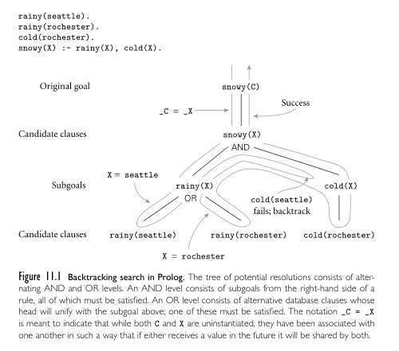
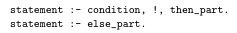

**Main Source:**

- **Book 2 chapter 11**
- **[Logic programming — Wikipedia](https://en.wikipedia.org/wiki/Logic_programming)**

Logic programming is programming based on formal logic, providing a declarative way to solve problem. Logic languages are [declarative](/cs-notes/computer-and-programming-fundamentals/declarative-functional-programming#declarative-programming), meaning that we specify what we want to achieve rather than how to achieve it. This is achieved by specifying logical relationship, then the language inference engine derive a solution. One major logic language is Prolog, most of them are used for AI and database.

The basic idea is:

1. Basic building blocks are logical statements. These statements are expressed in terms of **facts** and **rules**. Facts represent simple assertions about the world, while rules define relationships and dependencies between facts.
2. The logic language store all the facts and rules in a knowledge base.
3. To actually find a solution, we will need to query to the knowledge base.
4. The language engine typically uses [backtracking](/cs-notes/data-structures-and-algorithms/backtracking) to explore different possibilities and find multiple solutions to a query. Then, it uses logical reasoning and deduction techniques to manipulate the statements in the knowledge base as well as applying rule to derive new facts or make conclusions.

### Prolog

#### Basic Concepts

- **Facts**: Written using predicates, which consist of a predicate name followed by a list of arguments enclosed in parentheses.

  ```
  A(B1, B2, B3, ..., Bn)
  ```

  ```
  likes(john, pizza).
  ```

  This means John likes pizza. For a computer, which doesn't understand human language, it simply interprets that `john` has the predicate of `likes` associated with `pizza`. We call things like `john` or `pizza` as **constants**, they are typically written in lowercase.

- **Rules**: Written in form of clauses, in the form of head and body, separated by `:-`.

  ```
  A:- B1, B2, B3, ..., Bn
  ```

  Bi are called literals or conditions. It is read as "A if B1 and B2 and B3 and ... and Bn".

  ```
  loves(john, X):- likes(john, X), vegetarian(X).
  ```

  For example, means that `john` has the predicate `loves` for `X` if `john` has the predicate `likes` for `X` and `X` is the predicate `vegetarian`. In human language, "john loves X if he likes X and X is a vegetarian." We consider `X` here as a **variable** (typically written in uppercase), which can hold a value (in this case as a placeholder for an unknown value).

  Rules with one or more head and zero or more body is also called **Horn clauses**. Sometimes it is written as `H ← B1, B2, B3, ..., Bn`, which means if all the `B`'s are all true, then we can deduce `H` is true as well.

  Example of deduction is:

  ```
  B ← A
  C ← B
  ```

  Remember that we assume statements are true. By the given statement, if `A` is true, we can deduce `C` is true. This is because we know that `A` implies `B`, which in turns also implies `C`.

- **Queries**: Queries or goals is the body of rules with the `?-` symbol.

  ```
  ?- B1, B2, B3, ..., Bn
  ```

  ```
  ?- likes(X, pizza).
  ?- likes(john, pizza).
  ```

  The first query ask what is the entity that has `likes` predicate to `pizza`. The answer of the query should be something like `X = entity_that_like_pizza`, such as `X = john`. The second query ask if entity 'john' has predicate `likes` to `pizza`, which will return "no" or "yes".

#### Resolution & Unification

**Unification** is when one or more terms identical (logic programming way to check for equality). It is done by creating a variable, then substituting it with some value and comparing it with the other term. If we have the query `likes(john, X)` and the fact `likes(john, pizza)`, we can substitute variable `X` with `pizza`, which will make the two terms identical or unified.

We can check for equality with query, such as `?- A = B`, which return yes or no.

The rules of unification:

- A constant unifies only with itself (i.e., `?- a = a` returns yes).
- Two terms can be unified if and only if they have the same functor (e.g., predicate) and the number of arguments are same, as well as their argument unify recursively.
- Variable unifies with anything. Variable are said to be **instantiated** if they hold a value (i.e., substituted).

#### Lists

List can be constructed by using a sequence of elements followed by `.` (dot), comma, and enclosing it within parentheses. For example, a list of `a`, `b`, and `c`: `.(a, .(b, .(c, [])))`, where `[]` is the tail of the list.

Prolog adds a syntactic sugar to construct a list, the same list can be constructed with just `[a, b, c]`. Furthermore, Prolog allows us to add a vertical bar `|` in the middle of the list to decompose a list into its head and tail parts. It will be useful in the case of the tail is a variable.

A list with elements `a`, `b`, `c`: `[a | [b, c]]`.

Some operation we can do with list are `append`, `reverse`, `sorted`, etc.

#### Arithmetic

In Prolog, arithmetic is done with predicate as well. For example, the result of `2 + 3` can be obtained by.

```
?- is(X, 2 + 3).
```

`is` is a built-in predicate to evaluate arithmetic expressions and bind the result to a variable. Essentially, it unifies the first argument and the second argument. This query returns `X = 5`.

#### Execution Order

We know that the inference engine search for possible solution over the knowledge base. There are two general strategies for this:

- **Forward Chaining**: The bottom-up approach, starting with the available facts and iteratively apply rules to derive new conclusions or facts.
- **Backward Chaining**: The top-down approach, starting from the goal or query to find a sequence of rules and facts that support or satisfy the goal.

When there are many rules, but the less number of facts, forward chaining can be faster than backward chaining. Prolog uses backward chaining.

Starting from the goal, the interpreter searches through the available clauses in the program to find a clause whose head unifies with the current goal. When a clause match, that clause is expanded. The expansion of clause forms a search tree. Basically, this search tree will be traversed in [DFS](/cs-notes/data-structures-and-algorithms/traversal#depth-first-search-dfs) left-to-right manner. When traversing certain node then the clause fails to match, then the interpreter will [backtrack](/cs-notes/data-structures-and-algorithms/backtracking) and reconsider alternative choices.

  
Source: Book 2 page 567

In the example, the query is `snowy(C)`, trying to find which entity is `snowy`. Based on the knowledge base, something is `snowy` if it's `rainy` and `cold`.

1. Starting from the `snowy(C)`, a variable `X` is unified with `C`, so that they share same value.
2. `The snowy(X)` is then expanded into `rainy(X)` and `cold(X)`.
3. Going further, it checks if there are stored facts in the form of `rainy(X)`.
4. It turns out that there is `rainy(seattle)` and `rainy(rochester)`, which are potentially valid solution.
5. However, upon traversing the `cold(X)` node, `cold(seattle)` which is required doesn't exist within the knowledge base, while `cold(rochester)` exist. This mean we have found a solution to `X`, which is `rochester`.

##### Infinite Regression

It is possible that during the search, an infinite recursion occurs. It can be caused by rules that has cyclic dependency. For example, consider the rules below.

```
parent(X, Y):- child(Y, X).
child(X, Y):- parent(Y, X).
```

The first rule states that `X` is a parent of `Y` if `Y` is a child of `X`. The second rule states that `X` is a child of `Y` if `Y` is a parent of `X`.

If we query with:

```
?- parent(john, mary).
```

Prolog will attempt to evaluate the `parent(john, mary)` query. According to the first rule, it will try to evaluate `child(mary, john)`. Then, according to the second rule, it will again try to evaluate `parent(john, mary)`. This cycle will continue indefinitely, resulting in an infinite regression.

#### Control Flow

##### Cut

The cut is an operator (!). It is a mechanism to commits Prolog to a particular choice, preventing backtracking beyond the cut. It is used to enforce a specific solution or to optimize the search process by avoiding unnecessary backtracking.

For example, consider an example below.

```
animal(cat).
animal(dog).
animal(elephant).

mammal(X):- animal(X), !.
mammal(X):- fail.

query1:- mammal(cat).  % Succeeds, cut prevents backtracking and finding other solutions.
query2:- mammal(dog).  % Succeeds, cut prevents backtracking and finding other solutions.
query3:- mammal(elephant).  % Succeeds, cut prevents backtracking and finding other solutions.
```

`fail` is a built-in predicate in Prolog that always fails. It is often used to intentionally force a failure in a specific branch of execution.

In the `query1`, `query2`, and `query3`, initially they match with the available facts. However, `mammal` has a second rule, where the rule is nothing but is failing anything. The use of cut operator will prevent us for checking from this rule. It essentially "cut" down any amount of rule to just the rule we are currently processing. However, it doesn't mean we simply finish the current rule. If there is still term beyond the cut, they are still needed to evaluate.

When `animal(X)` fails, the cut will not be evaluated because the rule already fails anyway. This allows the program to backtrack and explore alternative solutions, which is the second rule where it always fails.

- If preceding term fails, cut is skipped, the program checks alternative rule.
- If preceding term succeed, cut is not skipped, the program stop backtrack since it encounter cut.

  
Source: Book 2 page 573

The cut operator can be used to achieve if-else statement.

##### Not

Not is a predicate to create exclusion in statements.

```
parent(john, mary).
parent(john, peter).
parent(mary, anna).
parent(mary, david).

sibling(X, Y):- parent(Z, X), parent(Z, Y), not(X = Y).
```

With `not` being present, the rule `sibling` between `X` and `Y` is true when `Z` is parent of `X` and `Z` is also the parent of `Y`, but this is not true when `X = Y` (i.e., doesn't make sense a child is sibling of itself).

Under the hood, the `not` predicate is implemented using `call`, cut operator, and `fail`. It is defined as:

```
not(Goal):- call(Goal), !, fail.
not(Goal).
```

The `call` predicate is used to dynamically query during runtime.

If that evaluated `Goal` succeeds, next is evaluating the cut. The cut want us to focus just on that first rule, abandoning the second rule. The next term, there is `fail`, which will always fail any statement. We can't continue to check for the second rule, because again, cut has prevented us from backtracking.

If that evaluated `Goal` fails, it will not evaluate the term beyond it and proceeds to the second rule. The second rule is nothing but an unconditional rule that will always true. So, the overall result will be success.

##### Loop

The `fail` predicate can also be used to create a loop control flow. This is done by combining it with predicate that is recursive.

```
loop(0).
loop(N):- N > 0, writeln(N), N1 is N - 1, fail.
loop(_).
```

The first and third rule define base case for the loop. First rule is base case for loop variable reaching 0, while the third is when the loop variable reaches some number below 0. The second rule is where actual loop happen.

It checks if `N > 0`, if yes, it writes `N` to the console through the `writeln`. Then, it subtracts `N` with 1 and assign it to new variable called `N1`. The next step is to fail the rule. This is done so that the interpreter can backtrack to the solution again but now with the `N` value being decremented. It will stop when it reaches any of the base cases.
