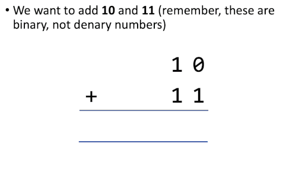
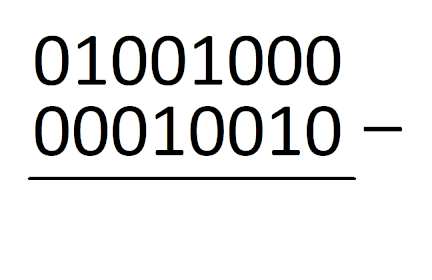
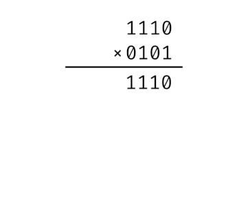
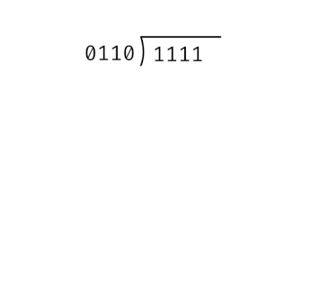
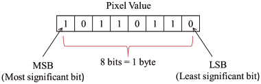
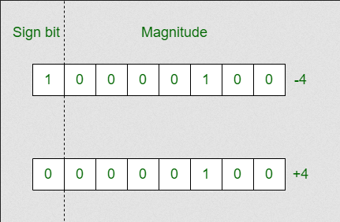
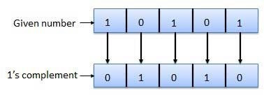
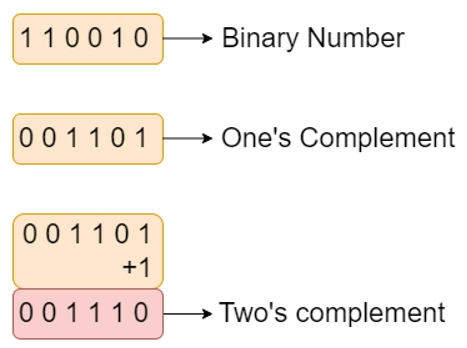
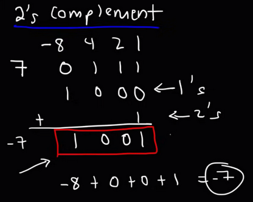

**Main Source:**

- **[Binary Addition and Subtraction With Negative Numbers, 2's Complements & Signed Magnitude — The Organic Chemistry Tutor](https://youtu.be/sJXTo3EZoxM?si=4d2siZL-FEOu-TAC)**
- **[1’s and 2’s complement of a Binary Number — Geeks For Geeks](https://www.geeksforgeeks.org/1s-2s-complement-binary-number/)**

### Binary Operation

Similar to decimal number system we uses in everyday life, binary numbers can also be subject to basic arithmetic operations such as addition, subtraction, multiplication, and division. The overall idea is the same as decimal number operation, however, it differs in the representation of numbers and the rules for carrying out the operations.

#### Addition

There are four possible combination of addition in binary:

- 0 + 0 = 0
- 0 + 1 = 1
- 1 + 0 = 1
- 1 + 1 = 0 (with a carry of 1)

Carry refers to the situation where the sum of two digit in a column exceeds the base (which is 2 in binary). When a carry occurs, it is carried over to the next column to the left. In decimal addition, when the sum of two digits in a column is greater than 9, we carry over the tens place value to the left column. (e.g. 5 + 6 = 11, we carry 10 to left column, resulting the digit of 1 in the current column).

Here is an example of binary addition:

  
Source: https://www.tes.com/teaching-resource/r354-ks3-computer-science-theory-sow-12775550 (edited)

#### Subtraction

There are four possible combination in binary subtraction:

- 0 - 0 = 0: When subtracting 0 from 0, the result is 0.
- 1 - 0 = 1: When subtracting 0 from 1, the result is 1.
- 1 - 1 = 0: When subtracting 1 from 1, the result is 0.
- 0 - 1 = 1 with a borrow: When subtracting 1 from 0, borrowing occurs from a higher place value. This is similar to decimal subtraction, where you borrow when subtracting a larger number from a smaller number. In binary, when subtracting 1 from 0, you borrow 1 from the next higher bit, resulting in 1 in the current place value and a borrow to the left. If the higher bit is also 0, we will keep borrowing until a nonzero bit is encountered or until there are no more higher bits (resulting in negative number in decimal).

  
Source: https://joeherbert.dev/revision/computing (edited)

#### Multiplication & Division

  
Source: https://medium.com/@karlrombauts/building-an-8-bit-computer-in-logisim-part-2-arithmetic-ae7861c82e79 (edited)

  
Source: https://medium.com/@karlrombauts/building-an-8-bit-computer-in-logisim-part-2-arithmetic-ae7861c82e79 (edited)

### Binary Representation

Binary representation have some properties and utilization to represent concept like negative numbers.

#### Least & Most Significant Bit

They are the terms used in binary representation to refer to the position or significance of bits within a binary number.

The **least significant bit (LSB)** is the rightmost bit in a binary number, and it holds the least amount of significance, which is the $2^0$.

The **most significant bit (MSB)**, on the other hand, is the leftmost bit in a binary number, and it holds the most significant value. Its value corresponds to the highest power of 2 within the number. For example, in a byte or 8-bit binary numbers, it holds the $2^7$ value.

  
Source: https://www.researchgate.net/figure/Least-significant-bit_fig2_351128700

#### Signed Magnitude

In binary numbers, we don't use negative sign to represent negative number, we instead uses another binary digit to determine whether its a positive or negative number, the extra digit is called the **sign bit**, and it doesn't contribute to overall value. The other binary digit that contributes to overall value is called the **magnitude bits**.

Signed magnitude is a way to represent negative or positive number, where the most significant bit (MSB) is used as the sign bit. The MSB of 1 represent the binary number is negative, while 0 represent positive number. In some cases, the usage of MSB as the sign bit makes us need an extra binary digit to represent a larger number.

The representation using signed magnitude is very simple, however, it introduces complexity when performing arithmetic operations, as special rules are required to handle the sign bit separately from the magnitude bits.

  
Source: https://www.geeksforgeeks.org/difference-between-signed-magnitude-and-2s-complement/

#### One Complement

One complement is another signed number representation or the method of representing both positive and negative numbers, it uses a specific method to represent negative number.

In one complement, we still use sign bit (same as signed magnitude) to indicate the sign of the number (positive or negative), and the magnitude bits are obtained by inverting (flipping) all the bits of the positive number.

For example, the number +5 is represented as `0101`. To obtain the one's complement representation of 5, we invert each bit to get `1010`, which represent -5. Similarly, the number -5 in one's complement representation `1010` can be converted back to its positive form by inverting each bit, resulting in `0101`.

  
Source: https://www.meracalculator.com/math/ones-complement.php

#### Two Complement

The two complement is another signed number representation. To obtain the two complement of a binary number, the method is very similar to one complement, we first obtain the one complement (flip the bit), and then we add extra 1 to the resulting binary number.

For example, the number 5 in binary form, which is `00000101`. By inverting the bits, we obtain `11111010`, and when we add 1 to this result, we arrive at the two's complement representation, which is `11111011`. This representation signifies the value of -5.

  
Source: https://www.codingninjas.com/studio/library/2-s-complement

To actually determine the decimal value of a binary number in two complement, we will need to add each positional value along with the power of base 2 and include the sign bit by negating the value of the power of base 2.

  
Source: https://youtu.be/sJXTo3EZoxM?si=j67uhtI6_sfZauME&t=457

7 is represented as `0111` in binary, the two complement is `1001`. To calculate `1001`, we will do ($1 \times 2^0$) + ($0 \times 2^1$) + ($0 \times 2^2$) + ($1 \times -(2^3)$), which is equal to 1 + 0 + 0 + (-8) = -7.
