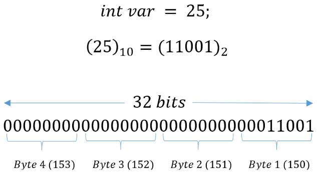
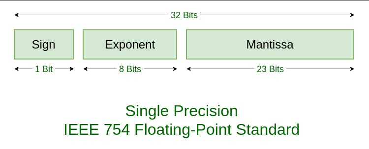

**Main Source:**

- **[Fixed Point Representation — Geeks For Geeks](https://www.geeksforgeeks.org/fixed-point-representation/)**
- **[Exponent Bias — Wikipedia](https://en.wikipedia.org/wiki/Exponent_bias)**
- **[Representations of Floating Point Numbers — Neso Academy](https://youtu.be/yvdtwKF87Ts?si=zGhXPUB3nHHT4jH4)**
- **[binary-system](https://binary-system.base-conversion.ro/real-number-converted-from-decimal-system-to-32bit-single-precision-IEEE754-binary-floating-point.php?decimal_number_base_ten=-3.14)**

**Floating Number** is a numerical representation in computer that is used to represent real number or number with decimal point. It is a common data type used to represent numbers with a fractional component or very large or small numbers that cannot be represented using a whole number.

### Whole Number Representation

Computer can easily represent decimal or whole number using a binary representation consisting of specific number of binary digits, typically in a multiple of 8.

For example, we can use 32 binary digits (bits), which is able to make a 4 billion possible combination. We are able to represent decimal number ranging from 0 to 4.294.967.295. The calculation, which is explained in the [binary number system](/computer-and-programming-fundamentals/number-system#binary), involve summing each binary digits (0 or 1) multiplied by each power of base two based on its positional value in the binary representation.

However, that is the case if we don't consider a negative number. To consider negative number, we can use the [most significant bit](/computer-and-programming-fundamentals/binary-representation#least--most-significant-bit) as the [sign bit](/computer-and-programming-fundamentals/binary-representation#signed-magnitude), making us able to represent decimal value from -2.147.483.648 to 2.147.483.647.

  
Source: https://medium.com/@luischaparroc/integer-numbers-storage-in-computer-memory-47af4b59009 (cropped)

### Real Number Representation

#### Fixed-Point Representation

One way to represent fractional or number with decimal point is through the **fixed-point representation**. In fixed-point representation, we allocate some binary digits to store the integer part of the decimal value and the leftover is used to store the fractional value.

Like usual, each position represent a power of two where it increases by 1 as we go to the left. However, the part where we separate the integer and fractional value (also called **binary point** or **radix point**), is where the power of two starts to increase or decrease up to negative power of two, which correspond to fractional value (properties of exponents, e.g. $2^{-2} = \dfrac{1}{2^2}$).

  
Source: https://www.geeksforgeeks.org/fixed-point-representation/

By using this representation, we can represent a fractional value. For example, given a binary values of `00010.110` in a fixed-point representation, we can calculate it as usual:

($0 × 2^4$) + ($0 × 2^3$) + ($0 × 2^2$) + ($1 × 2^1$) + ($0 × 2^0$) + ($1 × 2^{-1}$) + ($1 × 2^{-2}$)

$0 + 0 + 0 + 2 + 0 + 0.5 + 0.25 = 2.75$

Where $2^{-1} = \dfrac{1}{2^1} = 0.5$ and $2^{-2} = \dfrac{1}{2^2} = 0.25$

##### Limitation

In fixed-point representation, the value we can achieve for all fractional bits is fixed by the multiply negative power of two. To be able to represent value with a more complex fractional accurately, we will need more fractional bits, which will also increase the memory requirements and computational complexity. This method is also not suitable to represent irrational numbers, because by definition it cannot be expressed as a ratio of two integers, also they have an infinite number of non-repeating decimal places. We can still approximate the irrational number, but it can be hard to find the combination of binary values that will sum close to them.

Even sometimes we can't exactly represent a fractional value. This is because fixed-point representation uses binary (base-2) representation, and some decimal fractions don't have an exact binary representation. But, we can at least round or approximate those fractions.

The precision of the fractional value is determined by the number of fractional bits allocated, by having more fractional bits, we can represent smaller and smaller fractions, giving us a higher level of precision. Each additional bit allows us to represent a smaller increment or division of the value.

For instance, to represent $\dfrac{1}{100}$ or $0.01$, we can choose 8 fractional bits. We can represent it in: $0.00000011$ = $0 + 0 + 0 + 0 + 0 + 0 + \dfrac{1}{2^7} + \dfrac{1}{2^8}$ = $0.01171875$, which differs by $0.00171875$ from $0.01$.

:::note
This was calculated by hand, there is probably better way to approximate $0.01$.
:::

#### Floating Number Representation

The floating number representation, also known as the **IEEE 754 standard**, is the widely used standard to represent fractional value more accurately. It also provides a wider range of representable numbers compared to fixed-point representation such as more accuracy to represent rational and irrational number and able to represent special values such as positive and negative infinity.

##### Scientific Notation

Scientific notation is a way to express numbers that are very large or very small in a concise and standardized format. It is commonly used in science, engineering, and mathematics to represent numbers with many digits.

In scientific notation, a number is expressed as the product of a coefficient and a power of 10. The coefficient is a decimal number greater than or equal to 1 and less than 10, and the power of 10 indicates the scale or magnitude of the number.

  
Source: https://byjus.com/maths/scientific-notation/

##### Part of Floating Number & Precision

Scientific notation provide a framework for floating number representation. In the floating-point standard, we are going to represent decimal numbers using scientific notation. This involves three components: the coefficient (often called as **mantissa** or **significand**), the base (typically 2 for binary representation), and the exponent. We will also have single bit that stores the sign bit (indicates positive or negative number).

Still, some numbers cannot be exactly represented due to the limitations of the finite number of bits available. The floating-point standard specifies that we can choose two kinds of precision:

- **Single Precision**: Uses **32-bit** to represent a single number, this format allocates **1 bit for the sign**, **8 bits for the exponent**, and **23 bits for the mantissa**, providing 7 decimal digits of precision.
- **Double Precision**: Uses **64-bit** to represent a single number, this format allocates **1 bit for the sign**, **11 bits for the exponent**, and **52 bits for the mantissa**, providing 16 decimal digits of precision.

  
Source: https://www.geeksforgeeks.org/ieee-standard-754-floating-point-numbers/

##### Special Cases

The floating point standard have some special cases to handle special number:

- **Zero**: All bits in the mantissa are set to zero, and the exponent is also set to zero. It represents a value of exactly zero.
- **Infinity**: All the exponent consists of all 1s, and the mantissa is all zeros. It represents an overflow or a result that is too large to be represented within the range of the floating-point format. Positive and negative infinity are used to represent values that are larger or smaller than the maximum or minimum representable values, respectively.
- **Not-a-Number (NaN)**: NaN is a special case that represents an undefined or nonsensical result. It is typically used to indicate operations that are mathematically undefined, such as dividing zero by zero or taking the square root of a negative number. NaN values have a specific bit pattern in the exponent and significand that distinguishes them from other floating-point numbers.

##### Normalization

Normalization is the process that provides a standardized way to represent floating-point numbers, which helps to avoid ambiguity and ensures consistent interpretation of the numerical value.

Normalizing number ensure that only one non-zero digit exist to the left of the binary point. For example in decimal number, the number $53.75 \times 10^{0}$ can be normalized to $5.375 \times 10^{1}$ or even $0.5375 \times 10^{2}$.

There are two types of normalization:

###### Explicit

In explicit normalization, we represent the float number in scientific notation by moving the decimal point to the right or left until there is only one non-zero digit to the left of the decimal point.

For $0.00345$, to normalize it explicitly, we can move the decimal point three places to the right, resulting in the number $3.45 \times 10^{(-3)}$.

###### Implicit

In implicit normalization, the float number is represented in a normalized form without explicitly indicating the position of the decimal point. Instead, the decimal point is assumed to always be immediately to the right of the leftmost non-zero digit.

For $0.00345$, in implicit normalization, we directly represent it as $345 \times 10^{(-5)}$, assuming the decimal point is right after the leftmost non-zero digit.

##### Example

Representing the number $3.14$ in floating point standard:

1. Determine the sign bit: The number $3.14$ is positive, so the sign bit would be $0$.
2. Convert $3.14$ to binary: It becomes approximately $11.00100011110101110000101$.
3. Normalize the binary representation: We can use explicit normalization, we will move binary point to the left until there is only one non-zero digit to the left of the binary point. This results in $1.100100011110101110000101 \times 2^1$.
4. Determine the exponent: We get that the exponent is $1$.

   In general, the exponent can be negative, but we do not allocate a sign bit for the exponent. If we use 8 bits to represent the exponent, we can represent 256 different exponents ranging from 1 to 254 ([0 and 255 have special meanings](/computer-and-programming-fundamentals/floating-number#special-cases)). To represent negative exponents, we need to adjust the range of the exponent. The standard specifies that we subtract a bias value (often called the **bias exponent**) from the true exponent. For single precision, the **bias value is 127**, which makes the exponent range from -126 to +127.

   To convert the exponent to binary, we need to do the opposite. Since the true exponent is $1$, the biased exponent that will be used is $1 + 127 = 128$. The number $128$ in decimal is equal to $10000000$ in binary. To interpret this, we subtract $127$ (the bias) from the exponent in binary representation: $128 - 127 = 1$, which is the true exponent.

5. Determine the mantissa: The mantissa is just the right-hand side of the normalized binary representation, which is the $100100011110101110000101$.
6. Putting it all together: Combining the sign bit, exponent, and mantissa, we can represent $3.14$ in binary using floating point standard with: $0$ $10000000$ $100100011110101110000101$.
