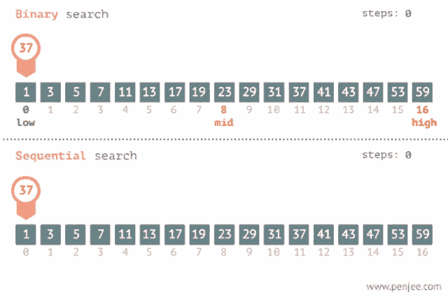

**Main Source:**

- **[Data structure — Wikipedia](https://en.wikipedia.org/wiki/Data_structure)**
- **[Analysis of algorithms — Wikipedia](https://en.wikipedia.org/wiki/Analysis_of_algorithms)**

### Algorithm

An algorithm is a set of step-by-step instructions or rules to solve a specific problem or perform a particular task. Computer works by executing instruction, an algorithm in computer programming act as the building block of a program.

Algorithm is really just an instruction to solve a problem, it is also not specific to computer. For example, cooking a food can be formulated in set of instruction, it may include instruction starting from preparing the ingredients, combining the ingredients, heating the pan, inserting the ingredients, and so on.

#### Basic Type of Algorithm

There are many types of algorithm that are frequently used in computer programming to solve a certain task. The two basic type of algorithm are **sort** and **search**, they are the most intuitive algorithm and commonly used real-life.

- **Sorting**: Sorting algorithms are used to arrange a collection of elements in a specific order. Element can be sorted in ascending (increasing) or descending (decreasing) order. For instance, your computer may sort file on a folder by its name in ascending order. A file name contains alphabet character, the smallest alphabet character is "a" and the largest alphabet character is "z". Sorting in ascending order involve comparing each alphabet in the file name, the file name with smaller alphabet should be placed first before the larger alphabet.

  There are many kinds of sorting algorithm, each with its own characteristics and efficiency. Example of sorting algorithm includes bubble sort, insertion sort, and selection sort.

    
   Source: https://emre.me/algorithms/sorting-algorithms/

- **Searching**: Searching algorithms are used to find the presence or location of a specific element within a collection of elements. For example, in real-life, we may try to find a document within a filling cabinet. We will take the document and check if it's the one we are looking for, if yes, we will take it and if not, we will put it back and take another document.

  The common searching algorithm are the **linear search** and the **binary search**, they are used to find the location of specific element in some collection. The linear search is a very intuitive algorithm that sequentially checks each element in a collection until a match is found or the end of the collection is reached. The binary search instead is a more efficient algorithm, however, it is only appliable for sorted collection.

  Below is the comparison for linear and binary search.

    
   Source: https://tenor.com/view/binary-search-sequence-search-gif-20595028

  In the GIF above, we are looking to find the location of specific element, which is 37, in a group of numbers. The steps indicate the number of time we access or check a number.

  The linear or sequential search begins from the left and sequentially check if it's the element we are looking for. The search will continue until we find the element. As seen in the GIF, in this case, the linear search takes more step than the binary search.

  The binary search algorithm assume that the collection of numbers is sorted, whether in ascending or descending order, but from now on, we will assume the collection is sorted in ascending order. In a sorted collection, the elements on the left is always smaller than the elements on the right, and vice versa. The idea is, if we managed to find a smaller number than the number we are looking for, because the numbers are sorted, then there is no way that the element would be in the left of the smaller number. Therefore, we don't need to search the portion of the collection preceding the smaller number, instead we can just eliminate that range and focuses to search on the other range.

  As seen in the GIF, we started the search in the middle, while it is possible to start at the 3/4 or 1/4 of the elements, there is no assurance that doing so would result in a more significant range reduction.

#### Algorithm Complexity

We can decide which algorithm is better than which by comparing the efficiency. The efficiency of an algorithm is typically measured by **time and space complexity**. Time and space complexity refers to the amount of time and amount of memory or storage required by the algorithm to run.

##### Big-O Notation

The time and space complexity is typically measured by the dimension of the input, they are denoted by the **Big-O notation**. The big-O notation describe the efficiency of algorithms in terms of their growth rates as the input size increases.

Some example of big-O notation:

- **O(1) — Constant Complexity**: A constant time complexity indicates that the algorithm will always run in the same time regardless of how many inputs are given. Similarly, a constant space complexity indicates the algorithm will always use the same amount of memory for any input.

- **O(log n) — Logarithmic Complexity**: A logarithmic complexity indicates the time or space complexity grows logarithmically with the input size.

- **O(n) — Linear Time Complexity**: A logarithmic complexity indicates the time or space complexity grows linearly with the input size, there is a proportional relationship between the algorithm's resource usage and the input size.

  
Source: https://www.freecodecamp.org/news/all-you-need-to-know-about-big-o-notation-to-crack-your-next-coding-interview-9d575e7eec4/

#### Example

For example, in the linear search, when we start searching from the left, there is a chance that the element we are looking for is at the rightmost, therefore we have to check each element in the collection. This is the **worst case scenario** of the linear search, the time complexity is O(n) or it will be proportional to the size of the input which is the number of elements in the collection being searched.

On the other hand, the linear search algorithm require no extra memory, making the space complexity is O(1).

### Data Structures

**Data Structures** are specialized formats of storage used to store data efficiently. Each data structure has different characteristics that are suited for different kinds of tasks, and these characteristics correspond to the algorithm's time and space complexity.

Here are commonly used data structures:

- **Array**: Array is a data structure where a collection of elements is grouped together within a contiguous block of memory, where each element is next to each other. Each element in the array has its own position, called **index** and it starts from 0. To access specific element in the array, we need to know its index. The time complexity to access a single element will be in O(1) time, this is because no matter the size of the array size is, we will always access it the same way.

- **Stack**: Stack is a data structure where the elements are stacked on top of each other. It follows the Last-In-First-Out (LIFO) principle, where element can be added or removed only from the top of the stack. The operation of adding element is often called "push" and the operation of removing element is called "pop". The time complexity to add or remove element is also O(1), no matter the size, the operation will always be the same.

- **Hash Table**: Hash table is a data structure where we access element based on a unique identifier called **key**. An element is a set of key-value pair, the key is the identifier and the value is the actual value associated with it.

  Under the hood, hash table uses an array to store the element. An array has a constant time complexity to access an element, however, in some cases the index of the element we are looking for is not known. Sometimes, the index of the element also changes overtime when we remove an element from the array.

  The idea of hash table is, we do not directly use index to access an element, we instead use a key as a unique identifier that will never change and always known by the programmer. To determine in which position of the array would the element be stored, hash table takes the key and input it in function called **[hash function](/cs-notes/data-structures-and-algorithms/hash-table#hash-function)**. The hash function is a mathematical function that takes input and output a **hash code**, which is an integer value that can be used as the index of the element in the array. The array used in hash table is typically fixed in size, the hash function will be configured such that it will always return a value in the range of the array size.

  So, to add an element to a hash table, we will need a key and the value which is the element we are going to store. Hash table does the same way to access the element, given a key, transform it into hash code from the hash function, then use the result to access the element from the array. The hash function typically has a constant time complexity, making it a very efficient data structure to quickly access element.

  However, in some cases, the hash function may return the same hash code for different key, this is called **[collision](/cs-notes/data-structures-and-algorithms/hash-table#collision)** and it's a common problem in hash table. Technique such as **chaining** is employed to mitigate this problem.

    
  Source: [array](https://www.geeksforgeeks.org/when-to-use-array-over-a-list/), [stack](https://www.trivusi.web.id/2022/07/struktur-data-stack.html), [hash table](https://khalilstemmler.com/blogs/data-structures-algorithms/hash-tables/)

:::tip
Refer to [data structures and algorithm](/cs-notes/data-structures-and-algorithms) for more detailed explanation
:::
