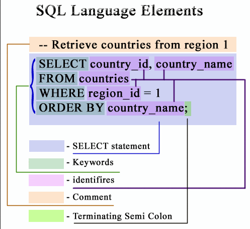

**Main Source:**

- **[SQL — Wikipedia](https://en.wikipedia.org/wiki/SQL)**

**Query Language** is a computer language used to communicate with and retrieve information from databases. A database is a collection of data, which can be categorized as either **[relational](/cs-notes/database-system/relational-data)**, where data is organized into tables with rows and columns, or **[non-relational](/cs-notes/database-system/nosql)**, where data do not use fixed tabular structure and is instead unstructured, often used to store rapidly changing data.

Query languages are considered as [declarative programming](/cs-notes/computer-and-programming-fundamentals/declarative-functional-programming#declarative-programming), they focus on specifying the desired outcome or result rather than the detailed steps or procedures to achieve that outcome.

Query language uses statements to command the database system to retrieve specific outcomes or perform certain operations. A query language can have keyword that indicate the type of operation to be performed, provide additional information to the operation, expression that define calculation or transformation that will be applied to data, and some conditional logic to adjust the operation based on specific condition. Last but not least, query language may have their own syntax rules and conventions that define how the keywords, expressions, or other operators should be structured.

For example, consider a scenario where we need to retrieve product data from a shop database. We can use `GET` keyword to retrieve data, we can also provide additional information to select product by the provided name. Here is an example of the statement: `GET Product name = "Soap"` (just a fictional language). The keyword `GET` specify the specific type of operation, the `Product` denotes that we are retrieving product-related data, the expression `name = "Soap"` that uses an `=` symbol specify the condition for retrieving data with the name of "Soap".

That was just a simple example of a query language, the most popular query language especially for relational database is the **[Structured Query Language (SQL)](/cs-notes/database-system/query-language)**. Here is an example of a SQL statement: `SELECT * FROM Customers WHERE Country = 'USA'`. The SQL statement is using the `SELECT` keyword to retrieve data from a table named `"Customers"`, the asterisk `*` represents all columns in the table. The `WHERE` clause is used to specify a condition, in this case, to retrieve only the rows where the `"Country"` column value is equal to `'USA'`. In summary, this statement will return all customer from the `Customers` table where their country is `'USA'`.

  
Source: https://www.w3resource.com/sql/sql-syntax.php

Another example of SQL statement which is selecting only the "country_id" and "country_name" from "countries" table, where their "region_id" is 1 and the column should be ordered by "country_name".

:::tip
Find out more about **[database system](/cs-notes/database-system)**.
:::
