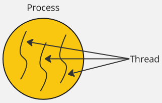
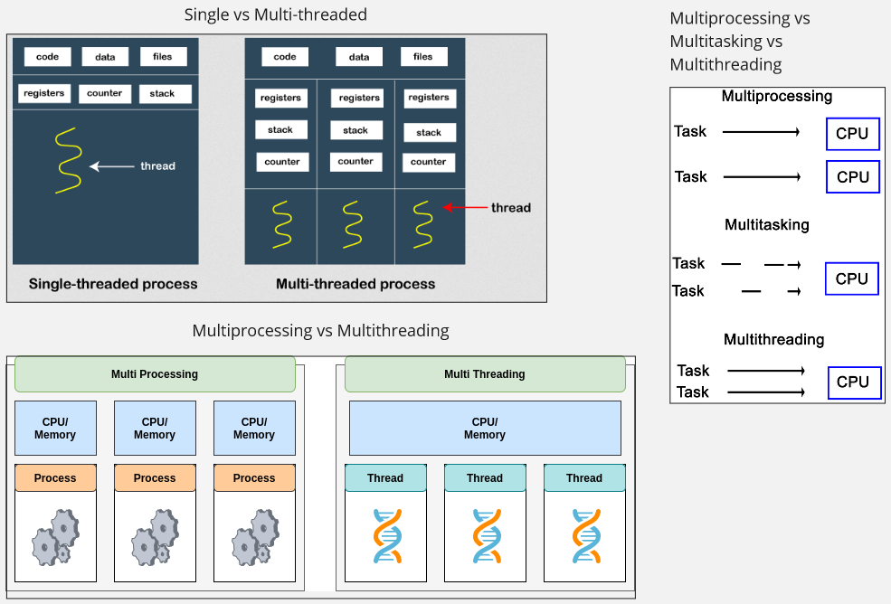
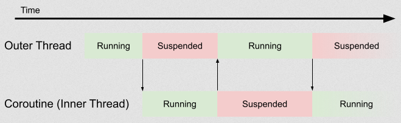
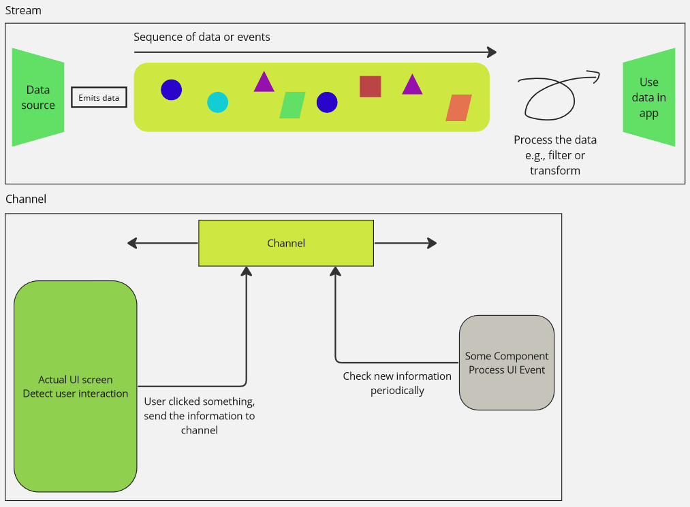
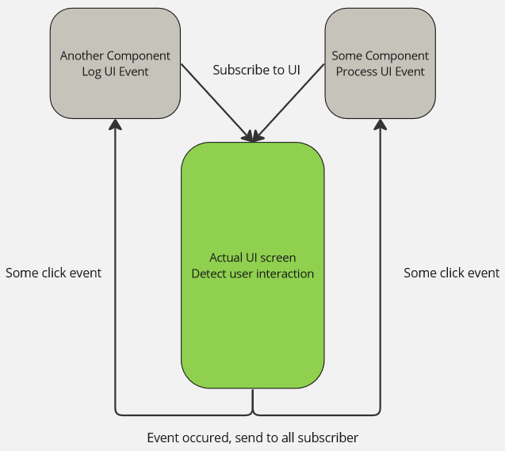
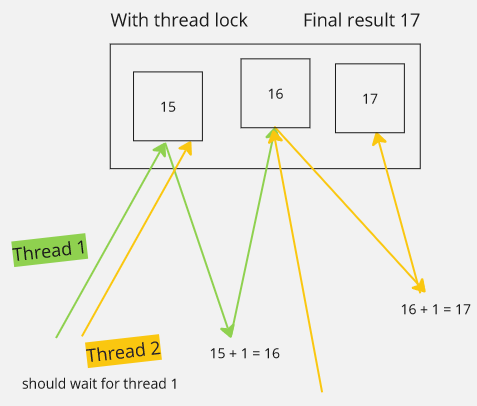
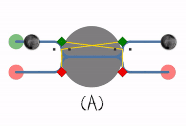

**Main Source:**

- **[Process (computing) — Wikipedia](/cs-notes/<https://en.wikipedia.org/wiki/Process_(computing)>)**
- **[Thread (computing) — Wikipedia](/cs-notes/<https://en.wikipedia.org/wiki/Thread_(computing)>)**
- **[Multiprocessing — Wikipedia](https://en.wikipedia.org/wiki/Multiprocessing)**
- **[Blocking threads, suspending coroutines by Roman Elizarov — Medium](https://elizarov.medium.com/blocking-threads-suspending-coroutines-d33e11bf4761)**
- **[Asynchronous programming techniques — Kotlin Docs](https://kotlinlang.org/docs/async-programming.html)**
- **[What is a race condition? — stackoverflow](https://stackoverflow.com/questions/34510/what-is-a-race-condition)**
- **[Some simple Google search](https://www.google.com)**
- **Chapter 12, Programming Language Pragmatics — Michael L. Scott**

### Concurrency

Computer executes tasks one by one sequentially, often times some tasks require a lot of time to finish. For example, in a web application like e-commerce, our browser will need to load some data from the server to display it to us. If the server takes a long time to process the request or the network connection is slow, it can result in a noticeable delay before the data is available to the browser. Imagine if there are more tasks than just requesting data to server, such as processing and transforming the data. If computer can only execute one task at a time, then it may take a long time.

Many techniques can be employed to mitigate this issue. **Concurrency** is the ability of a system to handle multiple tasks or processes, either simultaneously or interleaved. One improvement we could make is, instead of waiting all the data to be received and then process it one by one, we can download the data and process it simultaneously.

Another example is a mobile app that loads data from the phone's storage. The app is supposed to display loading animation in the screen, without the ability of processing multiple task simultaneously, the screen may freeze because the system is focusing on retrieving data from the storage and can't update the animation.


:::note
For the purposes of terminology, we will consider concurrent and interleaved execution as interchangeable. Both refer to situations where tasks are executed alternately or sometimes overlap. On the other hand, parallel execution refers to the simultaneous execution of tasks at the same physical instant, a stricter definition than the former. Concurrency refers to the technique that executes tasks either in parallel; or concurrent or interleaved.
:::

### Process & Thread

#### Process

A **process** is an instance of a running program. A process encapsulates the running program's code, data, and resources required to execute a program. Each process has its own memory space and system resources. Process is managed by the [operating system](/cs-notes/computer-and-programming-fundamentals/operating-system), and is independent with each other process, they are executed in its own isolated memory space.

Process has its own memory space and system resource, they are not directly accessible or affected by another process. In order to communicate with other processes, a mechanism called **[Inter-Process Communication (IPC)](/cs-notes/operating-system/inter-process-communication)** is employed.

Operating system will keep track the state of each process, a process will run through several states:

- **Created**: When a process is created or initialized, the process is being set up by the operating system, allocating resources such as memory and initializing data structures.
- **Waiting**: A process in the waiting state is prepared but is waiting to be executed by the operating system scheduler.
- **Running**: When a process is selected by the scheduler and is executing on the CPU, it is in the running state. In this state, the process is actively using the CPU to execute its instructions. Only one process can be in the running state at a given time on a single CPU core.
- **Blocked**: If a process is unable to proceed further and must wait for an event or resource, it enters the blocked state. For example, if a process is waiting for user input such as selecting file, it will be blocked and temporarily suspended until the required event occurs.
- **Terminated**: When a process finishes its execution or is explicitly terminated by the operating system or a user, it enters the terminated state. In this state, the process is no longer active, and its resources are released by the operating system.

  
Source: https://en.wikipedia.org/wiki/Process_%28computing%29#/media/File:Concepts-_Program_vs._Process_vs._Thread.jpg

#### Thread

**Thread**, on the other hand, is a basic unit of execution within a process. A thread is a single sequence of instruction that can be executed by the CPU. Thread exists inside a process, they share the same memory space and resources of the process that created them.

A single process can have multiple thread to execute multiple task, the technique is called [multithreading](#multithreading). In a process where multiple thread exist, they can work together to complete a task as they share the same memory space.

#### Process vs Thread

The obvious difference between them is that a process is the running program, while a thread is the one that executes tasks within that program. The process owns memory and system resource, while thread do not have their own and access the one owned by the process. Each process has at least one thread, called the **main thread**, which starts executing the program from its entry point.

  
Source myself, inspired by: https://www.java67.com/2012/12/what-is-difference-between-thread-vs-process-java.html

### Concurrent Programming

**Concurrent Programming** is a programming paradigm that involves executing multiple tasks or processes concurrently. It aims to make efficient use of system resources by allowing tasks to overlap or interleave in execution.

There are many techniques to achieve concurrency and asynchronous.

#### Multithreading

A process can have multiple threads, **multithreading** refers to the ability of a program or process to execute multiple threads concurrently within a single process. Multithreading allows for parallel execution of multiple tasks within the same program, improving performance and resource utilization.

Threads within the same process share the same memory space. This means they can access and modify shared data and resources, enabling ease communication and coordination between threads. This make it possible for thread to substitute for each other and continue each other task.

Threads are used in the case where multiple tasks need to be performed, such as the mobile application scenario earlier. One thread may request data to a server, another thread processes the data on the fly, and another thread updates the screen to display animation.

  
Source: https://www3.ntu.edu.sg/home/ehchua/programming/java/j5e_multithreading.html

#### Multiprocessing

**Multiprocessing** is a technique that takes advantages of computer with multiple CPU or processor to execute tasks simultaneously (also often referred as parallel). Unlike multithreading, which involves multiple threads within a single process, multiprocessing utilizes multiple processes that can run independently and concurrently.

In multiprocessing, each process will have different memory and system resource. They are also not able to access each other resource directly, to be able to execute a single task with multiple process, they will need a proper coordination through the [IPC mechanism](/cs-notes/operating-system/inter-process-communication).

Multiprocessing can be beneficial for computer that has multiple cores, as it can significantly improve performance. However, it can be heavier and tend to consume more power. On the other hand, creating and managing threads in multithreading is generally faster and more lightweight compared to creating separate processes. Thread can also coordinate and communicate with each other easily because they share the same memory.

  
Source: https://www.shiksha.com/online-courses/articles/difference-between-multiprocessing-and-multiprogramming/

#### Multitasking

**Multitasking** refers to the ability of an operating system to execute multiple processes concurrently. The operating system gives each process CPU processing time. The CPU switches rapidly between tasks, each task will have small-time execution. This switching occurs so quickly that it creates the perception of simultaneous execution.

For example, in our desktop, we can run multiple application at the same time. This is actually an illusion, the operating system rapidly switches between these processes, giving each one a small portion of CPU time to make it appear simultaneously.

  
Source: https://en.wikipedia.org/wiki/Computer_multitasking#/media/File:Desktop-Linux-Mint.png

##### Summary

- **Multithreading**: The use of multiple thread to achieve parallelism within a single process (thread-level parallelism).
- **Multiprocessing**: Execution of multiple independent process in parallel, typically to utilize multicore processor (process-level parallelism).
- **Multitasking**: The concurrent execution of multiple process.

All of them are technique to concurrently execute task.

  
Source: [Single vs Multi-threaded](https://www.javatpoint.com/process-vs-thread), [Multiprocessing vs Multithreading](https://www.linkedin.com/pulse/demystifying-multithreading-multiprocessing-python-somasundaram), [Multiprocessing vs Multitasking vs Multithreading](https://subscription.packtpub.com/book/programming/9781787121706/2/ch02lvl1sec13/defining-multithreading)

#### Coroutine

In a long operation where execution of thread is temporarily paused, such as waiting for I/O event or waiting to access resource held by another thread, the specific thread which executes the task is considered as **blocked**. When a thread is blocked, it means the thread is unable to proceed with its execution and is waiting for a particular operation to complete. It does not consume CPU resources because it is not actively executing instructions, but it results in underutilization of resource.

:::note
If a thread is purely doing a long computation, we do not consider it blocked, as it does not wait for any external events and continues to efficiently utilize CPU resources.
:::

Thread shouldn't be blocked, one reason is because they are expensive. They require memory to store its own stack space to store execution-related information and the operating system needs to manage them, which result in additional computation.

Another reason is in a scenario where application is included with UI (user interface). UI should be responsible to react at user interaction (e.g., updating screen when user click on something). However, because the thread is currently blocked, it can't respond to UI event which will result in a poor user experience.

One way to mitigate this thread blocking is **coroutine**. **Coroutine** is a unit of execution that can be **cooperatively scheduled**, meaning it can be paused and resumed at specific points in its execution. We call a piece of code that can be paused and resumed later on **suspendable**.

When a piece of code can be suspended, it means that it can yield control to other tasks without blocking the thread it is running on. The idea is, instead of the thread waiting for specific task to complete, coroutine allows it to perform another task without waiting. When the task is complete, the thread will continue its previous task.

  
Source: https://blog.adacore.com/coroutines-in-ada-a-clean-but-heavy-implementation

Coroutine differs with multithreading. In multithreading, multiple thread can work together in parallel (i.e., they can execute code simultaneously). Having multiple thread can be resource intensive, since each of them require memory to keep track execution context (e.g., call stack, registers, counter) and the frequent switches between them can be expensive.

On the other hand, coroutines do not require many threads, as the same thread can switch between tasks, executing their code while they wait. It is a concurrent construct rather than a parallelism construct, enabling efficient multitasking within a smaller number of threads. In summary, coroutines can be seen as a lightweight alternative to threads, enabling efficient utilization of available resources without the overhead of threads.

:::tip
Thread is considered as **preemptive multitasking**, which mean it is the responsibility of the operating system to manage the execution between them. On the other hand, coroutine is considered as **cooperative multitasking**, where each coroutine is responsible for yielding control to others.
:::

### Asynchronous Programming

In traditional programming, a task is executed sequentially and the program waits for each task to finish before moving on to the next one, this is called **synchronous programming**. On the other hand, **asynchronous programming** is a programming paradigm where the program continue doing other task instead of just waiting for a specific task to complete.

#### Callbacks

A callback is a general term for a function that is passed as argument to another function. The purpose of passing function is to allow the receiving function to invoke the provided function at a specific point in its execution or in response to a certain event or condition.

For example, consider a scenario where we need to load data from server and then process it after. We have function A that loads data from a server and function B that processes the data. Function A will complete its execution when all the data is loaded. However, we don't know when will it complete.

One workaround is, we can pass function B to function A. Within the body of function A, we can include a code that invoke function B. The point where function B is invoked is when function A finishes. This way, we can ensure that the operations execute in the correct order and at the appropriate time.

Here is an example in the Python programming language.

```python
def load_data(on_data_loaded):
    data = load_data_from_server()  # Simulate long computation to load data
    on_data_loaded(data)  # Call the provided function and pass the loaded data


def process_data(data):
    # Process the loaded data...

# When data is loaded, we want to process the data
load_data(on_data_loaded = process_data)
```

#### Future, Promise, Async Await

**Future** and **Promise** are both abstractions that represent the eventual result of an asynchronous operation. An operation, regardless of the amount of time it takes to complete and whether they are success or not, they must eventually have a result. A future or promise is an object that represent the result.

The implementation of future or promise typically have some set of methods to handle the result, it may include method that indicates when the operation is finished, a method that is responsible to handle success operation, where we can use the result for our use case, or method to handle error operation.

Here is an example in Kotlin programming language (not a real code):

```kotlin
// load data must complete at one point, represent by Future object
fun loadData(): Future<String> {
    // load data...
}

fun main() {
    val futureString = loadData()
    // When loadData is completed, we will pass callback that will be executed
    // in the event of a successful data load or an error.
    futureString.onDone(
        onSuccess = { data ->
            // Handle success scenario
        },
        onError = { error ->
            // Handle error scenario
        }
    )
}
```

### Reactive Programming

**Reactive Programming** is a programming paradigm that focuses on asynchronous data streams and the propagation of changes. Reactive programming is used in the scenario where data or events occurs over time and we need to react over it.

There is another term called **event-driven programming**, which is a programming paradigm that focuses on designing software systems around the concept of events such as user actions and sensor inputs. It can be implemented using reactive programming technique.

#### Stream, Channel

Stream and channel are commonly encountered concepts in the reactive programming. A **stream** refers to asynchronous sequences of data items or events. On the other hand, **channel** is communication mechanism which data can flow between different components of a system.

For example, in a mobile application with sensor, the sensor is considered as a data source that capable of outputting a sequence of sensor information. We can represent it as a stream and process the data to use it in the app. In the application itself, we can use channel as a way to communicate between component in the application. When the UI detect user's interaction, send the interaction information to a channel and then another component may check the channel periodically for event.



#### Observable, Consumer, Subscribe

These three concepts are related to each other. Something is called **observable** if it is capable of being a source of events or data (e.g., a data stream). The component that have an intention to receive data emitted by that stream is called the **observer** (also known as **consumer**). **Subscribe** is the action of establishing a connection between an observable and a consumer. When a component "subscribe" to an observable, it will be notified whenever an event occurs.



### Terminology

#### Race Condition

A race condition happens when multiple threads try to use the same data at the same time, and the final outcome of the program depends on the order in which the threads are executed. For example, imagine two threads, thread 1 and thread 2, they will access some number and increment it. If thread 1 starts first and thread 2 starts very quickly afterward, there is a chance that thread 2 might access the number before thread 1 has finished modifying it. This can lead to unexpected and incorrect results because thread 2 should ideally wait for thread 1 to finish modifying the number before accessing it.


#### Thread Lock

Thread lock, often used interchangeably with [mutual exclusion (mutex)](/cs-notes/operating-system/multithreading#locks--mutex), is a synchronization mechanism used prevent race condition. It simply ensures that only one thread can access the resource at a time.



#### Thread Safe

Thread safe refers to the property of a program or data structure that can be safely accessed and manipulated by multiple threads concurrently, without causing race conditions or other synchronization issues.

#### Deadlock

[Deadlock](/cs-notes/operating-system/process-synchronization#deadlock) is a situation where two or more threads are unable to proceed because each is waiting for the other to take a specific action. Deadlock can occur when attempting to prevent race conditions through synchronization mechanisms, but those mechanisms are implemented incorrectly.

  
Source: https://en.wikipedia.org/wiki/Deadlock

#### Thread Pool

[Thread pool](/cs-notes/operating-system/multithreading#thread-pool) is a collection of pre-initialized threads. Instead of creating a new thread for each task and destroying it after it finishes its execution, a thread pool maintains a pool of reusable threads. Unused thread will be stored there to reduce the overhead of creating and destroying threads.

##### Dispatch Loop

With thread pool, typically a mechanism called dispatch loop is used to manage and scheduling the execution of threads. It is a piece of code that loops, typically indefinitely until program ends, that actively assign task to available threads.

For example, dispatch loop might look like below.

```
threadPool = ThreadPool(numThread=5)
queueOfTasks = Queue()

while (true) {
    if (queueOfTasks.isThereTask()) {
        task = queueOfTasks.getNextTask()
        thread = threadPool.getAvailableThread()
        thread.execute(task)
    }
}
```

Then, upon the thread finishes it execution, it may be added back to the thread pool.

For more complex program, threads and tasks could be categorized and separated between distinct thread pool based on the type of work. For example, 5 thread may be assigned for downloading/uploading tasks, 1 thread for rendering user interface, 1 thread for interacting with the I/O system, and so on.

:::tip
In relation with multitasking and concurrency, see also [multithreading](/cs-notes/operating-system/multithreading).
:::
