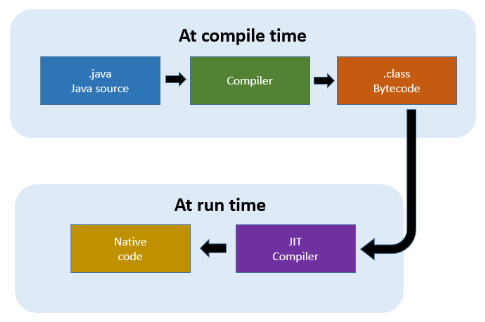

**Main Source:**

- **[Interpreter (computing) — Wikipedia](<https://en.wikipedia.org/wiki/Interpreter_(computing)>)**
- **[Just-in-time compilation — Wikipedia](https://en.wikipedia.org/wiki/Just-in-time_compilation)**
- **[Just in Time Compilation Explained — freeCodeCamp](https://www.freecodecamp.org/news/just-in-time-compilation-explained/)**
- **[What does a just-in-time (JIT) compiler do? — stackoverflow](https://stackoverflow.com/questions/95635/what-does-a-just-in-time-jit-compiler-do)**

**Interpreter** is a program that reads and executes source code written in a high-level language directly, without the need for prior compilation to machine language.

### Compiler vs Interpreter

A compiler takes high-level source code and translate it to lower-level language, without running it. On the other hand, an interpreter takes high-level source code, which doesn't need to be [machine language](/cs-notes/computer-and-programming-fundamentals/compilation#language-abstraction) and directly runs it.

An interpreter executes each statement in the source code line by line, without the need for prior translation into machine code like a compiler. The speed of execution in an interpreter can vary depending on the context. When frequently running a specific piece of code, an interpreter may execute it faster since it avoids the overhead of entire source code compilation. In contrast, a compiler initially takes time to translate the entire source code, but the resulting compiled code can execute more quickly afterwards.

Compiler solely translates code, in some case it will need an interpreter. For instance, in the case of the Java programming language, the source code is compiled into [bytecode](/cs-notes/computer-and-programming-fundamentals/compilation#language-abstraction), which is an intermediate representation. This bytecode is then interpreted by the **Java Virtual Machine (JVM)**.

### Interpreter Process

Some steps are quite similar to [compilation process](/cs-notes/computer-and-programming-fundamentals/compilation#compilation-process).

1. **Lexical Analysis**: The interpreter starts by performing lexical analysis or the **tokenization process**. It breaks down the source code into a sequence of tokens, such as keywords, identifiers, operators, and literals. It removes whitespace, comments, and other non-essential characters.

2. **Parsing**: The interpreter proceeds to the parsing phase. It analyzes the sequence of tokens according to the syntax rules of the programming language. This step involves building a representation of the code's structure, such as an **abstract syntax tree (AST)** (code representation in tree-like structure) or another suitable data structure. The parser ensures that the code is grammatically correct and adheres to the language's syntax rules.

3. **Semantic Analysis**: Once the code has been parsed, the interpreter performs semantic analysis, which involves checking the code for semantic errors. The interpreter verifies aspects such as variable declarations, type compatibility, scoping rules, and other language-specific rules. It helps catch errors that may not be identified during parsing.

4. **Execution**: After the code has been analyzed and deemed semantically correct, the interpreter proceeds to execute it. It traverses through the generated AST or data structure, interpreting each statement and performing the associated actions or operations.

### JIT Compilation

**Just-In-Time (JIT) compilation** is a technique that compiles code during execution rather than before execution. In traditional compilation, the entire source code is compiled **ahead of time (AOT)** into machine code, which is then executed directly by the hardware. However, in JIT compilation, the compilation process is deferred until the code is about to be executed.

JIT is typically used for language that uses intermediate representation (e.g., Java bytecode) and usually included in an interpreter. The high-level source code is compiled into bytecode. However, rather than being directly executed by the interpreter, the code is further compiled into machine code, which can be executed directly by the underlying hardware.

The advantage of JIT compilation is that it can apply some runtime optimization, because it can access some of runtime information, such as the actual values of variables, the execution context.

An example of runtime optimization is the function inlining. Inlining involves replacing a function call with the actual code of the called function. This eliminates the overhead of the function call itself, improving performance by reducing the stack frame (data structure used by a program's to manage function or method calls) setup and teardown.

JIT compilation does have a downside related to increased startup time. This is due to the requirement of compiling the code at runtime before it can be executed, which can result in longer startup times compared to programs that are compiled ahead of time (AOT).

  
Source: https://aboullaite.me/understanding-jit-compiler-just-in-time-compiler/
