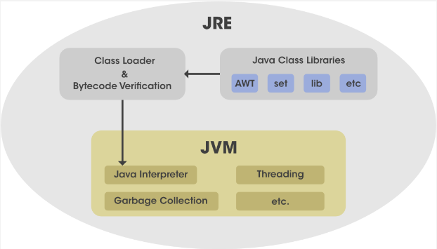

**Main Source:**

- **[Runtime system — Wikipedia](https://en.wikipedia.org/wiki/Runtime_system)**
- **[What is JRE (Java Runtime Environment)? — AWS](https://aws.amazon.com/what-is/java-runtime-environment/)**

**Runtime Environment** is a place needed by a program in order to run. It is a system that provides necessary functionality, support, and management for the program during its execution. A runtime environment provides several things:

- **Execution Engine**: The runtime environment includes an execution engine that [interprets](/cs-notes/computer-and-programming-fundamentals/interpreter) or [compiles](/cs-notes/computer-and-programming-fundamentals/compilation) the program's code for execution.

- **Memory Management**: The runtime environment handles memory management for the program. It allocates and deallocates memory as needed, tracks memory usage, and provides mechanisms for managing memory resources efficiently (e.g., [garbage collection](/cs-notes/computer-and-programming-fundamentals/memory#garbage-collection)).

- **Platform Abstraction**: The runtime environment provide a consistent interface for the program to interact with the various hardware and operating system.

- **Libraries and APIs**: The runtime environment often includes libraries, frameworks, APIs, and other language supports that provide pre-built functionality for common tasks. They simplify development by providing higher-level abstractions and reusable code.

### Java Runtime Environment (JRE)

**Java Runtime Environment (JRE)** is the runtime environment for executing Java programs. It consists of several components:

:::note
A Java program in source code (with format of `.java`), needs to be compiled into [bytecode](/cs-notes/computer-and-programming-fundamentals/compilation#language-abstraction) (an intermediate representation with format of `.class`).
:::

- **Java Class Library**: The Java class library is a set of pre-compiled Java's APIs that provide a wide range of functionality for Java applications. It includes standard classes for tasks such as I/O operations, networking, database access, GUI development, concurrency, and more.
- **Class Loader**: The class loader is a part of JRE used to dynamically loads Java classes into memory as they are referenced during program execution. It is responsible for locating the compiled bytecode for a class and creating the corresponding Class objects.
- **Bytecode Verification**: Bytecode verification is a process that verifies the integrity and security of Java bytecode before it is executed. The process examines the bytecode to ensure it adheres to the rules and constraints specified by the Java virtual machine specification to prevent certain runtime errors and security vulnerabilities.
- **Java Virtual Machine (JVM)**: The JVM is the execution engine responsible for executing Java bytecode on different hardware and operating systems. The JVM provides an execution environment that abstracts the underlying system details and provides several key functionalities, including memory management, garbage collection, thread management, exception handling, and runtime support.

  
Source: https://www.geeksforgeeks.org/jre-full-form/

### Node JS

JavaScript is a programming language mainly used for client-side web development. It is a programming language that runs on web browser to manipulate the webpage (HTML) and its style (CSS).

**Node JS** is a JavaScript programming language runtime environment that allows developers to run JavaScript on the server-side. By enabling JavaScript on the server side, JavaScript can be used to build server-side applications, handle incoming requests, process data, interact with databases, and perform various server-side operations.

:::tip
Another note about [Node JS](/cs-notes/internet-and-web/javascript#node-js)
:::
