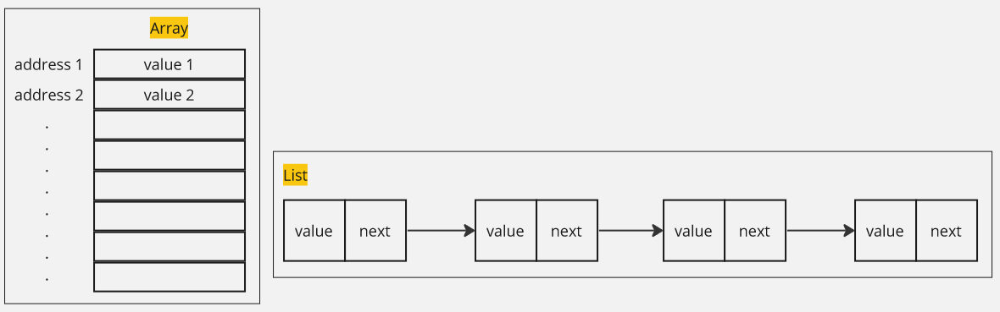
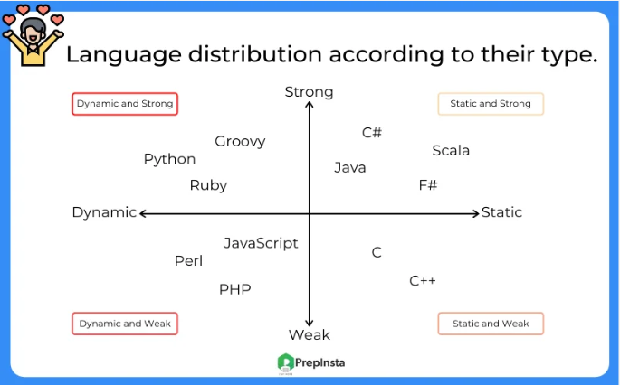
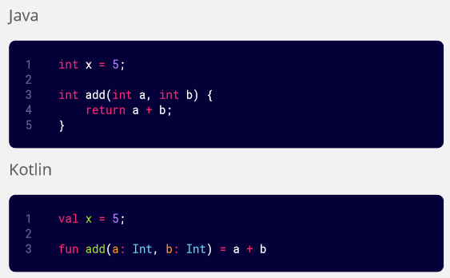
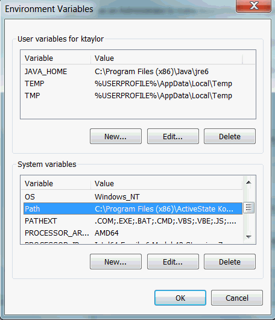

/computer-and-programming-fundamentals/computer-and-programming-terminology

### Programming Terms

#### Pseudocode

Pseudocode is a representation of computer program's algorithm, which is not written in any programming language. Pseudocode uses the combination of natural language and programming constructs and common programming concepts to describe the steps or operations performed by a program.

The purpose of pseudocode is to provide a clear and understandable outline of the program's logic without getting into the specifics of the programming language syntax. It serves as a bridge between the problem-solving phase and the actual implementation in a programming language.

  
Source: https://www.computerscience.gcse.guru/theory/pseudocode

#### Data Structures

##### Hash map vs Hash set vs Dictionary

- **Hash map**: [Hash table or Hash map](/cs-notes/computer-and-programming-fundamentals/data-structures-and-algorithms#data-structures) is a data structure where we access element based on a unique identifier called **key**. An element is a set of key-value pair, the key is the identifier and the value is the actual value associated with it.
- **Hash set**: **[Set](/cs-notes/data-structures-and-algorithms/set)** is a data structure that stores unique element. **Hash set** is one way to implement set data structure using hash code. It uses hash table internally, which mean it uses hashing function similar to hash map. While it uses hash table, it is not a key-value pair data structure unlike hash map.
- **Dictionary**: Just another name for hash map in language like Python.

##### Array vs List vs ArrayList

- **Array**: [Array](/cs-notes/computer-and-programming-fundamentals/data-structures-and-algorithms#data-structures) is a fixed-sized data structure that stores same type of element in a contiguous block of memory.
- **List**: List is a variable-sized data structure that can store different type of element. A list can be implemented using a [linked list](/cs-notes/data-structures-and-algorithms/linked-list), which allows for non-contiguous memory allocation, enabling each value to be located at an arbitrary position.
- **ArrayList**: ArrayList is an implementation of list data structure using a [dynamic array](/cs-notes/data-structures-and-algorithms/array#dynamic-array). Unlike traditional array, a dynamic array can be resized.



#### Type System

##### Typing Strength

Typing strength refers to the level of strictness or flexibility in type checking and type enforcement within a programming language.

- **Strong vs Weak**: In a strongly typed language, implicit type conversions or operations between incompatible types without explicit casting are not allowed. For instance, if you try to add an integer with a string, a strongly typed language will not automatically change the type of the string to a number to perform the operation. On the other hand, weakly typed languages perform automatic type checking and conversions as needed, which can potentially lead to unexpected errors.
- **Static vs Dynamic**: In a static typed language, variable types are checked at compile-time. Variables are required to have their types declared explicitly, a variable type can't be changed, and the type checking is performed before the program is executed. On the other hand, dynamic typing is the opposite, variable types are checked at runtime. Variables do not require explicit type declarations and can hold values of different types during the execution of the program.

  
Source: https://prepinsta.com/python/why-python-is-a-strongly-typed-language/

##### Type Inference

In a static typed language, we must declare a type of a variable. Type inference is a feature in some programming language that allows the compiler or interpreter to deduce the type of a variable or expression based on its usage and context, without requiring explicit type annotations.

For instance, we can compare Java and Kotlin programming language:



We don't need to specify the type of variable and function return types if we make it inline in Kotlin.

##### Type Safety

Type safety refers to the degree to which a programming language helps prevent type-related errors during the execution of a program. When a system is called type-safe, it means that it can be guaranteed that the type of the values will be compatible with the expected type.

For example, if a type-safe function is declared to return an integer, it guarantees that the function will consistently return an integer whenever it is called.

:::tip
See also [type systems](/cs-notes/compilers-and-programming-languages/data-types#type-systems).
:::

#### Standard Library

Standard library is a collection of pre-written code modules or libraries that are included with a programming language. It is a programming language built-in functionality consisting a wide range of common function, data structures, and algorithms that can be used to develop program.

#### Abstraction

Abstraction is a fundamental concept in computer science and programming that involves simplifying complex systems by focusing on essential features and hiding unnecessary details. Abstraction is made to allow programmers to work with higher-level concepts and operations without needing to worry about internal details.

#### API

**Application Programming Interface (API)** is an interface for programmer to interact with different software component in a system. An API defines how different components of software systems should interact, specifying the methods, data formats, and conventions that should be used.

:::tip
See a more detailed explanation about [API](/cs-notes/backend-system/apis-server-logic#what-is-api)
:::

#### Reflection

Reflection is a feature that enables program to examine internal detail about a previously compiled program. Examples are getting class name, interface methods, object type, and other information during runtime. It allows us to programmatically analyze and manipulate the structure and behavior of code without having prior knowledge or compile-time access to the specific elements.

#### Serialization

Serialization is the process of converting an object or data structure into a format that can be easily stored, transmitted, or reconstructed later. For example, when transferring data in the form of object through the network, we will need to convert it to format that can be transmitted such as [JSON](/cs-notes/digital-media-processing/json) file.

For example, here is a simple object in Kotlin:

```kotlin
data class User(val name: String, val age: Int)
```

We have a `User` object in Kotlin, if we need to send user data to a server over a network, we can convert the user object to JSON format.

```kotlin
// user data that wants to be transfered
val user = User(name = "Serial", age = 23)
```

```json
// result of serialization
{
  "name": "Serial",
  "age": 23
}
```

In the case of [HTTP request](/cs-notes/computer-networking/http-https), this JSON file will be included in the payload. This will be sent over the network, the JSON data will be received on the other end by the recipient. In order to use this data in the form of Kotlin object, it will need to go through the **deserialization** or the reverse process of serialization that converts it back to object.

#### Brute Force

Brute force is a strategy of solving a problem that involves trying out all possible solution, without any additional optimization or anything that might improve the overall outcome. Brute force is typically used in the case where the problem is very small or there are just too many solution and constraint.

Example of brute forcing is when you try to guess a 3-digit PIN code. Each of the digit can be anything from 0 to 9, and each number can repeat in other digit place. Starting from 000, you would incrementally try each possible combination, such as 001, 002, 003, and so on, until you reach 009. After that, you would move on to the next hundreds place, trying combinations like 010, 011, 012, and so forth until the last 999.

### Other Terms

#### Command Line, Command Prompt, Shell, Bash, Terminal, Console

- **Command Line (CLI)**: Also known as command-line interface (CLI), it refers to the interface where users can enter commands to interact with a computer system or execute programs. It is a text-based interface where commands are entered as text strings.
- **Command Prompt**: Command prompt is the specific CLI in Windows OS. There are two command prompts in Windows:
  - **Windows CMD**: Windows CMD is the default CLI for Windows OS
  - **Windows PowerShell**: PowerShell is a more advanced CLI, it also supports scripting with its own scripting language, which is based on the .NET Framework.
- **Shell**: Shell is the program that runs in CLI, it is the one that interprets commands.
- **Bash**: Bash (Bourne Again SHell) is a shell in Unix operating system, including Unix-like operating system like macOS and Linux (PowerShell is also a shell with more scripting capabilities).
- **Terminal**: Simply any program that uses text-based interface for input/output, it can be a CLI, but it doesn't have to be.
- **Console**: Historically, it is a terminal which is connected into physical machine (a physical terminal). Nowadays, console is commonly referred as a terminal that displays output.

:::tip
See also [shell](/cs-notes/compilers-and-programming-languages/scripting-languages#shell)
:::

##### Environment Variables

Environment Variables are variables that contains value defined by user that are set outside the program, typically within the environment in which processes operate. Environment variables are commonly used in operating systems and programming frameworks to store information such as system paths, network configurations, authentication credentials, and application-specific settings.

Some common environment variable:

- PATH: Specifies the directories where the operating system looks for executable files. In order to run a program, it is necessary to obtain the precise location of the executable file (e.g., find the executable file and double click it to run it). Specifying the program's location in the environment variable allows us to run the program from any directory without specifying the full path to its executable file. This is a common practice among programs that are executed within the command line.
- USER: Stores the username of the currently logged-in user.
- LANG: Determines the language and localization settings for the system.
- DATABASE_URL: Holds the connection details for a database server.

  
Source: https://docs.oracle.com/cd/E83411_01/OREAD/creating-and-modifying-environment-variables-on-windows.htm
