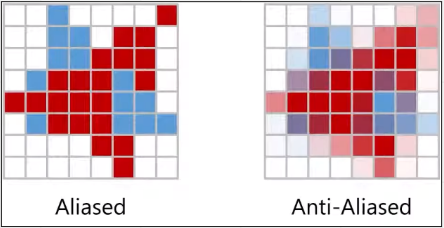
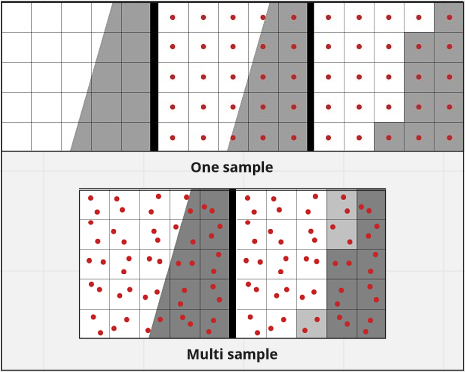
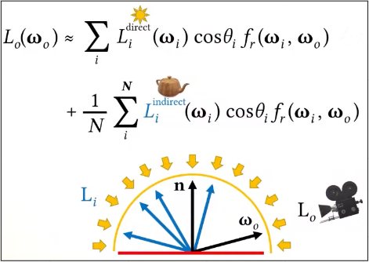
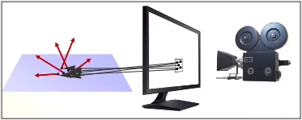
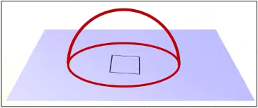
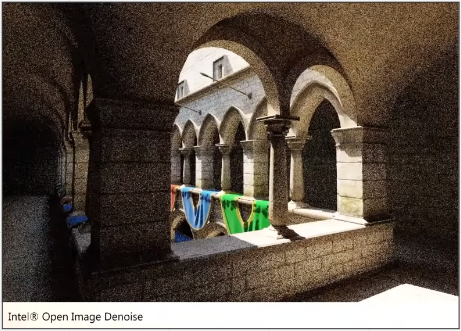

# Sampling

**Main Source: [Intro to Graphics 21 — Sampling](https://youtu.be/qgdDu-K0pZ4)**

**Sampling** is a technique of **taking some representative data from a group of data**. In computer graphics, sampling is often used in the context of rendering, which is the process of generating a 2D image or a series of images from a 3D scene.

When rendering an image, the renderer needs to determine the color of each pixel in the final image by simulating the interaction of light with the objects in the scene. This process involves sampling the scene at various points and computing the color of the corresponding pixel.

An example of sampling is to determine the color of pixel to smoothen an image. In some anti-aliasing technique, we divide the pixel into more sub-pixel. The color values obtained from each of these sub-pixel samples can then be combined to produce a final color value for the pixel.

  
Source: [https://youtu.be/qgdDu-K0pZ4?t=1088](https://youtu.be/qgdDu-K0pZ4?t=1088)

In normal sampling, we only take sample of a point in an image, using multi sampling we would take more point and we will interpolate the color from all the pixel to get a smoother color.

  
Source: [https://www.racoon-artworks.de/cgbasics/sampling.php](https://www.racoon-artworks.de/cgbasics/sampling.php)

### Monte Carlo Ray Tracing

In the rendering equation, we calculate the outgoing light taking account from all light source in the scene. The equation itself involves integral and can’t be solved because it’s a recursive integration.

To solve this, we can approximate the solution, one of the technique is **Monte Carlo Sampling** approximate a value by taking random samples. This method randomly sample the directions of incoming light and use these samples to estimate the integral in the rendering equation.

Below are rendering equation that uses Monte Carlo Sampling (Monte Carlo Ray Tracing).

  
Source: [https://youtu.be/qgdDu-K0pZ4?t=1893](https://youtu.be/qgdDu-K0pZ4?t=1893)

### Path Tracing

**Path Tracing** adds a layer of complexity to the ray tracing algorithm, instead of tracing a single ray from the camera, path tracing simulates the path that the light takes through the scene by tracing many rays from the camera and simulating the interactions of these rays with surfaces in the scene.

  
Source: [https://youtu.be/qgdDu-K0pZ4?t=2906](https://youtu.be/qgdDu-K0pZ4?t=2906)

Light bounces off surfaces in many direction creating a hemisphere of light, which we can integrate to get the color for each pixel. The problem is the integral is too complex to solve analytically, so path tracing approximate the light using Monte Carlo technique which random samples the light.

  
Source: [https://youtu.be/qgdDu-K0pZ4?t=2990](https://youtu.be/qgdDu-K0pZ4?t=2990)

However, because we random sampled the light, this can create inaccurate representation of image. This is called **noise** and may look like random variations of brightness and color that aren't part of the original image.

There are some algorithm to **de-noise** the image, which uses machine learning techniques to analyze the noisy image and generate a smoother version of the image.

  
Source: [https://youtu.be/qgdDu-K0pZ4?t=3112](https://youtu.be/qgdDu-K0pZ4?t=3112)
