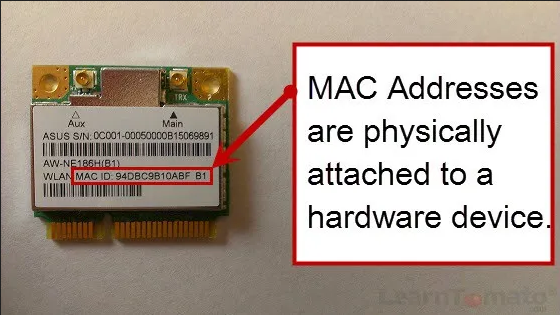

**Main Source: [MAC Address Explained | PowerCert](https://youtu.be/TIiQiw7fpsU)**

**MAC (Media Access Control) Address** is a unique identifier assigned to a network interface controller (NIC) of a network device. NIC, also known as network adapter, is a hardware component that enables a computer or other device to connect to a network. It is responsible for the transmission and reception of data over a network. It is a hardware address that operates at the [data link layer of the OSI model](/cs-notes/computer-networking/osi-model#osi-layers).

### MAC Address Assignment

A MAC address is a 48-bit (6-byte) identifier, typically represented as a series of six pairs of hexadecimal digits, separated by colons or hyphens. For example, a MAC address might look like: `00:1A:2B:3C:4D:5E`, `00-B0-D0-63-C2-26`. With hexadecimal, it is available from `00-00-00-00-00-00` through `FF-FF-FF-FF-FF-FF`.

The MAC address is assigned by the manufacturer of the network interface and is usually burned into the device's hardware during production. It is divided by two parts, the first 3 segment identifies the manufacturer and the last 3 segment which is a random bytes that identifies device in a network.

  
Source: https://learntomato.flashrouters.com/what-is-a-mac-address-how-to-find-my-mac-address/

### Purpose of MAC Address

IP address might change sometimes because of various reason such as configuration change or [DHCP](/cs-notes/computer-networking/dhcp). MAC address act as a physical hardware identifier that never changes. As it is assigned permanently by manufacturer, no two devices should have the same MAC address.

IP addresses facilitate communication between devices across networks, while MAC addresses provide physical addressing and facilitate communication within a local network segment. Overall MAC address is used in the data link layer of OSI model while IP address operator on the network layer.

  
Source: https://youtu.be/TIiQiw7fpsU?t=416
